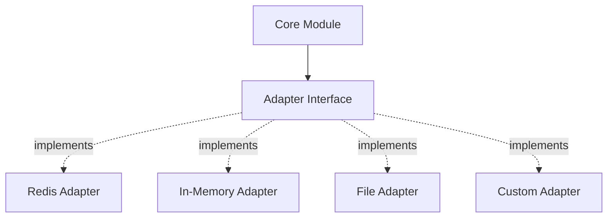

Adapters allow iii Core Modules to integrate with external systems and swap implementations without changing module logic.

## What are Adapters?

Adapters are pluggable backends for Core Modules. They implement specific interfaces that modules use to interact with external systems like databases, message brokers, or storage services.



## Why Adapters?

**Flexibility**: Swap implementations without code changes
- Development: Use in-memory adapters for fast local testing
- Production: Use Redis adapters for distributed deployments

**Integration**: Connect to your existing infrastructure
- Use your existing Redis cluster
- Integrate with custom message brokers
- Store data in your preferred database

**Extensibility**: Build custom adapters for specific needs
- Integrate proprietary systems
- Implement custom caching strategies
- Add specialized logging backends

## Available Adapters by Module

### Event Module

<AccordionGroup>
  <Accordion title="RedisAdapter" icon="database">
    Uses Redis Pub/Sub for event distribution.

    ```yaml
    adapter:
      class: modules::event::adapters::RedisAdapter
      config:
        redis_url: redis://localhost:6379
    ```

    **Best for**: Production, distributed systems
  </Accordion>

  <Accordion title="InMemoryAdapter" icon="memory-stick">
    Stores events in memory (single instance only).

    ```yaml
    adapter:
      class: modules::event::adapters::InMemoryAdapter
    ```

    **Best for**: Development, testing, single-instance deployments
  </Accordion>
</AccordionGroup>

### Stream Module

<AccordionGroup>
  <Accordion title="RedisAdapter" icon="database">
    Uses Redis for state storage and Pub/Sub for real-time sync.

    ```yaml
    adapter:
      class: modules::streams::adapters::RedisAdapter
      config:
        redis_url: redis://localhost:6379
    ```

    **Best for**: Production, persistent state, real-time features
  </Accordion>
</AccordionGroup>

### Cron Module

<AccordionGroup>
  <Accordion title="RedisAdapter" icon="database">
    Uses Redis for distributed locking to prevent duplicate job execution.

    ```yaml
    adapter:
      class: modules::cron::adapters::RedisAdapter
      config:
        redis_url: redis://localhost:6379
    ```

    **Best for**: Multi-instance deployments
  </Accordion>
</AccordionGroup>

### Logging Module

<AccordionGroup>
  <Accordion title="RedisLogger" icon="database">
    Stores logs in Redis for centralized log aggregation.

    ```yaml
    adapter:
      class: modules::observability::adapters::RedisLogger
      config:
        redis_url: redis://localhost:6379
    ```

    **Best for**: Centralized logging, log analysis
  </Accordion>

  <Accordion title="FileLogger" icon="file-text">
    Writes logs to a file on disk.

    ```yaml
    adapter:
      class: modules::observability::adapters::FileLogger
      config:
        file_path: app.log
        save_interval_ms: 5000
    ```

    **Best for**: Simple deployments, local development
  </Accordion>
</AccordionGroup>

## Adapter Configuration

Adapters are configured in the `config.yaml` file within the module configuration:

```yaml
modules:
  - class: modules::event::EventModule
    config:
      adapter:
        class: modules::event::adapters::RedisAdapter
        config:
          redis_url: ${REDIS_URL:redis://localhost:6379}
```

**Configuration Pattern:**
1. **class**: Full path to the adapter implementation
2. **config**: Adapter-specific configuration object

## Building Custom Adapters

You can create custom adapters by implementing the adapter interface for each module type.

### Event Adapter Interface

```rust
#[async_trait]
pub trait EventAdapter: Send + Sync {
    async fn emit(&self, topic: &str, event_data: Value);
    async fn subscribe(&self, topic: &str, id: String, function_path: String);
    async fn unsubscribe(&self, topic: &str, id: &str);
}
```

### Example: Logging Event Adapter

Wrapper adapter that logs all events while delegating to another adapter:

```rust
pub struct LoggingEventAdapter {
    inner: Arc<dyn EventAdapter>,
}

#[async_trait]
impl EventAdapter for LoggingEventAdapter {
    async fn emit(&self, topic: &str, event_data: Value) {
        tracing::info!(
            topic = %topic,
            event_data = %event_data,
            "Emitting event"
        );
        self.inner.emit(topic, event_data).await;
    }

    async fn subscribe(&self, topic: &str, id: String, function_path: String) {
        tracing::info!(topic = %topic, "Subscribing to topic");
        self.inner.subscribe(topic, id, function_path).await;
    }

    async fn unsubscribe(&self, topic: &str, id: &str) {
        tracing::info!(topic = %topic, "Unsubscribing from topic");
        self.inner.unsubscribe(topic, id).await;
    }
}
```

## Adapter Selection Guide

| Module | Development | Production (Single) | Production (Multi-Instance) |
|--------|-------------|---------------------|----------------------------|
| **Event** | InMemory | Redis | Redis |
| **Stream** | Redis | Redis | Redis |
| **Cron** | N/A | N/A | Redis |
| **Logging** | File | File / Redis | Redis |

**Notes:**
- **Development**: Fast, simple, no external dependencies
- **Single Instance**: One engine instance, may need persistence
- **Multi-Instance**: Multiple engine instances, requires distributed coordination

## Environment-Based Configuration

Use environment variables to switch adapters between environments:

```yaml
modules:
  - class: modules::event::EventModule
    config:
      adapter:
        class: ${EVENT_ADAPTER:modules::event::adapters::InMemoryAdapter}
        config:
          redis_url: ${REDIS_URL:redis://localhost:6379}
```

**Deployment:**

```bash
# Development
EVENT_ADAPTER=modules::event::adapters::InMemoryAdapter iii

# Production
EVENT_ADAPTER=modules::event::adapters::RedisAdapter \
REDIS_URL=redis://production.redis:6379 \
iii
```

## Next Steps

<Columns cols={2}>
  <Card icon="Blocks" title="Core Modules" href="/docs/core-modules">
    Learn about modules that use adapters
  </Card>
  <Card icon="Settings" title="Deployment" href="/docs/advanced/deployment">
    Configure adapters for production
  </Card>
</Columns>
