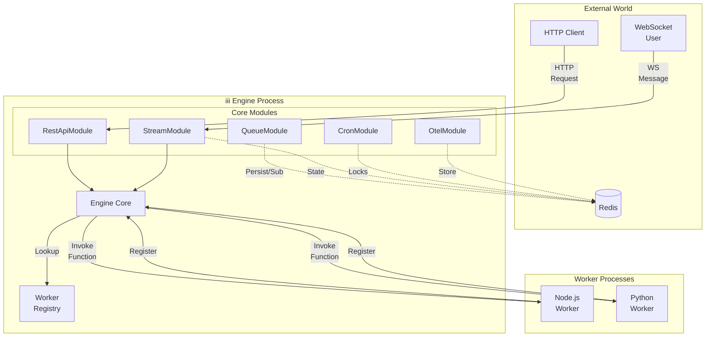
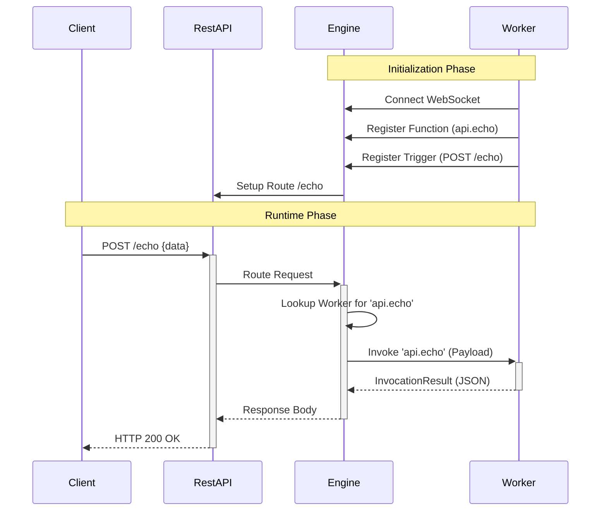
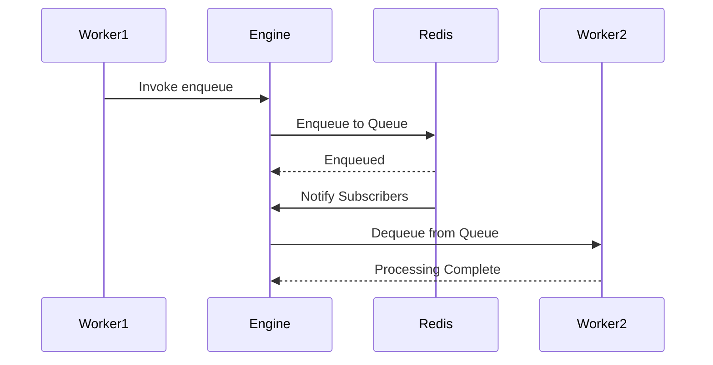
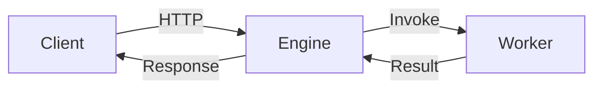
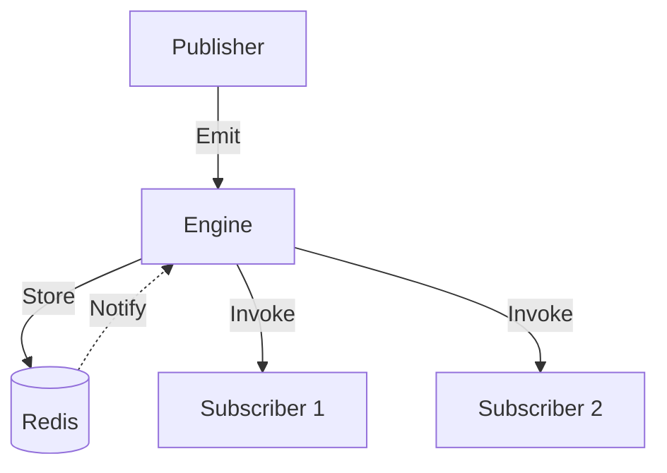
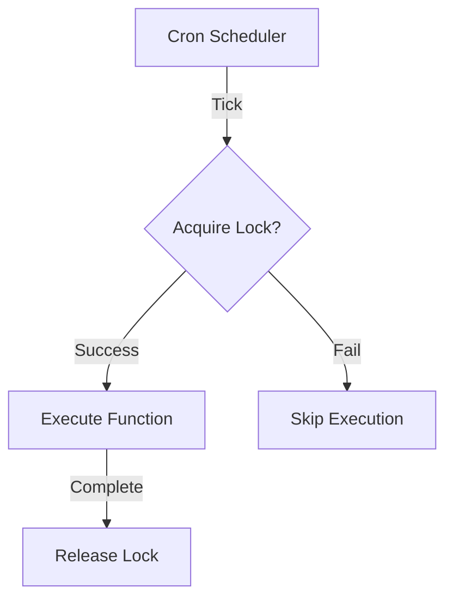
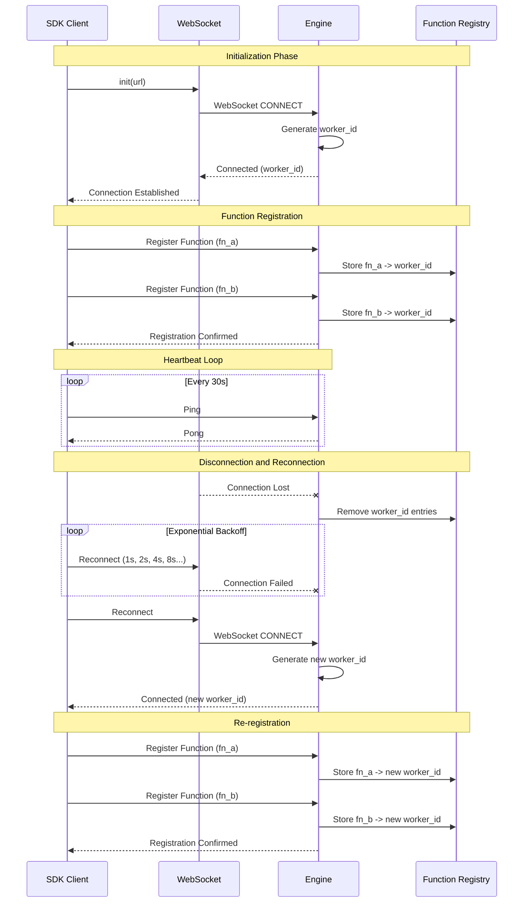
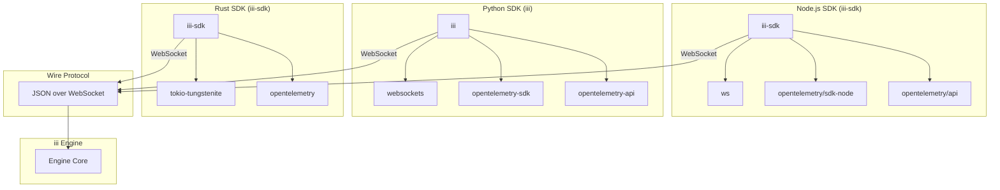

Understanding the iii architecture helps you build more efficient and scalable applications.

## System Components

The iii architecture consists of three main layers:

1. **Engine Core** - Manages worker connections, routing, and module lifecycle
2. **Core Modules** - Provide interfaces to external systems (HTTP, Redis, WebSocket)
3. **Workers** - External processes that execute business logic

## Worker Registry

The Worker Registry tracks connected workers and their registered functions:

| Component | Description |
|-----------|-------------|
| `WorkerRegistry` | Thread-safe map storing active workers by UUID |
| `Worker` | Represents a connected client with WebSocket channel |
| `function_ids` | Set of function IDs the worker can execute |
| `invocations` | Active request IDs being processed |

## Communication Flow

### HTTP Request to Worker

### Event Publishing

## Module Architecture

Core Modules implement the `CoreModule` trait and bridge external protocols to internal function calls.

### HTTP Module

Maps HTTP routes to internal function paths using a hot router:

- **Dynamic Registration**: Routes can be added at runtime
- **Path Router**: Links HTTP method + path to function
- **Request Mapping**: Converts HTTP requests to function invocations

### Streams Module

Manages real-time state and WebSocket connections:

- **State Management**: Get/set/delete operations on hierarchical data
- **Real-time Sync**: WebSocket-based state synchronization
- **Authentication**: Optional auth function for connection validation

### Queue Module

Implements publish-subscribe pattern:

- **Adapters**: Pluggable backends (Redis, RabbitMQ, Built-in)
- **Topics**: Subscribe to specific event topics
- **Async Processing**: Non-blocking event distribution

### Cron Module

Handles distributed scheduling:

- **Cron Parser**: Supports standard cron expressions
- **Distributed Locks**: Prevents duplicate execution across instances
- **Job Management**: Tokio-based task scheduling

## Data Flow Patterns

### Synchronous Pattern (API Requests)

### Asynchronous Pattern (Events)

### Scheduled Pattern (Cron)

## Scalability Considerations

### Horizontal Scaling

Run multiple engine instances with shared Redis:

- **Stateless Workers**: Connect to any engine instance
- **Shared State**: Redis provides distributed state
- **Load Distribution**: HTTP load balancer for API requests
- **Lock-based Coordination**: Cron jobs use distributed locks

### Vertical Scaling

Optimize single instance performance:

- **Rust Performance**: Core modules built for speed and memory efficiency
- **Async Runtime**: Tokio for concurrent request handling
- **Connection Pooling**: Efficient WebSocket management
- **Adapter Optimization**: Redis pipelining, connection pooling

## SDK Connection Flow

The SDK connection lifecycle manages initialization, function registration, and automatic reconnection with the engine.

## Package Architecture

All three SDK packages connect to the same iii Engine using a shared JSON-over-WebSocket wire protocol.

## Extension Points

### Custom Modules

Build custom core modules by implementing the `CoreModule` trait:

1. Define module configuration
2. Implement initialization logic
3. Register trigger types
4. Expose functions to workers

### Custom Adapters

Replace default adapters with custom implementations:

- **Event Adapters**: Alternative message brokers (RabbitMQ, Kafka)
- **Stream Adapters**: Different storage backends
- **Cron Adapters**: Alternative scheduling systems
- **Logging Adapters**: Custom log destinations
