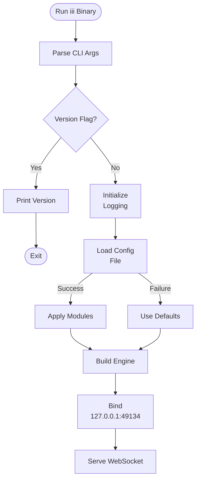
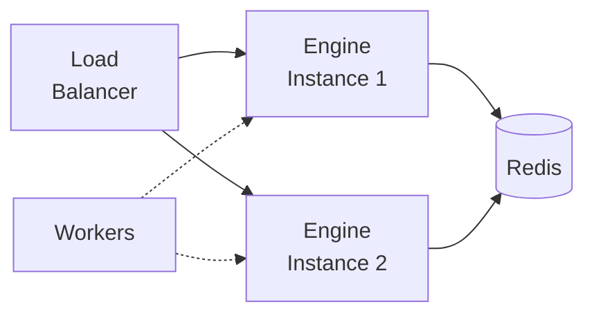

This guide covers deploying the iii Engine and configuring it for production use.

## Installation

Install the iii Engine binary:

```bash
curl -fsSL https://install.iii.dev/iii/main/install.sh | sh
```

Or run directly with Cargo:

```bash
cargo install iii-engine
```

## Running the Engine

The engine accepts the following CLI arguments:

| Argument    | Short | Default       | Description                |
| ----------- | ----- | ------------- | -------------------------- |
| `--config`  | `-c`  | `config.yaml` | Path to configuration file |
| `--version` | `-v`  | -             | Print version and exit     |

Start the engine:

```bash
# Using default config.yaml
iii

# With custom config
iii --config /path/to/config.yaml

# Check version
iii --version
```

## Configuration File

The engine uses a YAML configuration file to define active modules and their settings.

### Basic Structure

```yaml
modules:
  - class: modules::api::RestApiModule
    config:
      host: 0.0.0.0
      port: 3111

  - class: modules::stream::StreamModule
    config:
      host: 0.0.0.0
      port: 3112
      adapter:
        class: modules::streams::adapters::RedisAdapter
        config:
          redis_url: redis://localhost:6379
```

### Environment Variables

Configuration supports environment variable expansion using `${VAR_NAME:default_value}`:

```yaml
modules:
  - class: modules::api::RestApiModule
    config:
      host: ${API_HOST:127.0.0.1}
      port: ${API_PORT:3111}

  - class: modules::queue::QueueModule
    config:
      adapter:
        class: modules::queue::adapters::RedisAdapter
        config:
          redis_url: ${REDIS_URL:redis://localhost:6379}
```

**Behavior:**

- If `REDIS_URL` is set, uses that value
- If not set, uses the default (`redis://localhost:6379`)
- If no default provided and variable is missing, engine logs an error

## Docker Deployment

### Single Container

The quickest way to get started is pulling the pre-built image:

```bash
docker pull iiidev/iii:latest

docker run -p 3111:3111 -p 49134:49134 \
  -v ./config.yaml:/app/config.yaml:ro \
  iiidev/iii:latest
```

### Docker Compose (Development)

The base `docker-compose.yml` runs the engine with Redis and RabbitMQ:

```bash
docker compose up -d
```

| Port  | Service                        |
| ----- | ------------------------------ |
| 49134 | WebSocket (worker connections) |
| 3111  | REST API                       |
| 3112  | Streams API                    |
| 9464  | Prometheus metrics             |

### Docker Compose (Production Example)

The included `docker-compose.prod.yml` runs iii behind a [Caddy](https://caddyserver.com/docs/) reverse proxy for TLS, using only built-in adapters.

**1. Edit the `Caddyfile`** — replace `your-domain.com` with your actual domain:

```
your-domain.com {
    handle /api/* {
        reverse_proxy iii:3111
    }
    handle /ws {
        reverse_proxy iii:49134
    }
    handle {
        reverse_proxy iii:3111
    }
}
```

See the [Caddy documentation](https://caddyserver.com/docs/) for TLS and reverse proxy configuration.

**2. Start the stack:**

```bash
docker compose -f docker-compose.prod.yml up -d
```

## Reverse Proxy Examples

The iii engine does not handle TLS itself. Place a reverse proxy in front of it to terminate TLS. Below are minimal examples for [Caddy](https://caddyserver.com/docs/) and [Nginx](https://nginx.org/en/docs/).

### Caddy

```
your-domain.com {
    handle /api/* {
        reverse_proxy 127.0.0.1:3111
    }
    handle /streams/* {
        reverse_proxy 127.0.0.1:3112
    }
    handle /ws {
        reverse_proxy 127.0.0.1:49134
    }
    handle {
        reverse_proxy 127.0.0.1:3111
    }
}
```

### Nginx

```nginx
server {
    listen 443 ssl;
    server_name your-domain.com;

    location /api/ {
        proxy_pass http://127.0.0.1:3111;
    }

    location /ws {
        proxy_pass http://127.0.0.1:49134;
        proxy_http_version 1.1;
        proxy_set_header Upgrade $http_upgrade;
        proxy_set_header Connection "upgrade";
    }

    location /stream/ {
        proxy_pass http://127.0.0.1:3112;
        proxy_http_version 1.1;
        proxy_set_header Upgrade $http_upgrade;
        proxy_set_header Connection "upgrade";
    }

    location / {
        proxy_pass http://127.0.0.1:3111;
    }
}
```

See the [Nginx documentation](https://nginx.org/en/docs/) for SSL, header, and proxy configuration.

## Production Configuration

Example configuration using built-in adapters:

```yaml
modules:
  - class: modules::api::RestApiModule
    config:
      host: 0.0.0.0
      port: 3111

  - class: modules::cron::CronModule

  - class: modules::observability::OtelModule
    config:
      enabled: true
      exporter: memory
```

Additional modules (Streams, Events, Queue) require external adapters such as Redis or RabbitMQ. See the [Configuration File](#configuration-file) section for examples.

## Production Checklist

### Security Hardening

Running the iii container with minimal privileges:

```bash
docker run --read-only --tmpfs /tmp \
  --cap-drop=ALL --cap-add=NET_BIND_SERVICE \
  --security-opt=no-new-privileges:true \
  -v ./config.yaml:/app/config.yaml:ro \
  iiidev/iii:latest
```

- **Read-only filesystem** (`--read-only`): Prevents writes to the container filesystem
- **Drop all capabilities** (`--cap-drop=ALL`): Minimizes kernel access
- **No new privileges** (`--security-opt=no-new-privileges:true`): Prevents privilege escalation
- **Non-root user**: The official image already runs as a non-root user

### Health Checks and Monitoring

The engine exposes Prometheus metrics on port `9464`:

```bash
curl http://localhost:9464/metrics
```

Health check endpoints:

```bash
# REST API
curl http://localhost:3111/health

# WebSocket port
nc -zv 127.0.0.1 49134
```

## Default Modules

If no configuration file is provided, the engine loads these default modules:

- **RestApiModule** - Host: 127.0.0.1, Port: 3111
- **QueueModule** - Redis at localhost:6379
- **OtelModule** - Observability (traces, metrics, logs)
- **CronModule** - Built-in KV or Redis at localhost:6379
- **StreamModule** - Stream API at 127.0.0.1:3112

## Startup Flow



## Multi-Instance Deployment

When running multiple engine instances:

1. **Redis Required**: Use Redis adapters for Queue, Cron, Streams, and State
2. **Load Balancing**: Use a load balancer for API endpoints
3. **Distributed Locking**: Cron module uses Redis locks to prevent duplicate execution
4. **Session Affinity**: Not required - workers connect to any engine instance



## Health Checks

Monitor engine health by checking:

1. **WebSocket Port**: Engine listens on `127.0.0.1:49134` by default
2. **Module Ports**: REST API (3111), Streams (3112)
3. **Redis Connection**: If using Redis adapters

Example health check:

```bash
# Check if WebSocket is listening
nc -zv 127.0.0.1 49134

# Check REST API
curl http://localhost:3111/health
```

## Logging

Configure the observability module (traces, metrics, logs):

```yaml
modules:
  - class: modules::observability::OtelModule
    config:
      enabled: true
      exporter: memory  # or otlp, both
```

Configure Rust logging verbosity via environment variable:

```bash
RUST_LOG=debug iii
```
