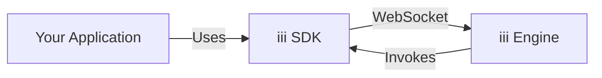
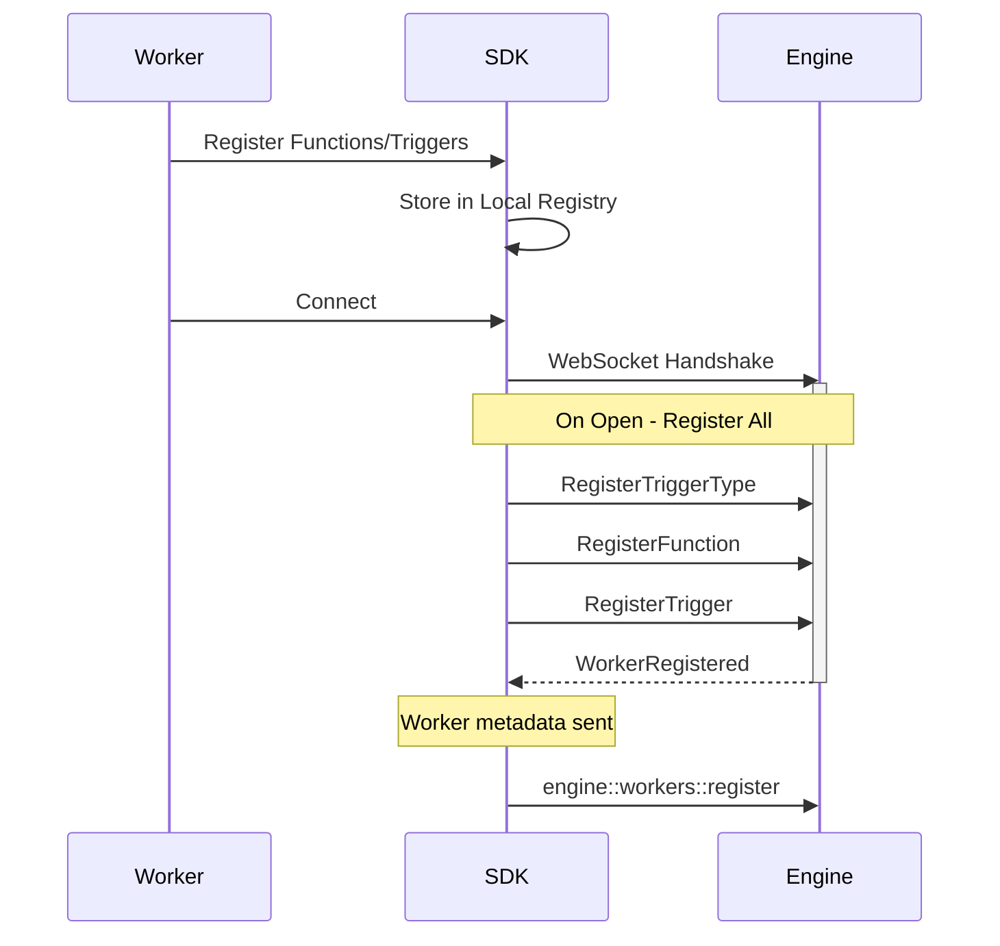

The iii SDK is available for Node.js, Python, and Rust, providing a client that connects to the iii Engine via WebSocket for function registration, trigger setup, and remote procedure calls.

## SDK Architecture

Each SDK maintains a persistent WebSocket connection to the engine. Functions and triggers are registered locally, then flushed to the engine on connection (and re-registered on reconnect).



## Connection Lifecycle

The SDK establishes a WebSocket connection to the engine (defaulting to `ws://127.0.0.1:49134`). Upon connection, it flushes all pending registration messages (trigger types, services, functions, triggers) to ensure the engine is aware of the worker's capabilities.



<Callout title="Node.js auto-connects" type="info">
  The Node SDK connects automatically when you call `init()`. Python and Rust require an explicit `connect()` / `connect().await` call.
</Callout>

### Reconnection

All three SDKs handle reconnection automatically. The Node SDK supports configurable exponential backoff with jitter. On reconnect, all registered functions, triggers, and services are re-sent to the engine.

## Message Types and Protocol

The SDKs communicate with the engine using JSON messages over WebSocket. Each message has a `type` field.

| Message Type | Description | Key Fields |
| --- | --- | --- |
| `registerfunction` | Registers a callable function | `id`, `description` |
| `registertrigger` | Binds a trigger config to a function | `trigger_type`, `function_id`, `config` |
| `invokefunction` | Requests function execution | `function_id`, `data`, `invocation_id` |
| `invocationresult` | Returns execution result | `invocation_id`, `result`, `error` |
| `registertriggertype` | Registers a custom trigger type | `id`, `description` |
| `workerregistered` | Engine confirms worker registration | `worker_id` |

Invocations can be fire-and-forget by omitting `invocation_id`. Distributed tracing context is propagated via `traceparent` and `baggage` fields.

## Node.js Implementation

The Node.js SDK (`iii-sdk`) uses TypeScript and the `ws` library.

### Installation

```bash
npm install iii-sdk
```

### Basic Usage

```typescript
import { init, getContext, type ApiRequest, type ApiResponse } from 'iii-sdk'

const iii = init('ws://127.0.0.1:49134')

iii.registerFunction(
  { id: 'users::create', description: 'Create a user' },
  async (data) => {
    const ctx = getContext()
    ctx.logger.info('Creating user', data)
    const user = { id: crypto.randomUUID(), ...data }
    return { status_code: 201, body: user } satisfies ApiResponse
  },
)

iii.registerTrigger({
  type: 'http',
  function_id: 'users::create',
  config: { api_path: '/users', http_method: 'POST' },
})
```

### Internal Structure

The `Sdk` class (returned by `init()`) manages:
- `functions` — `Map<string, RemoteFunctionData>` of registered handlers
- `triggers` — `Map<string, RegisterTriggerMessage>` of trigger bindings
- `invocations` — `Map<string, Invocation>` of pending call/response pairs
- `messagesToSend` — queue for messages sent before the socket is open

On connection open, all registrations are flushed and worker metadata is sent. On close, automatic reconnection is scheduled with exponential backoff.

### OpenTelemetry

OpenTelemetry is initialized automatically by default. Each function invocation is wrapped in a span with trace context propagated from the engine. Disable with `init(url, { otel: { enabled: false } })` or `OTEL_ENABLED=false`.

### Subpath Exports

| Import | Contents |
| --- | --- |
| `iii-sdk` | `init`, `getContext`, `withContext`, `Logger`, `ISdk`, `ApiRequest`, `ApiResponse` |
| `iii-sdk/stream` | `IStream`, stream input/output types, `UpdateOp` |
| `iii-sdk/state` | State management types |
| `iii-sdk/telemetry` | `initOtel`, `getTracer`, `getMeter`, `withSpan`, `SpanKind`, etc. |

## Python Implementation

The Python SDK (`iii-sdk` on PyPI, imported as `iii`) uses `asyncio` and `websockets`.

### Installation

```bash
pip install iii-sdk
```

### Basic Usage

```python
import asyncio
from iii import III, InitOptions, get_context, ApiRequest, ApiResponse

iii = III(
    address="ws://127.0.0.1:49134",
    options=InitOptions(worker_name="my-worker"),
)

async def create_user(data):
    ctx = get_context()
    ctx.logger.info("Creating user")
    user = {"id": "123", **data}
    return {"status_code": 201, "body": user}

iii.register_function("users::create", create_user, description="Create a user")

iii.register_trigger(
    type="http",
    function_id="users::create",
    config={"api_path": "/users", "http_method": "POST"},
)

async def main():
    await iii.connect()
    while True:
        await asyncio.sleep(60)

asyncio.run(main())
```

### Key Components

<AccordionGroup>
  <Accordion title="III" icon="network-wired">
    The main client class. Manages the WebSocket connection, function/trigger registries, and reconnection.

    ```python
    from iii import III, InitOptions

    iii = III(address="ws://127.0.0.1:49134", options=InitOptions(worker_name="worker-1"))
    await iii.connect()
    ```

  </Accordion>

  <Accordion title="Logger" icon="file-text">
    Context-aware logger that sends log events to the engine via `engine::log::*` functions.

    ```python
    from iii import get_context

    ctx = get_context()
    ctx.logger.info("Processing started")
    ctx.logger.error("Something failed")
    ```

  </Accordion>

  <Accordion title="Types" icon="code">
    Pydantic models for API request/response and stream operations.

    ```python
    from iii import ApiRequest, ApiResponse

    def handler(data) -> ApiResponse:
        req = ApiRequest(**data)
        return ApiResponse(status_code=200, body={"path": req.path_params})
    ```

  </Accordion>
</AccordionGroup>

### Streams

Register a custom stream by implementing the `IStream` abstract class:

```python
from iii import III
from iii.stream import IStream, StreamGetInput, StreamSetInput, StreamDeleteInput, StreamListInput

class MyStream(IStream):
    async def get(self, input: StreamGetInput):
        ...
    async def set(self, input: StreamSetInput):
        ...
    async def delete(self, input: StreamDeleteInput):
        ...
    async def list(self, input: StreamListInput):
        ...
    async def list_groups(self, input):
        ...

iii.create_stream("my-stream", MyStream())
```

## Rust Implementation

The Rust SDK (`iii-sdk` crate, lib name `iii_sdk`) uses `tokio` and `tokio-tungstenite`.

### Installation

```toml
[dependencies]
iii-sdk = { version = "0.2", features = ["otel"] }
```

### Basic Usage

```rust
use iii_sdk::{III, get_context};
use serde_json::json;

#[tokio::main]
async fn main() -> Result<(), Box<dyn std::error::Error>> {
    let iii = III::new("ws://127.0.0.1:49134");

    iii.register_function("users::create", |input| async move {
        let ctx = get_context();
        ctx.logger.info("Creating user", None);
        Ok(json!({
            "status_code": 201,
            "body": { "id": "123", "name": input["name"] },
        }))
    });

    iii.register_trigger("http", "users::create", json!({
        "api_path": "/users",
        "http_method": "POST",
    }))?;

    iii.connect().await?;

    loop {
        tokio::time::sleep(std::time::Duration::from_secs(60)).await;
    }
}
```

### Streams

The Rust SDK provides atomic stream updates via the `Streams` helper:

```rust
use iii_sdk::{Streams, UpdateOp};

let streams = Streams::new(iii.clone());

let result = streams.update(
    "orders::user-123::order-456",
    vec![
        UpdateOp::increment("total", 100),
        UpdateOp::set("status", json!("processing")),
    ],
).await?;
```

### Error Handling

All fallible operations return `Result<T, IIIError>`. Common variants:

- `IIIError::NotConnected` — WebSocket is not open
- `IIIError::Timeout` — invocation timed out
- `IIIError::Remote` — remote function returned an error
- `IIIError::Serde` — JSON serialization failed

## Request and Response Models

All three SDKs use the same `ApiRequest` / `ApiResponse` shape for HTTP trigger handlers.

### ApiRequest

<ResponseField name="path_params" type="dict / Record">
  URL path parameters.

```python
req.path_params  # {"userId": "123"}
```

</ResponseField>

<ResponseField name="query_params" type="dict / Record">
  Query string parameters.

```python
req.query_params  # {"status": "active"}
```

</ResponseField>

<ResponseField name="body" type="Any / unknown">
  Parsed request payload.
</ResponseField>

<ResponseField name="headers" type="dict / Record">
  Request headers.
</ResponseField>

<ResponseField name="method" type="str / string">
  HTTP method (GET, POST, etc.).
</ResponseField>

### ApiResponse

<ResponseField name="status_code" type="int / number">
  HTTP status code.

<Tabs items={['TypeScript', 'Python', 'Rust']}>
  <Tab value="TypeScript">

```typescript
return { status_code: 200, body: { message: 'OK' } } satisfies ApiResponse
```

  </Tab>
  <Tab value="Python">

```python
return ApiResponse(status_code=200, body={"message": "OK"})
```

  </Tab>
  <Tab value="Rust">

```rust
Ok(json!({ "status_code": 200, "body": { "message": "OK" } }))
```

  </Tab>
</Tabs>

</ResponseField>

<ResponseField name="body" type="Any / unknown">
  Response payload (serialized to JSON).
</ResponseField>

<ResponseField name="headers" type="dict / Record">
  Response headers (optional).
</ResponseField>

## Stream Management

All SDKs interact with the engine's Stream module via `stream::` namespace functions.

| Operation | Function ID | Description |
| --- | --- | --- |
| Get | `stream::get({stream_name})` | Retrieve an item |
| Set | `stream::set({stream_name})` | Save an item |
| Delete | `stream::delete({stream_name})` | Remove an item |
| List | `stream::list({stream_name})` | List items in a group |
| List Groups | `stream::list_groups({stream_name})` | List all groups |
| Update | `stream::update({stream_name})` | Atomic update with operations |

Custom stream implementations override the default engine behavior for a given stream name. Register them with `createStream` (Node), `create_stream` (Python), or by registering the individual `stream::*` functions (Rust).

## Best Practices

<AccordionGroup>
  <Accordion title="Type Safety">
    Use typed request/response models for better IDE support and fewer runtime errors.

    <Tabs items={['TypeScript', 'Python', 'Rust']}>
      <Tab value="TypeScript">

```typescript
import type { ApiRequest, ApiResponse } from 'iii-sdk'

iii.registerFunction({ id: 'handler' }, async (data: ApiRequest) => {
  return { status_code: 200, body: { ok: true } } satisfies ApiResponse
})
```

      </Tab>
      <Tab value="Python">

```python
from iii import ApiRequest, ApiResponse

async def handler(data) -> ApiResponse:
    req = ApiRequest(**data)
    return ApiResponse(status_code=200, body={"ok": True})
```

      </Tab>
      <Tab value="Rust">

```rust
use iii_sdk::types::ApiRequest;

iii.register_function("handler", |input| async move {
    let req: ApiRequest = serde_json::from_value(input)?;
    Ok(json!({ "status_code": 200, "body": { "ok": true } }))
});
```

      </Tab>
    </Tabs>

  </Accordion>

  <Accordion title="Error Handling">
    Always handle errors gracefully and return appropriate HTTP status codes.

    ```python
    async def handler(data):
        try:
            result = await process_data(data)
            return ApiResponse(status_code=200, body=result)
        except ValueError as e:
            ctx = get_context()
            ctx.logger.error(f"Validation error: {e}")
            return ApiResponse(status_code=400, body={"error": str(e)})
    ```

  </Accordion>

  <Accordion title="Graceful Shutdown">
    Implement proper shutdown to flush telemetry and clean up resources.

    <Tabs items={['TypeScript', 'Python', 'Rust']}>
      <Tab value="TypeScript">

```typescript
process.on('SIGINT', async () => {
  await iii.shutdown()
  process.exit(0)
})
```

      </Tab>
      <Tab value="Python">

```python
try:
    await iii.connect()
    await asyncio.Event().wait()
finally:
    await iii.shutdown()
```

      </Tab>
      <Tab value="Rust">

```rust
tokio::signal::ctrl_c().await?;
iii.shutdown_async().await;
```

      </Tab>
    </Tabs>

  </Accordion>
</AccordionGroup>

## Next Steps

<Columns cols={2}>
  <Card title="API Reference" href="/docs/api-reference/iii-sdk">
    Full method signatures for all three SDKs
  </Card>
  <Card title="Remote Functions" href="/docs/remote-functions">
    Understand function registration and invocation
  </Card>
</Columns>
