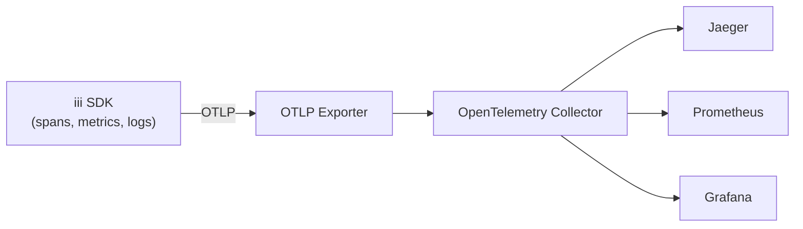
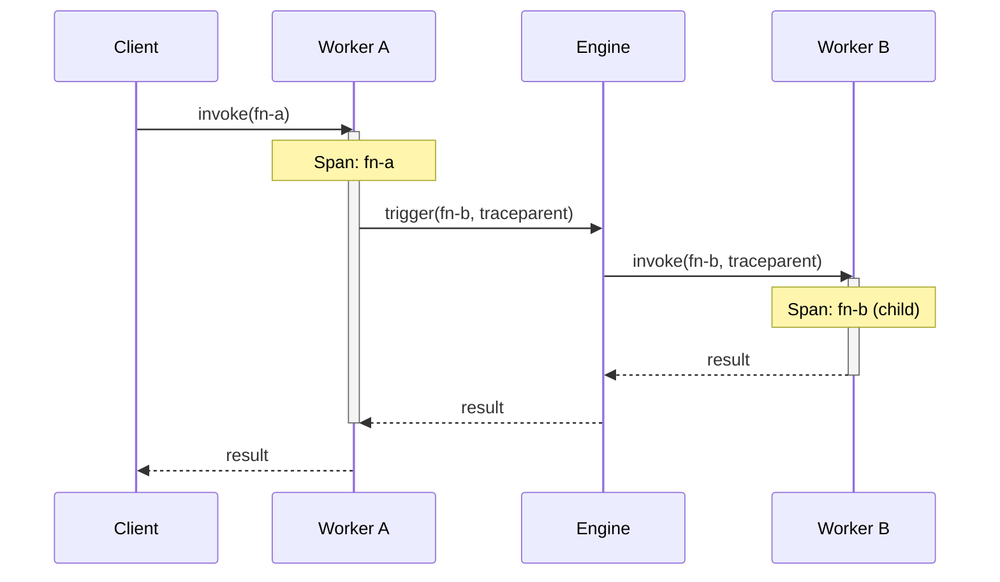

The iii SDK ships with built-in OpenTelemetry (OTel) support across all three SDKs (Node.js, Python, Rust). Every function invocation is automatically traced, worker metrics are collected, and structured logs are forwarded to the engine — all using the standard OTLP protocol.

## Data Flow



## Auto-Instrumentation

<Callout type="info" title="Enabled by default in Node.js">
  The Node.js SDK initializes OpenTelemetry automatically when you call `init()`. Python and Rust require an explicit `init_otel()` call.
</Callout>

To disable auto-instrumentation in the Node.js SDK, set the environment variable `OTEL_ENABLED=false` or pass the option directly:

```typescript
const iii = init('ws://localhost:49134', {
  otel: { enabled: false },
})
```

## Configuration

<Tabs items={['Node / TypeScript', 'Python', 'Rust']}>
  <Tab value="Node / TypeScript">

```typescript
import { init } from 'iii-sdk'

const iii = init('ws://localhost:49134', {
  otel: {
    enabled: true,
    serviceName: 'my-service',
    exporterEndpoint: 'http://localhost:4318',
  },
})
```

  </Tab>
  <Tab value="Python">

```python
from iii import III, InitOptions, OtelOptions

iii = III(
    address="ws://localhost:49134",
    options=InitOptions(
        otel=OtelOptions(
            enabled=True,
            service_name="my-service",
            exporter_endpoint="http://localhost:4318",
        ),
    ),
)
```

  </Tab>
  <Tab value="Rust">

```rust
use iii_sdk::{III, InitOptions, OtelOptions};

let iii = III::builder("ws://localhost:49134")
    .otel(OtelOptions {
        enabled: true,
        service_name: "my-service".into(),
        exporter_endpoint: "http://localhost:4318".into(),
    })
    .build();

iii.connect().await?;
```

  </Tab>
</Tabs>

## Traces

Every function invocation creates a span automatically. Cross-worker calls propagate trace context via `traceparent` and `baggage` headers, so a single request that fans out across multiple workers appears as a unified trace.



### Custom Spans

Use `withSpan` to create custom spans within a function handler:

<Tabs items={['Node / TypeScript', 'Python', 'Rust']}>
  <Tab value="Node / TypeScript">

```typescript
import { withSpan } from 'iii-sdk/telemetry'

iii.registerFunction({ id: 'orders::process' }, async (data) => {
  return withSpan('validate-order', {}, async (span) => {
    span.setAttribute('order.id', data.orderId)
    const valid = await validateOrder(data)
    span.setAttribute('order.valid', valid)
    return { status_code: 200, body: { valid } }
  })
})
```

  </Tab>
  <Tab value="Python">

```python
from iii.telemetry import with_span

async def process_order(data):
    async with with_span("validate-order") as span:
        span.set_attribute("order.id", data["orderId"])
        valid = await validate_order(data)
        span.set_attribute("order.valid", valid)
        return {"status_code": 200, "body": {"valid": valid}}
```

  </Tab>
  <Tab value="Rust">

```rust
use iii_sdk::telemetry::with_span;

iii.register_function("orders::process", |input| async move {
    with_span("validate-order", |span| async move {
        span.set_attribute("order.id", input["orderId"].as_str().unwrap_or_default());
        let valid = validate_order(&input).await?;
        span.set_attribute("order.valid", valid);
        Ok(json!({ "status_code": 200, "body": { "valid": valid } }))
    }).await
});
```

  </Tab>
</Tabs>

## Metrics

Worker metrics (CPU, memory, event loop latency) are reported via `WorkerMetricsCollector`. Metrics reporting is enabled by default through the `enableMetricsReporting: true` option.

<Tabs items={['Node / TypeScript', 'Python', 'Rust']}>
  <Tab value="Node / TypeScript">

```typescript
const iii = init('ws://localhost:49134', {
  enableMetricsReporting: true,
})
```

  </Tab>
  <Tab value="Python">

```python
iii = III(
    address="ws://localhost:49134",
    options=InitOptions(enable_metrics_reporting=True),
)
```

  </Tab>
  <Tab value="Rust">

```rust
let iii = III::builder("ws://localhost:49134")
    .enable_metrics_reporting(true)
    .build();
```

  </Tab>
</Tabs>

The following metrics are collected automatically:

| Metric | Type | Description |
|--------|------|-------------|
| `iii.worker.cpu_usage` | Gauge | Worker CPU utilization percentage |
| `iii.worker.memory_rss` | Gauge | Resident set size in bytes |
| `iii.worker.event_loop_lag` | Histogram | Event loop lag (Node.js only) |
| `iii.invocation.duration` | Histogram | Function invocation duration in milliseconds |
| `iii.invocation.count` | Counter | Total number of invocations |
| `iii.invocation.errors` | Counter | Total number of failed invocations |

## Logs

Subscribe to OpenTelemetry log events from the engine using `onLog()`. Logs include severity level, body text, and resource attributes.

<Tabs items={['Node / TypeScript', 'Python', 'Rust']}>
  <Tab value="Node / TypeScript">

```typescript
import { init } from 'iii-sdk'

const iii = init('ws://localhost:49134')

iii.onLog((log) => {
  console.log(`[${log.severity_text}] ${log.body}`)
}, { level: 'warn' })
```

  </Tab>
  <Tab value="Python">

```python
import asyncio
from iii import III, InitOptions

iii = III(address="ws://localhost:49134")

def handle_log(log):
    print(f"[{log.severity_text}] {log.body}")

iii.on_log(handle_log, level="warn")

asyncio.run(iii.connect())
```

  </Tab>
  <Tab value="Rust">

```rust
use iii_sdk::III;

let iii = III::new("ws://localhost:49134");

iii.on_log(|log| {
    println!("[{}] {}", log.severity_text, log.body);
}, Some("warn"));

iii.connect().await?;
```

  </Tab>
</Tabs>

## Telemetry Utilities

The `iii-sdk/telemetry` subpath (Node.js) and equivalent modules in Python and Rust export the following utilities:

| Utility | Description |
|---------|-------------|
| `getTracer()` | Returns the OTel `Tracer` instance for creating custom spans |
| `getMeter()` | Returns the OTel `Meter` instance for creating custom metrics |
| `getLogger()` | Returns the OTel `Logger` instance for structured log emission |
| `withSpan(name, opts, fn)` | Wraps an async function in a custom span |
| `currentTraceId()` | Returns the active trace ID for log correlation |
| `currentSpanId()` | Returns the active span ID for log correlation |
| `initOtel(config)` | Manually initialize OTel (Python and Rust) |
| `shutdownOtel()` | Flush pending telemetry and shut down the OTel SDK |

<Callout type="warn" title="Graceful shutdown">
  Always call `shutdownOtel()` (or `iii.shutdown()`) before your process exits to ensure all buffered spans, metrics, and logs are flushed to the collector.
</Callout>

## Cross-SDK Comparison

| Feature | Node.js | Python | Rust |
|---------|---------|--------|------|
| Auto-init | Yes (on `init()`) | Manual (`init_otel()`) | Manual (`init_otel()`) |
| Trace propagation | Automatic | Automatic | Automatic |
| Worker metrics | Built-in | Built-in | Built-in |
| Log subscription | `onLog()` | `on_log()` | `on_log()` |

## Environment Variables

Configure OpenTelemetry without code changes using standard OTel environment variables:

| Variable | Default | Description |
|----------|---------|-------------|
| `OTEL_ENABLED` | `true` | Enable or disable OpenTelemetry |
| `OTEL_SERVICE_NAME` | Worker name | Override the service name reported to the collector |
| `OTEL_EXPORTER_OTLP_ENDPOINT` | `http://localhost:4318` | OTLP exporter endpoint URL |

<Callout type="info" title="Precedence">
  Programmatic configuration passed to `init()` takes precedence over environment variables. Environment variables take precedence over defaults.
</Callout>

## Next Steps

<Columns cols={2}>
  <Card title="SDK Implementation" href="/docs/advanced/sdk-implementation">
    Deep dive into SDK internals and connection lifecycle
  </Card>
  <Card title="Deployment" href="/docs/advanced/deployment">
    Production deployment with observability infrastructure
  </Card>
</Columns>
