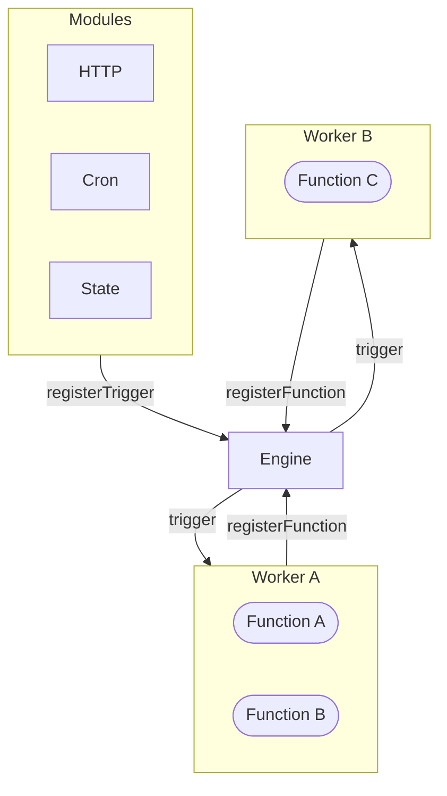

The Engine is the central orchestrator of a iii system. It maintains a registry of every connected Worker and every registered Function, and routes `trigger()` calls to the correct Worker — regardless of language, location, or runtime.



## Responsibilities

| Responsibility | Description |
|----------------|-------------|
| **Function registry** | Tracks all `registerFunction` calls across connected Workers |
| **Worker registry** | Tracks connected Workers, their status, and metadata |
| **Trigger dispatch** | Receives `trigger()` / `triggerVoid()` and routes to the correct Worker |
| **Module orchestration** | Loads and initializes Modules from `iii-config.yaml` |
| **Worker cleanup** | When a Worker disconnects, automatically removes all its registered functions and triggers |

## Configuration

The Engine is configured via `iii-config.yaml` at the root of your project.

### Ports

The Engine uses two separate ports:

| Port | Default | Purpose |
|------|---------|---------|
| Engine WebSocket | `49134` | Workers connect here via the SDK |
| HTTP API | `3111` | HTTP endpoints registered by the HTTP module |

```yaml
port: 49134   # WebSocket bridge port — workers connect here

modules:
  - class: modules::rest_api::RestApiModule
    config:
      port: 3111   # HTTP port for registered endpoints

  - class: modules::state::StateModule
    config:
      adapter:
        class: modules::state::adapters::KvStore
        config:
          store_method: file_based
          file_path: ./data/state

  - class: modules::queue::QueueModule
    config:
      adapter:
        class: modules::queue::BuiltinQueueAdapter

  - class: modules::observability::ObservabilityModule
    config:
      exporter: memory
```

## Discovery

The Engine exposes built-in functions for querying the current system state:

```typescript
// All registered functions across all workers
const functions = await iii.listFunctions()
// or: await iii.trigger('engine::functions::list', {})

// All connected workers and their status
const workers = await iii.listWorkers()
// or: await iii.trigger('engine::workers::list', {})
```

## Worker Disconnect Cleanup

When a Worker disconnects — whether cleanly or due to a crash — the Engine automatically:

- Removes all functions the Worker registered
- Cancels all in-flight invocations routed to that Worker
- Unregisters all triggers bound to that Worker's functions
- Fires the `engine::workers-available` trigger to notify other Workers

Workers reconnect automatically via the SDK's built-in reconnection logic. On reconnect, all `registerFunction` and `registerTrigger` calls are re-sent automatically.

## Architecture Agnostic

iii makes no distinction between cloud providers, colocated servers, serverless functions, or different languages. A Function registered on Worker A can `trigger()` a Function on Worker B without knowing where Worker B is running.

<Callout title="See also" type="info">
  For deployment options and production configuration, see [Deployment](/docs/advanced/deployment).
</Callout>
