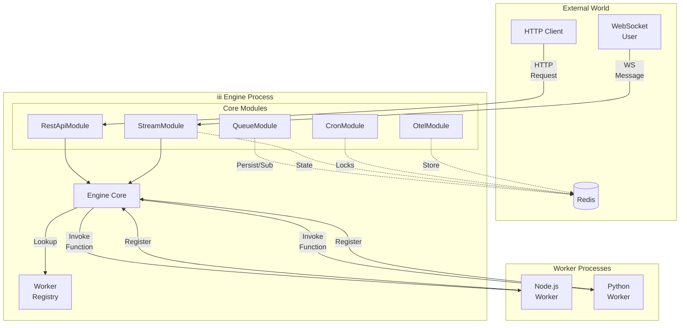

An iii system is made up of four components working together: the **Engine**, **Workers**, **Modules**, and **Context**.

```mermaid
graph TD
    subgraph "External World"
        Client[HTTP Client]
        Redis[(Redis)]
        User[WebSocket<br/>User]
    end

    subgraph "iii Engine Process"
        Core[Engine Core]
        Reg[Worker<br/>Registry]

        subgraph "Core Modules"
            API[RestApiModule]
            Stream[StreamModule]
            Log[OtelModule]
            Queue[QueueModule]
            Cron[CronModule]
        end
    end

    subgraph "Worker Processes"
        W1[Node.js<br/>Worker]
        W2[Python<br/>Worker]
    end

    Client -->|HTTP<br/>Request| API
    User -->|WS<br/>Message| Stream

    API --> Core
    Stream --> Core

    Core -->|Lookup| Reg
    Core -->|Invoke<br/>Function| W1
    Core -->|Invoke<br/>Function| W2

    W1 -->|Register| Core
    W2 -->|Register| Core

    Queue -.->|Persist/Sub| Redis
    Stream -.->|State| Redis
    Cron -.->|Locks| Redis
    Log -.->|Store| Redis
```