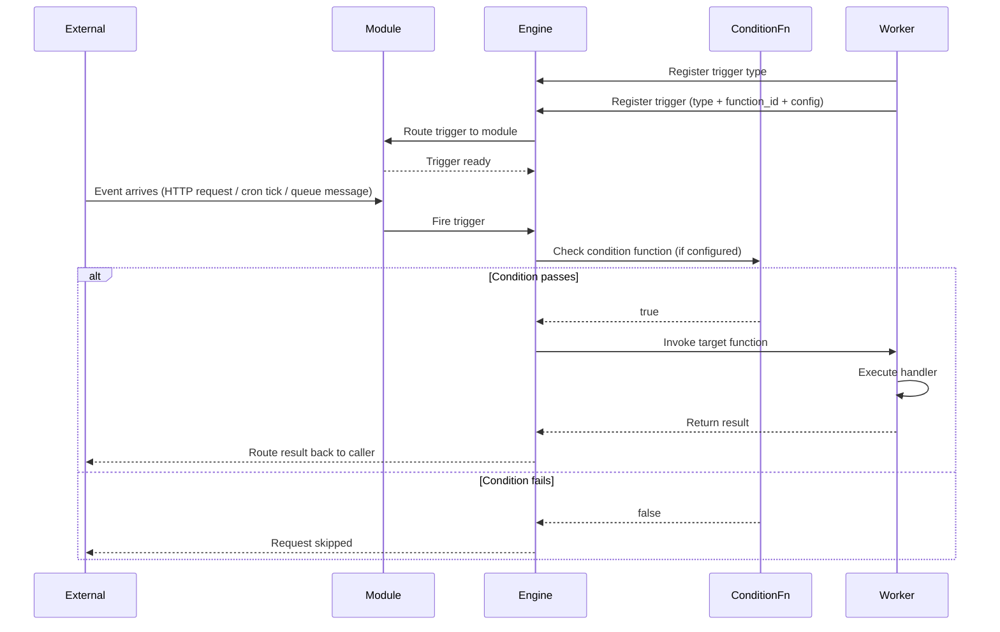
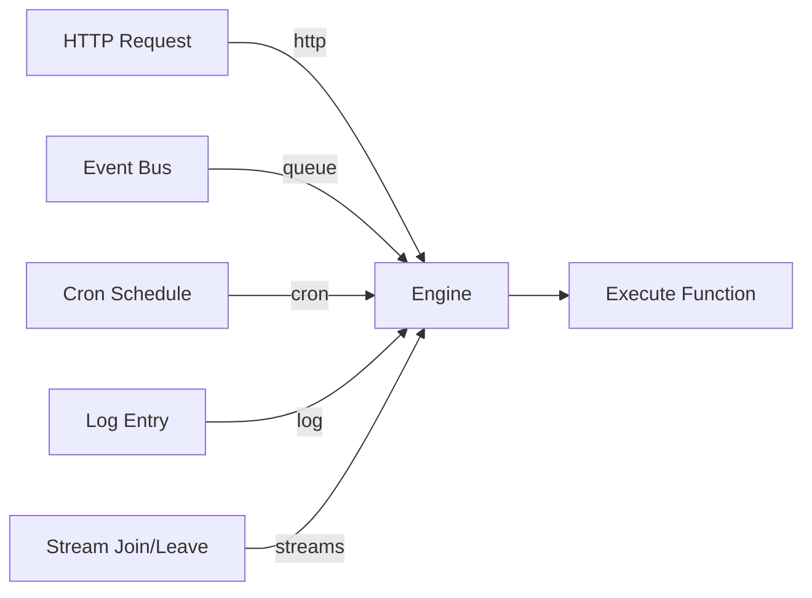
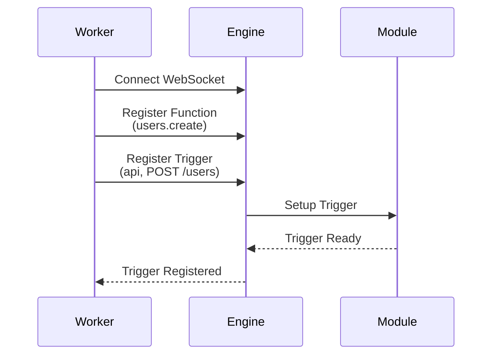
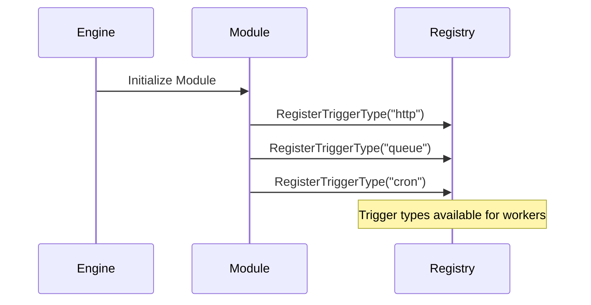
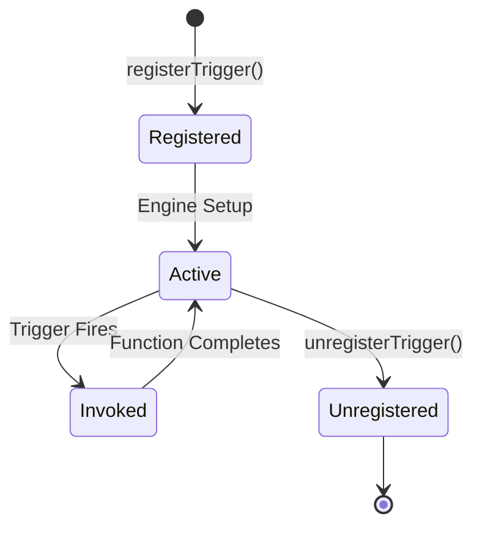

Triggers are entrypoints into a iii system. Each trigger defines the conditions that cause it to fire, a payload it accepts, and a function that it will invoke. When a trigger fires, the function is invoked with that payload.

## Trigger Components

A trigger consists of three parts:

1. **Trigger Type**: The mechanism that initiates execution (http, queue, cron, log, stream)
2. **Configuration**: Type-specific settings (path, schedule, topics)
3. **Function ID**: The function to invoke when triggered

<Tabs items={["Node / TypeScript", "Python", "Rust"]}>
<Tab value="Node / TypeScript">
```typescript
iii.registerTrigger({
  type: 'http',
  function_id: fn.id,
  config: {
    api_path: '/users',
    http_method: 'POST',
  },
})
```
</Tab>
<Tab value="Python">
```python
iii.register_trigger(
    type='http',
    function_id=fn.id,
    config={'api_path': '/users', 'http_method': 'POST'},
)
```
</Tab>
<Tab value="Rust">
```rust
iii.register_trigger("http", "users.create", json!({
    "api_path": "/users",
    "http_method": "POST"
}))?;
```
</Tab>
</Tabs>

## Trigger Pipeline



## Core Trigger Types



### HTTP Trigger (`http`)

Executes functions in response to HTTP requests.

**Provided by**: [HTTP Module](/docs/modules/module-http)

**Configuration:**

<Tabs items={["Node / TypeScript", "Python", "Rust"]}>
<Tab value="Node / TypeScript">
```typescript
{
  type: 'http',
  function_id: fn.id,
  config: {
    api_path: '/users/:id',
    http_method: 'GET'
  }
}
```
</Tab>
<Tab value="Python">
```python
{
    'type': 'http',
    'function_id': fn.id,
    'config': {
        'api_path': '/users/:id',
        'http_method': 'GET',
    },
}
```
</Tab>
<Tab value="Rust">
```rust
json!({
    "type": "http",
    "function_id": "users.get",
    "config": {
        "api_path": "/users/:id",
        "http_method": "GET"
    }
})
```
</Tab>
</Tabs>

**Input**: `ApiRequest` with path params, query params, body, headers

**Output**: `ApiResponse` with status_code, body, headers

**Conditions**: Optional. Add `_condition_path` to config with a function ID. The engine invokes it before the handler; if it returns `false`, the handler function is not called. See [Trigger Conditions](#trigger-conditions).

**Path Parameters**: Extract values from URL

```typescript
// Trigger: api_path: '/users/:userId/posts/:postId'
// Request: GET /users/123/posts/456
// Handler receives: { path_params: { userId: '123', postId: '456' } }
```

<Card icon={<Globe />} title="HTTP Module" href="/docs/modules/module-http">
  Learn more about the API trigger
</Card>

---

### Queue Trigger (`queue`)

Executes functions when events are published to subscribed topics.

**Provided by**: [Queue Module](/docs/modules/module-queue)

**Configuration:**

<Tabs items={["Node / TypeScript", "Python", "Rust"]}>
<Tab value="Node / TypeScript">
```typescript
{
  type: 'queue',
  function_id: fn.id,
  config: {
    topic: 'user.created'
  }
}
```
</Tab>
<Tab value="Python">
```python
{
    'type': 'queue',
    'function_id': fn.id,
    'config': {
        'topic': 'user.created',
    },
}
```
</Tab>
<Tab value="Rust">
```rust
json!({
    "type": "queue",
    "function_id": "users.on_created",
    "config": {
        "topic": "user.created"
    }
})
```
</Tab>
</Tabs>

**Input**: Event payload (any JSON data)

**Output**: Function result (optional, fire-and-forget pattern supported)

**Conditions**: Optional. Add `_condition_path` to config. See [Trigger Conditions](#trigger-conditions).

**Multiple Topics**: Register separate triggers for each topic.

<Card icon={<Zap />} title="Queue Module" href="/docs/modules/module-queue">
  Learn more about the Queue trigger
</Card>

---

### Cron Trigger (`cron`)

Executes functions on a time-based schedule using cron expressions.

**Provided by**: [Cron Module](/docs/modules/module-cron)

**Configuration:**

<Tabs items={["Node / TypeScript", "Python", "Rust"]}>
<Tab value="Node / TypeScript">
```typescript
{
  type: 'cron',
  function_id: fn.id,
  config: {
    expression: '0 2 * * *'
  }
}
```
</Tab>
<Tab value="Python">
```python
{
    'type': 'cron',
    'function_id': fn.id,
    'config': {
        'expression': '0 2 * * *',
    },
}
```
</Tab>
<Tab value="Rust">
```rust
json!({
    "type": "cron",
    "function_id": "reports.daily",
    "config": {
        "expression": "0 2 * * *"
    }
})
```
</Tab>
</Tabs>

**Input**: Cron execution context (timestamp, trigger info)

**Output**: Function result

**Conditions**: Optional. Add `_condition_path` to config. See [Trigger Conditions](#trigger-conditions).

**Cron Expression**: Standard 5-field format (minute hour day month weekday)

<Card icon={<Clock />} title="Cron Module" href="/docs/modules/module-cron">
  Learn more about the Cron trigger
</Card>

---

### Log Trigger (`log`)

Executes functions when log entries match specified criteria.

**Provided by**: [Observability Module](/docs/modules/module-observability)

**Configuration:**

<Tabs items={["Node / TypeScript", "Python", "Rust"]}>
<Tab value="Node / TypeScript">
```typescript
{
  type: 'log',
  function_id: fn.id,
  config: {
    level: 'error'
  }
}
```
</Tab>
<Tab value="Python">
```python
{
    'type': 'log',
    'function_id': fn.id,
    'config': {
        'level': 'error',
    },
}
```
</Tab>
<Tab value="Rust">
```rust
json!({
    "type": "log",
    "function_id": "alerts.on_error",
    "config": {
        "level": "error"
    }
})
```
</Tab>
</Tabs>

**Input**: Log entry with trace_id, message, level, function_name, date

**Output**: Function result (useful for alerting, metrics)

**Log Levels**: `info`, `warn`, `error`, `debug` (omit to receive all levels)

<Card icon={<FileText />} title="Observability Module" href="/docs/modules/module-observability">
  Learn more about the Log trigger
</Card>

---

### Stream Triggers (`stream:join`, `stream:leave`)

Executes functions when clients connect to or disconnect from streams.

**Provided by**: [Stream Module](/docs/modules/module-stream)

**Configuration:**

```typescript
{
  type: 'stream:join',
  function_id: fn.id,
  config: {}
}

{
  type: 'stream:leave',
  function_id: fn.id,
  config: {}
}
```

**Input**: Subscription info with stream_name, group_id, item_id, context

**Output**: Function result (useful for access control, analytics)

**Conditions**: Optional. Add `condition_function_id` to config for stream:join/stream:leave. See [Trigger Conditions](#trigger-conditions).

<Card icon={<Activity />} title="Stream Module" href="/docs/modules/module-stream">
  Learn more about Stream triggers
</Card>

## Trigger Type Comparison

| Trigger Type      | Use Case              | Synchronous | Multiple Subscribers    |
| ----------------- | --------------------- | ----------- | ----------------------- |
| **http**          | HTTP endpoints        | ✓ Yes       | ✗ No (1:1 mapping)      |
| **queue**         | Pub/sub messaging     | ✗ No        | ✓ Yes                   |
| **cron**          | Scheduled tasks       | ✗ No        | ✗ No (distributed lock) |
| **log**           | Log monitoring        | ✗ No        | ✓ Yes                   |
| **stream:join**  | Stream connections    | ✗ No        | ✓ Yes                   |
| **stream:leave** | Stream disconnections | ✗ No        | ✓ Yes                   |

## Registering Triggers

Triggers are registered by workers after establishing a connection to the engine:



**Step 1: Register Function**

First, register the function that will be invoked:

<Tabs items={["Node / TypeScript", "Python", "Rust"]}>
<Tab value="Node / TypeScript">
```typescript
const fn = iii.registerFunction({ id: 'users.create' }, async (data) => {
  return { id: '123', ...data }
})
```
</Tab>
<Tab value="Python">
```python
async def create_user(data):
    return {'id': '123', **data}

fn = iii.register_function('users.create', create_user)
```
</Tab>
<Tab value="Rust">
```rust
iii.register_function("users.create", |data: Value| async move {
    Ok(json!({"id": "123", "name": data["name"]}))
});
```
</Tab>
</Tabs>

**Step 2: Register Trigger**

Then, register a trigger that routes to that function:

<Tabs items={["Node / TypeScript", "Python", "Rust"]}>
<Tab value="Node / TypeScript">
```typescript
iii.registerTrigger({
  type: 'http',
  function_id: fn.id,
  config: {
    api_path: '/users',
    http_method: 'POST',
  },
})
```
</Tab>
<Tab value="Python">
```python
iii.register_trigger(
    type='http',
    function_id=fn.id,
    config={'api_path': '/users', 'http_method': 'POST'},
)
```
</Tab>
<Tab value="Rust">
```rust
iii.register_trigger("http", "users.create", json!({
    "api_path": "/users",
    "http_method": "POST"
}))?;
```
</Tab>
</Tabs>

**Step 3: Trigger Active**

The engine sets up the trigger in the appropriate module. When an HTTP POST request comes to `/users`, the `users.create` function will be invoked.

Trigger types are registered by core modules during engine initialization:



## Multiple Triggers to One Function

A single function can have multiple triggers:

<Tabs items={["Node / TypeScript", "Python", "Rust"]}>
<Tab value="Node / TypeScript">
```typescript
const fn = iii.registerFunction({ id: 'users.notify' }, async (data) => {
  await sendNotification(data)
})

iii.registerTrigger({
  type: 'http',
  function_id: fn.id,
  config: { api_path: '/notify', http_method: 'POST' },
})

iii.registerTrigger({
  type: 'queue',
  function_id: fn.id,
  config: { topic: 'user.created' },
})

iii.registerTrigger({
  type: 'cron',
  function_id: fn.id,
  config: { expression: '0 9 * * *' },
})
```
</Tab>
<Tab value="Python">
```python
async def notify(data):
    await send_notification(data)

fn = iii.register_function('users.notify', notify)

iii.register_trigger(
    type='http',
    function_id=fn.id,
    config={'api_path': '/notify', 'http_method': 'POST'},
)

iii.register_trigger(
    type='queue',
    function_id=fn.id,
    config={'topic': 'user.created'},
)

iii.register_trigger(
    type='cron',
    function_id=fn.id,
    config={'expression': '0 9 * * *'},
)
```
</Tab>
<Tab value="Rust">
```rust
iii.register_function("users.notify", |data: Value| async move {
    send_notification(&data).await;
    Ok(json!({}))
});

iii.register_trigger("http", "users.notify", json!({
    "api_path": "/notify",
    "http_method": "POST"
}))?;

iii.register_trigger("queue", "users.notify", json!({
    "topic": "user.created"
}))?;

iii.register_trigger("cron", "users.notify", json!({
    "expression": "0 9 * * *"
}))?;
```
</Tab>
</Tabs>

**Use Case**: Send notifications via API calls, events, or scheduled jobs using the same logic.

## Trigger Conditions

Triggers can optionally use a **condition function** to decide whether the handler should run. The engine invokes the condition with the trigger payload before the main handler. If it returns `false`, the handler is not invoked.

**Supported trigger types**: http, queue, cron, stream, state

### How It Works

1. Register a condition function that receives the same input as the handler and returns a boolean.
2. Add `_condition_path` to the trigger config for http, queue, and cron; use `condition_function_id` for state and stream triggers.
3. When the trigger fires, the engine calls the condition first. Only if it returns truthy does the handler run.

### Example: HTTP Trigger with Condition

<Tabs items={["Node / TypeScript", "Python", "Rust"]}>
<Tab value="Node / TypeScript">
```typescript
const conditionFn = iii.registerFunction(
  { id: 'conditions::requireVerified' },
  async (req) => req.headers?.['x-verified'] === 'true',
)

const fn = iii.registerFunction({ id: 'api::verifiedOnly' }, async (req) => ({
  status_code: 200,
  body: { message: 'Verified request' },
}))

iii.registerTrigger({
  type: 'http',
  function_id: fn.id,
  config: {
    api_path: '/verified',
    http_method: 'POST',
    _condition_path: conditionFn.id,
  },
})
```
</Tab>
<Tab value="Python">
```python
async def require_verified(req):
    return req.get('headers', {}).get('x-verified') == 'true'

condition_fn = iii.register_function('conditions::requireVerified', require_verified)

async def verified_only(req):
    return {'status_code': 200, 'body': {'message': 'Verified request'}}

fn = iii.register_function('api::verifiedOnly', verified_only)

iii.register_trigger(
    type='http',
    function_id=fn.id,
    config={
        'api_path': '/verified',
        'http_method': 'POST',
        '_condition_path': condition_fn.id,
    },
)
```
</Tab>
<Tab value="Rust">
```rust
iii.register_function("conditions::requireVerified", |req: Value| async move {
    let verified = req["headers"]["x-verified"].as_str() == Some("true");
    Ok(json!(verified))
});

iii.register_function("api::verifiedOnly", |_req: Value| async move {
    Ok(json!({"status_code": 200, "body": {"message": "Verified request"}}))
});

iii.register_trigger("http", "api::verifiedOnly", json!({
    "api_path": "/verified",
    "http_method": "POST",
    "_condition_path": "conditions::requireVerified"
}))?;
```
</Tab>
</Tabs>

### Example: Queue Trigger with Condition

<Tabs items={["Node / TypeScript", "Python", "Rust"]}>
<Tab value="Node / TypeScript">
```typescript
const conditionFn = iii.registerFunction(
  { id: 'conditions::highValue' },
  async (data) => (data?.amount ?? 0) > 1000,
)

const fn = iii.registerFunction({ id: 'orders::processHighValue' }, async (order) => {
  await processHighValueOrder(order)
  return {}
})

iii.registerTrigger({
  type: 'queue',
  function_id: fn.id,
  config: {
    topic: 'order.placed',
    _condition_path: conditionFn.id,
  },
})
```
</Tab>
<Tab value="Python">
```python
async def high_value(data):
    return (data.get('amount', 0)) > 1000

condition_fn = iii.register_function('conditions::highValue', high_value)

async def process_high_value(order):
    await process_high_value_order(order)
    return {}

fn = iii.register_function('orders::processHighValue', process_high_value)

iii.register_trigger(
    type='queue',
    function_id=fn.id,
    config={
        'topic': 'order.placed',
        '_condition_path': condition_fn.id,
    },
)
```
</Tab>
<Tab value="Rust">
```rust
iii.register_function("conditions::highValue", |data: Value| async move {
    let amount = data["amount"].as_f64().unwrap_or(0.0);
    Ok(json!(amount > 1000.0))
});

iii.register_function("orders::processHighValue", |order: Value| async move {
    process_high_value_order(&order).await;
    Ok(json!({}))
});

iii.register_trigger("queue", "orders::processHighValue", json!({
    "topic": "order.placed",
    "_condition_path": "conditions::highValue"
}))?;
```
</Tab>
</Tabs>

### Example: State Trigger with Condition

<Tabs items={["Node / TypeScript", "Python", "Rust"]}>
<Tab value="Node / TypeScript">
```typescript
const conditionFn = iii.registerFunction(
  { id: 'conditions::profileChanged' },
  async (event) => event.event_type === 'updated' && event.key === 'profile',
)

const fn = iii.registerFunction({ id: 'state::onProfileUpdate' }, async (event) => {
  console.log('Profile updated:', event.new_value)
  return {}
})

iii.registerTrigger({
  type: 'state',
  function_id: fn.id,
  config: {
    scope: 'users',
    condition_function_id: conditionFn.id,
  },
})
```
</Tab>
<Tab value="Python">
```python
async def profile_changed(event):
    return event.get('event_type') == 'updated' and event.get('key') == 'profile'

condition_fn = iii.register_function('conditions::profileChanged', profile_changed)

async def on_profile_update(event):
    print('Profile updated:', event.get('new_value'))
    return {}

fn = iii.register_function('state::onProfileUpdate', on_profile_update)

iii.register_trigger(
    type='state',
    function_id=fn.id,
    config={
        'scope': 'users',
        'condition_function_id': condition_fn.id,
    },
)
```
</Tab>
<Tab value="Rust">
```rust
iii.register_function("conditions::profileChanged", |event: Value| async move {
    let is_updated = event["event_type"].as_str() == Some("updated");
    let is_profile = event["key"].as_str() == Some("profile");
    Ok(json!(is_updated && is_profile))
});

iii.register_function("state::onProfileUpdate", |event: Value| async move {
    println!("Profile updated: {:?}", event["new_value"]);
    Ok(json!({}))
});

iii.register_trigger("state", "state::onProfileUpdate", json!({
    "scope": "users",
    "condition_function_id": "conditions::profileChanged"
}))?;
```
</Tab>
</Tabs>

### Config Keys by Trigger Type

| Trigger Type | Condition Config Key |
|--------------|----------------------|
| http | `_condition_path` |
| queue | `_condition_path` |
| cron | `_condition_path` |
| stream | `condition_function_id` |
| state | `condition_function_id` |

## Trigger Lifecycle



### Unregistering Triggers

Remove triggers dynamically. `registerTrigger` returns a trigger object with `unregister()`:

```typescript
const fn = iii.registerFunction({ id: 'api.temp' }, async () => ({ status_code: 200, body: {} }))
const trigger = iii.registerTrigger({
  type: 'http',
  function_id: fn.id,
  config: { api_path: '/temp', http_method: 'GET' },
})

trigger.unregister()
```

## Usage Patterns

### Webhook Handler

<Tabs items={["Node / TypeScript", "Python", "Rust"]}>
<Tab value="Node / TypeScript">
```typescript
const fn = iii.registerFunction({ id: 'webhooks.github' }, async (req) => {
  const event = req.headers?.['x-github-event']
  const payload = req.body

  await processGitHubWebhook(event, payload)

  return { status_code: 200, body: { received: true } }
})

iii.registerTrigger({
  type: 'http',
  function_id: fn.id,
  config: {
    api_path: '/webhooks/github',
    http_method: 'POST',
  },
})
```
</Tab>
<Tab value="Python">
```python
async def github_webhook(req):
    event = req.get('headers', {}).get('x-github-event')
    payload = req.get('body')

    await process_github_webhook(event, payload)

    return {'status_code': 200, 'body': {'received': True}}

fn = iii.register_function('webhooks.github', github_webhook)

iii.register_trigger(
    type='http',
    function_id=fn.id,
    config={
        'api_path': '/webhooks/github',
        'http_method': 'POST',
    },
)
```
</Tab>
<Tab value="Rust">
```rust
iii.register_function("webhooks.github", |req: Value| async move {
    let event = req["headers"]["x-github-event"].as_str().unwrap_or("");
    let payload = &req["body"];

    process_github_webhook(event, payload).await;

    Ok(json!({"status_code": 200, "body": {"received": true}}))
});

iii.register_trigger("http", "webhooks.github", json!({
    "api_path": "/webhooks/github",
    "http_method": "POST"
}))?;
```
</Tab>
</Tabs>

### Event Chain

<Tabs items={["Node / TypeScript", "Python", "Rust"]}>
<Tab value="Node / TypeScript">
```typescript
const processFn = iii.registerFunction({ id: 'orders.process' }, async (order) => {
  await saveOrder(order)
  await iii.trigger('enqueue', {
    topic: 'order.processed',
    data: order,
  })
})

iii.registerTrigger({
  type: 'queue',
  function_id: processFn.id,
  config: { topic: 'order.placed' },
})

const confirmFn = iii.registerFunction({ id: 'orders.sendConfirmation' }, async (order) => {
  await sendEmail(order.email, 'Order confirmed')
})

iii.registerTrigger({
  type: 'queue',
  function_id: confirmFn.id,
  config: { topic: 'order.processed' },
})
```
</Tab>
<Tab value="Python">
```python
async def process_order(order):
    await save_order(order)
    await iii.trigger('enqueue', {
        'topic': 'order.processed',
        'data': order,
    })

process_fn = iii.register_function('orders.process', process_order)

iii.register_trigger(
    type='queue',
    function_id=process_fn.id,
    config={'topic': 'order.placed'},
)

async def send_confirmation(order):
    await send_email(order['email'], 'Order confirmed')

confirm_fn = iii.register_function('orders.sendConfirmation', send_confirmation)

iii.register_trigger(
    type='queue',
    function_id=confirm_fn.id,
    config={'topic': 'order.processed'},
)
```
</Tab>
<Tab value="Rust">
```rust
iii.register_function("orders.process", |order: Value| async move {
    save_order(&order).await;
    iii.trigger("enqueue", json!({
        "topic": "order.processed",
        "data": order,
    })).await?;
    Ok(json!(null))
});

iii.register_trigger("queue", "orders.process", json!({
    "topic": "order.placed"
}))?;

iii.register_function("orders.sendConfirmation", |order: Value| async move {
    send_email(order["email"].as_str().unwrap_or(""), "Order confirmed").await;
    Ok(json!(null))
});

iii.register_trigger("queue", "orders.sendConfirmation", json!({
    "topic": "order.processed"
}))?;
```
</Tab>
</Tabs>

### Scheduled Cleanup

<Tabs items={["Node / TypeScript", "Python", "Rust"]}>
<Tab value="Node / TypeScript">
```typescript
const fn = iii.registerFunction({ id: 'maintenance.cleanup' }, async () => {
  const deleted = await deleteOldRecords()
  logger.info(`Deleted ${deleted} old records`)
})

iii.registerTrigger({
  type: 'cron',
  function_id: fn.id,
  config: {
    expression: '0 3 * * *',
  },
})
```
</Tab>
<Tab value="Python">
```python
async def cleanup():
    deleted = await delete_old_records()
    logger.info(f'Deleted {deleted} old records')

fn = iii.register_function('maintenance.cleanup', cleanup)

iii.register_trigger(
    type='cron',
    function_id=fn.id,
    config={
        'expression': '0 3 * * *',
    },
)
```
</Tab>
<Tab value="Rust">
```rust
iii.register_function("maintenance.cleanup", |_: Value| async move {
    let deleted = delete_old_records().await;
    info!("Deleted {} old records", deleted);
    Ok(json!(null))
});

iii.register_trigger("cron", "maintenance.cleanup", json!({
    "expression": "0 3 * * *"
}))?;
```
</Tab>
</Tabs>

## Best Practices

<AccordionGroup>
  <Accordion title="Use Descriptive Trigger IDs">
    Provide unique IDs for easier management:

    ```typescript
    const trigger = iii.registerTrigger({
      type: 'http',
      function_id: fn.id,
      config: { api_path: '/users', http_method: 'POST' }
    })
    ```

  </Accordion>

  <Accordion title="Match Function Capabilities">
    Ensure trigger configuration matches what the function expects:

    ```typescript
    const fn = iii.registerFunction({ id: 'users.create' }, async ({ name, email }) => { /* ... */ })

    iii.registerTrigger({
      type: 'http',
      function_id: fn.id,
      config: { api_path: '/users', http_method: 'POST' }
    })
    ```

  </Accordion>

  <Accordion title="Namespace Your Paths">
    Use consistent path patterns:

    ```typescript
    // Good: Organized, versioned
    api_path: '/api/v1/users'
    api_path: '/api/v1/orders'

    // Avoid: Inconsistent
    api_path: '/getUsers'
    api_path: '/order-list'
    ```

  </Accordion>

  <Accordion title="Handle Trigger Errors">
    Functions should handle errors gracefully:

    ```typescript
    iii.registerFunction({ id: 'api.create' }, async (req) => {
      try {
        const result = await createResource(req.body)
        return { status_code: 201, body: result }
      } catch (error) {
        return {
          status_code: 400,
          body: { error: error.message }
        }
      }
    })
    ```

  </Accordion>
</AccordionGroup>

## Custom Trigger Types

Modules can register custom trigger types by implementing the trigger interface:

```rust
pub struct CustomModule {
    // Module state
}

impl CoreModule for CustomModule {
    fn name(&self) -> &str {
        "custom"
    }

    async fn register_trigger_type(&self, registry: &TriggerRegistry) {
        registry.register("custom:trigger", CustomTriggerHandler);
    }
}
```

## Next Steps

<Card icon={<Blocks />} title="Modules" href="/docs/modules">
  Explore modules that provide trigger types
</Card>
