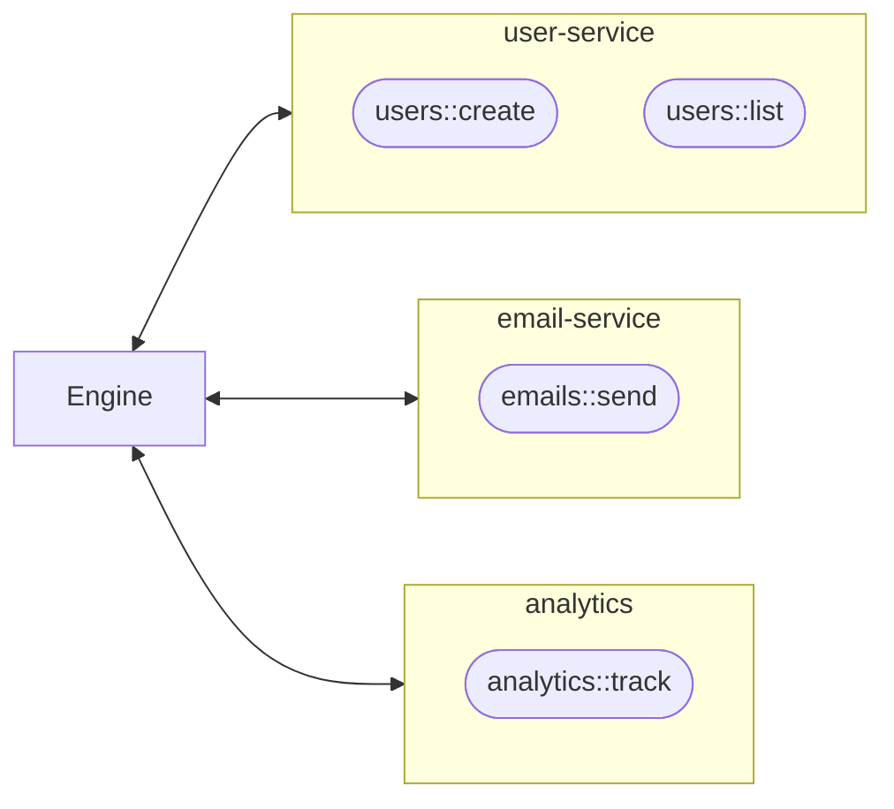

A Worker is any process that connects to the iii Engine over WebSocket using an SDK and registers Functions. The Engine routes incoming triggers to the correct Worker, which executes the handler and optionally returns a result.

Workers are independent processes — they can be written in any language, run anywhere, and crash without affecting other Workers.



## Creating a Worker

<Tabs items={["TypeScript", "Python", "Rust"]}>
<Tab value="TypeScript">
```typescript
import { init } from 'iii-sdk'

const iii = init('ws://localhost:49134', {
  workerName: 'user-service',
})

iii.registerFunction(
  { id: 'users::create' },
  async (data) => {
    const user = { id: crypto.randomUUID(), ...data }
    iii.triggerVoid('emails::welcome', { to: user.email })
    return user
  }
)
```
</Tab>
<Tab value="Python">
```python
import asyncio
from iii import III, InitOptions

async def main():
    iii = III('ws://localhost:49134', options=InitOptions(worker_name='user-service'))

    async def create_user(data):
        import uuid
        user = {'id': str(uuid.uuid4()), **data}
        iii.trigger_void('emails::welcome', {'to': user['email']})
        return user

    iii.register_function('users::create', create_user)
    await iii.connect()

asyncio.run(main())
```
</Tab>
<Tab value="Rust">
```rust
use iii::III;
use serde_json::{json, Value};
use std::sync::Arc;

let iii = Arc::new(III::new("ws://localhost:49134"));
let iii_clone = iii.clone();

iii.register_function("users::create", move |data: Value| {
    let iii = iii_clone.clone();
    async move {
        let user = json!({ "id": uuid::Uuid::new_v4().to_string(), "email": data["email"] });
        iii.trigger_void("emails::welcome", json!({"to": user["email"]}))?;
        Ok(user)
    }
});

iii.connect().await?;
```
</Tab>
</Tabs>

## What Workers Do

| Responsibility | Description |
|----------------|-------------|
| **Function hosting** | Register Functions with the Engine and execute them when triggered |
| **SDK connection** | Connect to the Engine via WebSocket, auto-reconnect on disconnect |
| **Language runtime** | Run in their own process — TypeScript, Python, Rust, or any language with an SDK |
| **Isolation** | Independent processes — a crash in one Worker doesn't affect others |

## Init Options

The second argument to `init()` configures the Worker's behavior:

| Option | Type | Default | Description |
|--------|------|---------|-------------|
| `workerName` | `string` | `${hostname}:${pid}` | Name shown in the iii Console and `listWorkers()` |
| `invocationTimeoutMs` | `number` | `30000` | Default timeout for `trigger()` calls in milliseconds |
| `enableMetricsReporting` | `boolean` | `true` | Report CPU, memory, and event loop metrics to the Engine |
| `reconnectionConfig` | `object` | see below | WebSocket reconnection behavior |
| `otel` | `object` | auto | OpenTelemetry configuration. Set `{ enabled: false }` to disable |

### Reconnection Config

Workers reconnect automatically on disconnect using exponential backoff:

| Field | Default | Description |
|-------|---------|-------------|
| `initialDelayMs` | `1000` | First retry delay |
| `maxDelayMs` | `30000` | Maximum retry delay cap |
| `backoffMultiplier` | `2` | Multiplier applied to delay each attempt |
| `jitterFactor` | `0.3` | Random jitter 0–1 to prevent thundering herd |
| `maxRetries` | `-1` | Maximum attempts. `-1` = infinite |

```typescript
const iii = init('ws://localhost:49134', {
  workerName: 'user-service',
  invocationTimeoutMs: 10000,
  reconnectionConfig: {
    initialDelayMs: 500,
    maxDelayMs: 10000,
    maxRetries: 10,
  },
})
```

## Worker Lifecycle

When a Worker connects, the SDK sends its metadata to the Engine via `engine::workers::register`:

```
runtime: 'node' | 'python' | 'rust'
version: SDK version
name: workerName
os: platform + arch
```

The Engine assigns a `worker_id` and the Worker's status transitions through:

```
connecting → connected → available / busy → disconnected
```

On disconnect — clean or crash — the Engine automatically removes all the Worker's registered Functions and Triggers. On reconnect, the SDK re-registers everything automatically.

## Worker Metadata

You can inspect all connected Workers at runtime:

```typescript
const workers = await iii.listWorkers()
// returns WorkerInfo[] with: id, name, runtime, version, os,
// status, connected_at_ms, function_count, functions[], active_invocations
```

<Callout title="See also" type="info">
  For details on building and deploying Workers in production, see the [Quickstart tutorial](/docs/tutorials/quickstart) or the [SDK Reference](/docs/api-reference/iii-sdk).
</Callout>
