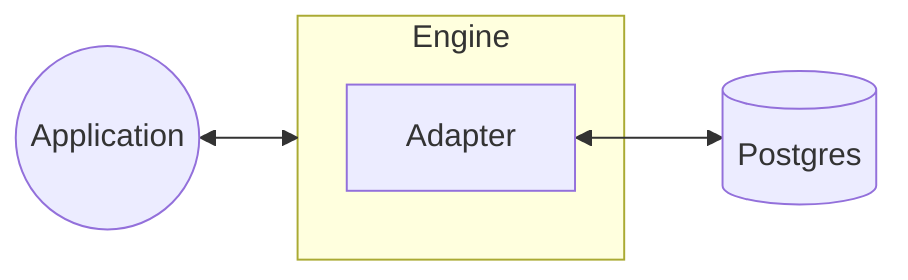

Adapters are simple interfaces that connect the Engine to services. This interface allows the Engine to share new integrations across your backend application with zero additional effort.

Adapters themselves are implemented inside Modules which actually do most of the heavy lifting.

