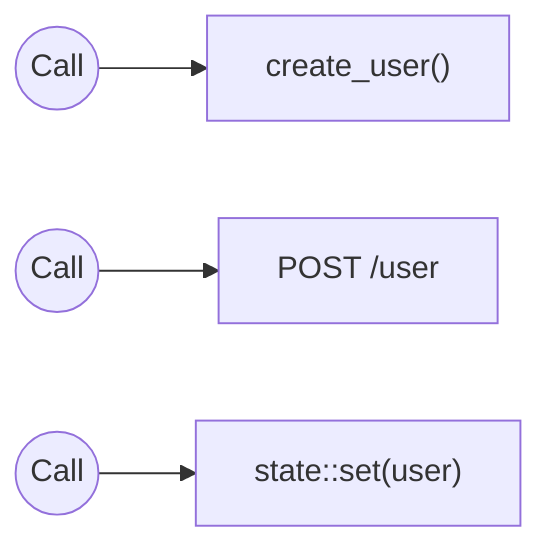

Call runs any Function registered with the Engine. It doesn't matter where the function lives, what language it's written in, or how it was registered.

The result is a unified way to invoke any functionality accessible to the Engine.

<Callout title="Functions?" type="info">
  A Function is anything that can receive a request and (optionally) return a response. Some examples that meet this
  definition are normal methods, http endpoints, state updates, and database mutations.
</Callout>

