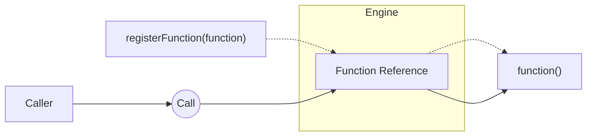

Call runs any function registered with the Engine regardless of where it lives, what language it's written in,
or how it was registered.

Without Call, invoking a function across services means knowing its location, protocol, and interface.
Call removes that burden by routing every invocation through the Engine, which already holds a reference to the function.
The developer supplies the intent; the Engine handles the rest.

<Cards>
  <Card icon={<Terminal />} title="Quickstart" href={`/docs/tutorials/quickstart`}>
    Build your first application and see Call and Function Registration in action.
  </Card>
  <Card icon={<LayoutTemplate />} title="Registration" href={`/docs/concepts/registration`}>
    Learn how functions become available to the Engine for Call to invoke.
  </Card>
</Cards>
