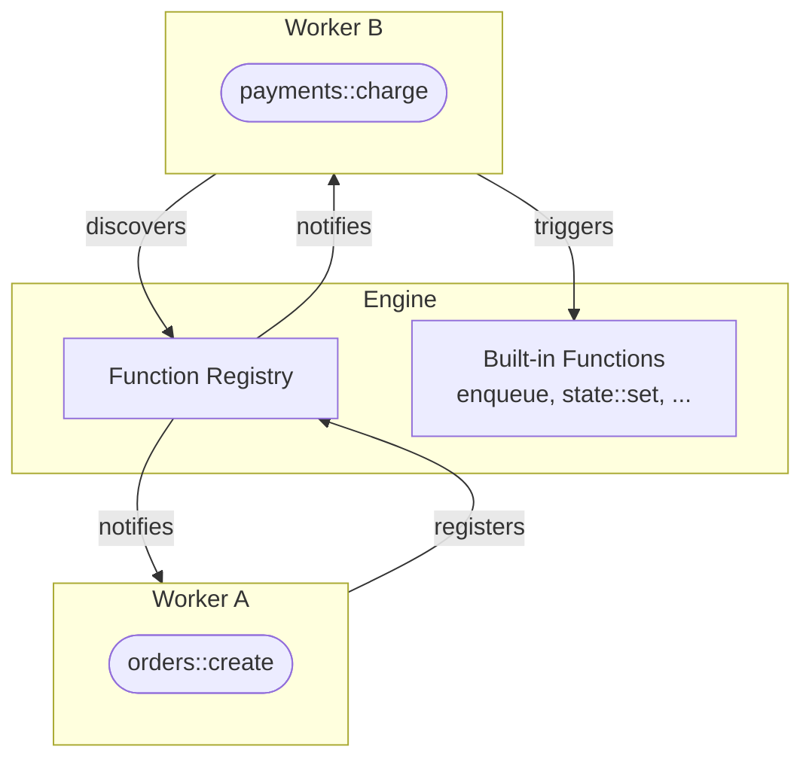

When a worker connects, it can see every function registered by every other worker, plus built-in functions the engine provides. No configuration files, no service registries. The engine maintains a live registry and notifies all workers when functions appear or disappear.

<Callout title="Why Discovery matters" type="info">
  Instead of importing a Redis client, a queue library, and a WebSocket server, you `trigger()` built-in functions. The engine manages the infrastructure. Your code has zero infrastructure dependencies.
</Callout>



## Runtime Discovery APIs

Query the engine to discover what is currently registered across all workers:

<Tabs items={["TypeScript", "Python", "Rust"]}>
<Tab value="TypeScript">
```typescript
const functions = await iii.listFunctions()

const workers = await iii.listWorkers()

iii.onFunctionsAvailable((functions) => {
  console.log('Available functions:', functions.map(f => f.function_id))
})
```
</Tab>
<Tab value="Python">
```python
functions = await iii.list_functions()

workers = await iii.list_workers()

@iii.on_functions_available
async def on_change(functions):
    print('Available functions:', [f.function_id for f in functions])
```
</Tab>
<Tab value="Rust">
```rust
let functions = iii.list_functions().await?;

let workers = iii.list_workers().await?;

iii.on_functions_available(|functions| {
    println!("Available: {:?}", functions.iter().map(|f| &f.function_id).collect::<Vec<_>>());
});
```
</Tab>
</Tabs>

## Built-in Functions

The engine provides built-in functions through its modules. Available to every worker on connection, no registration needed.

| Function | Module | Purpose |
|----------|--------|---------|
| `enqueue` | Queue | Publish a message to a topic |
| `state::set` | State | Store a value by scope + key |
| `state::get` | State | Retrieve a value by scope + key |
| `state::list` | State | List values in a scope |
| `state::delete` | State | Delete a value |
| `state::list_groups` | State | List all state scopes |
| `stream::set` | Stream | Set data on a real-time stream |
| `stream::get` | Stream | Get current stream data |
| `stream::delete` | Stream | Remove stream data |
| `stream::list` | Stream | List entries in a stream |

```typescript
await iii.trigger('enqueue', {
  topic: 'user.created',
  data: { userId: '123' },
})

await iii.trigger('state::set', {
  scope: 'users',
  key: '123',
  data: { name: 'Alice' },
})
```

See the [Modules](/docs/modules) pages for full details on each built-in function.

## What This Changes

Traditional approach: import Express for APIs, BullMQ for queues, ioredis for state, ws for WebSocket. Each library has its own connection, configuration, and failure mode. Your application code is tightly coupled to specific infrastructure.

With iii: connect to the engine and trigger built-in functions. Need a queue? `trigger('enqueue', {...})`. Need state? `trigger('state::set', {...})`. Need real-time? `trigger('stream::set', {...})`. Your code has zero infrastructure dependencies.

Want to swap the queue adapter from the built-in implementation to RabbitMQ? Change the engine configuration. Your application code stays the same.

<Cards>
  <Card icon={<Code />} title="Function & Trigger" href="/docs/concepts/function-and-trigger">
    How Functions are registered and triggered across workers and languages.
  </Card>
  <Card icon={<FileText />} title="SDK Reference" href="/docs/api-reference/iii-sdk">
    Full API reference for listFunctions, listWorkers, and onFunctionsAvailable.
  </Card>
  <Card icon={<Settings />} title="Modules" href="/docs/modules">
    Details on each built-in function: State, Queue, Stream, and more.
  </Card>
</Cards>
