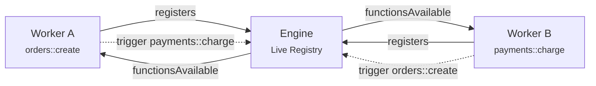

When a worker connects to the engine, it receives the full list of functions registered across every other worker. When a new worker connects and registers functions, every existing worker gets notified. When a worker disconnects, its functions disappear and everyone is notified again.

No configuration files. No service registries. No hardcoded URLs. The engine maintains a live registry and pushes changes to every connected worker in real time.

<Callout title="Why Discovery matters" type="info">
  In traditional architectures, services need to know where other services live — through config files, DNS, service meshes, or client libraries. With iii, you just `trigger()` a function by name. The engine knows which worker owns it and routes the invocation. Workers can come and go, scale up and down, and every other worker adapts automatically.
</Callout>

## How It Works



Every time a worker connects, disconnects, or registers new functions, the engine broadcasts an updated `functionsAvailable` message to all connected workers.

## Listening for Changes

Subscribe to discovery events to react when the system topology changes:

<Tabs groupId="language" persist items={["Node / TypeScript", "Python", "Rust"]}>
<Tab value="Node / TypeScript">
```typescript
iii.onFunctionsAvailable((functions) => {
  console.log('Available functions:', functions.map(f => f.function_id))
})
```
</Tab>
<Tab value="Python">
```python
@iii.on_functions_available
async def on_change(functions):
    print('Available functions:', [f.function_id for f in functions])
```
</Tab>
<Tab value="Rust">
```rust
iii.on_functions_available(|functions| {
    println!("Available: {:?}", functions.iter().map(|f| &f.function_id).collect::<Vec<_>>());
});
```
</Tab>
</Tabs>

## Querying the Registry

You can also query the current state of the registry at any time:

<Tabs groupId="language" persist items={["Node / TypeScript", "Python", "Rust"]}>
<Tab value="Node / TypeScript">
```typescript
const functions = await iii.listFunctions()

const workers = await iii.listWorkers()
```
</Tab>
<Tab value="Python">
```python
functions = await iii.list_functions()

workers = await iii.list_workers()
```
</Tab>
<Tab value="Rust">
```rust
let functions = iii.list_functions().await?;

let workers = iii.list_workers().await?;
```
</Tab>
</Tabs>

## What This Changes

Traditional architectures require services to know about each other ahead of time. You configure service URLs, set up service meshes, maintain API gateways, and redeploy when topology changes. Adding a new service means updating every service that needs to call it.

With iii, a new worker connects and registers its functions. Every other worker immediately knows those functions exist and can trigger them. No redeployment. No configuration changes. No coordination.

This means you can:
- **Scale workers independently** — spin up more instances of a worker and the engine load-balances across them
- **Deploy new capabilities** — connect a new worker with new functions and they're instantly available to the entire system
- **Remove services cleanly** — disconnect a worker and its functions disappear from the registry, no stale references

The engine also provides built-in functions through its modules (like `enqueue`, `state::set`, `stream::set`). These are always available and listed in the [Modules](/docs/modules) pages. But the real power of Discovery is the dynamic part — your workers forming a living system that adapts as it runs.

<Cards>
  <Card icon={<Code />} title="Function & Trigger" href="/docs/concepts/function-and-trigger">
    How Functions are registered and triggered across workers and languages.
  </Card>
  <Card icon={<FileText />} title="SDK Reference" href="/docs/api-reference/iii-sdk">
    Full API reference for listFunctions, listWorkers, and onFunctionsAvailable.
  </Card>
  <Card icon={<Settings />} title="Modules" href="/docs/modules">
    Details on each built-in function: State, Queue, Stream, and more.
  </Card>
</Cards>
