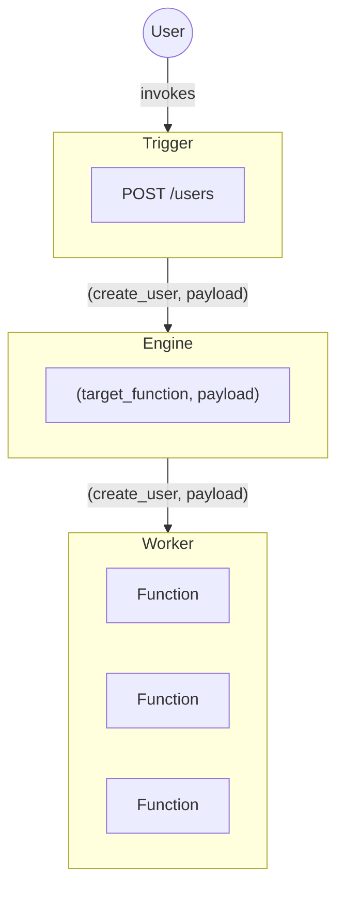

The Engine is primarily responsible for routing requests. When a trigger invokes a Function the Engine itself handles the routing and sends that message to a Worker that contains that Function.

The iii Engine is the central orchestrator of a iii powered application. It knows where every part of your application lives and routes requests to those parts.

This architecture is what enables your application code to be decoupled from the architecture it runs on. iii is completely architecture agnostic and it makes no distinction between an cloud providers, colocated servers, serverless functions, domains, databases, and already existing architecture.

<Callout title="Context" type="info">
  In addition to orchestration the Engine also keeps track of the system's Context. This is what enables application
  developers to have a shared context and access anything that the Engine has access to.
</Callout>
