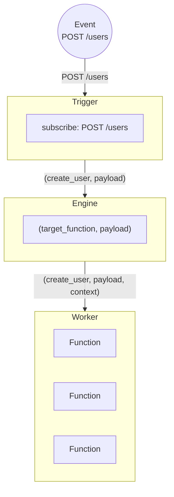

Whenever a Trigger fires it tells the Engine a target Function to call and the payload to send it. The Engine itself handles the routing and sends that message along with a context on to a Worker that contains that Function and can handle the request.

The iii engine is the central orchestrator of a iii powered application. It knows where every part of your application lives and routes requests to those parts. This architecture is what enables your application code to be decoupled from the architecture it runs on. iii is architecture agnostic and it makes no difference if an application is split across cloud providers, colocated servers with long running processes, remote functions, databases, message queues, and inside ancient stacks.

<Callout title="Context" type="info">
  In addition to orchestration the Engine also keeps track of the system's Context. This is what enables application
  developers to have a shared context and access anything that the Engine has access to.
</Callout>
