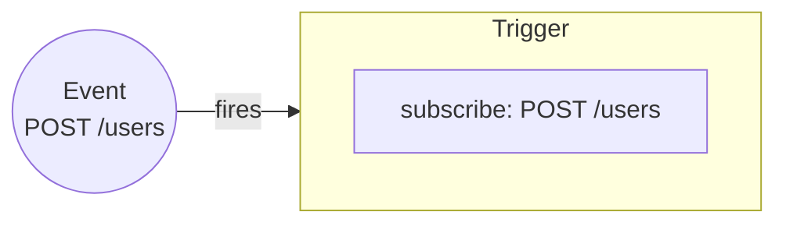

Events are the entrypoint of a iii-powered application.

However, for iii an event is much broader than the common definition. Here an event is anything that causes something to happen. That "event" can be an HTTP request, a cron job, a traditional event, a database mutation, or anything else.

When an event is received by the iii engine it causes any number of Triggers to fire provided that the Trigger is subscribed to it.

<Callout title="Unrolling the backend" type="info">
  Due to the way iii is structured there can be any amount of "entrypoints" into a iii application. This makes
  modification simpler, reduces complexity, and allows the adoption of any programming pattern into an existing
  application.
</Callout>
