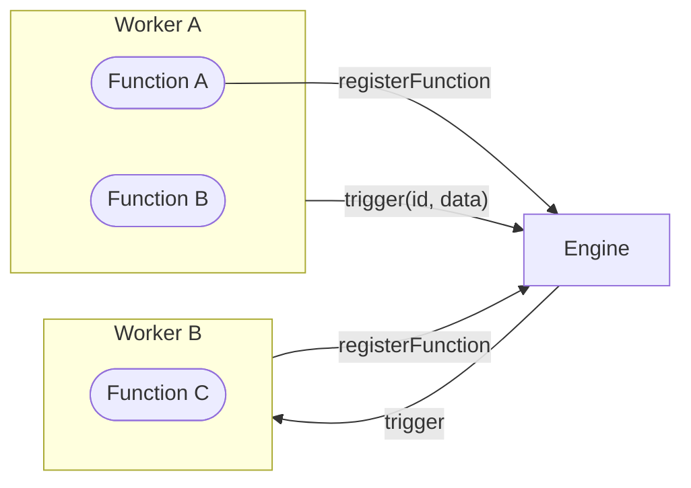

A **Function** is an async handler identified by a string ID. Register it with the engine over WebSocket and it becomes triggerable from anywhere in the system — other workers, other languages, other machines.

A **Trigger** is what causes a Function to run — either explicitly from code, or automatically from an event source.

<Callout title="Everything is a Function" type="info">
  HTTP endpoints, queue consumers, cron jobs, state operations — they're all Functions under the hood. Once registered, they're all the same first-class citizen.
</Callout>



## Register a Function

<Tabs items={["TypeScript", "Python", "Rust"]}>
<Tab value="TypeScript">
```typescript
import { init } from 'iii-sdk'

const iii = init('ws://localhost:49134')

iii.registerFunction(
  { id: 'math::add', description: 'Add two numbers' },
  async (input) => {
    return { result: input.a + input.b }
  }
)
```
</Tab>
<Tab value="Python">
```python
from iii import III

iii = III('ws://localhost:49134')

async def add(data):
    return {'result': data['a'] + data['b']}

iii.register_function('math::add', add)
await iii.connect()
```
</Tab>
<Tab value="Rust">
```rust
use iii_sdk::III;
use serde_json::json;

#[tokio::main]
async fn main() -> Result<(), Box<dyn std::error::Error>> {
    let iii = III::new("ws://127.0.0.1:49134");
    iii.connect().await?;

    iii.register_function("math::add", |input| async move {
        let a = input["a"].as_i64().unwrap_or(0);
        let b = input["b"].as_i64().unwrap_or(0);
        Ok(json!({ "result": a + b }))
    });

    loop {
        tokio::time::sleep(std::time::Duration::from_secs(60)).await;
    }
}
```
</Tab>
</Tabs>

Once registered, `math::add` is triggerable from anywhere in the system.

## Trigger a Function

Three ways to trigger a registered Function:

| Method | Returns | Use when |
|--------|---------|----------|
| `trigger(id, data)` | The function's result | You need the response |
| `triggerVoid(id, data)` | Nothing | Fire-and-forget, don't block |
| `registerTrigger(config)` | n/a | Automatic: HTTP, cron, queue, state changes, etc. |

### `trigger()` — await the result

```typescript
const result = await iii.trigger('math::add', { a: 2, b: 3 })
// result = { result: 5 }
```

### `triggerVoid()` — fire and forget

```typescript
iii.triggerVoid('enqueue', {
  topic: 'user.created',
  data: { userId: '123' },
})
// returns immediately
```

### `registerTrigger()` — automatic triggering

Bind a Function to an event source. The engine triggers it automatically when the event fires:

<Tabs items={["HTTP", "Cron", "State"]}>
<Tab value="HTTP">
```typescript
iii.registerTrigger({
  type: 'http',
  function_id: 'orders::create',
  config: { api_path: '/orders', http_method: 'POST' },
})
// POST /orders now triggers orders::create
```
</Tab>
<Tab value="Cron">
```typescript
iii.registerTrigger({
  type: 'cron',
  function_id: 'reports::generate',
  config: { expression: '0 * * * *' },
})
// triggers reports::generate every hour
```
</Tab>
<Tab value="State">
```typescript
iii.registerTrigger({
  type: 'state',
  function_id: 'audit::log',
  config: { scope: 'orders', key: 'status' },
})
// triggers audit::log when orders::status changes
```
</Tab>
</Tabs>

<Callout type="info" title="Queue uses enqueue">
  Queue messaging uses `enqueue` — a built-in function, no trigger registration needed: `iii.trigger('enqueue', { topic: 'user.created', data: {...} })`. See the [Queue module](/docs/modules/module-queue) for details.
</Callout>

`registerTrigger()` returns a handle so you can remove the trigger later:

```typescript
const t = iii.registerTrigger({ type: 'http', function_id: 'fn::id', config: { api_path: '/ping', http_method: 'GET' } })
t.unregister()
```

## Trigger Types

| Type | Fires when | Config fields | Module |
|------|-----------|---------------|--------|
| `http` | HTTP request received | `api_path`, `http_method` | REST API |
| `cron` | Schedule fires | `expression` | Cron |
| `queue` | Message published to a topic | `topic` | Queue |
| `subscribe` | PubSub message on a topic | `topic` | PubSub |
| `state` | State value changes | `scope`, `key` | State |
| `stream` | Stream value changes | `stream_name`, `group_id`, `item_id` | Stream |
| `stream:join` | Client connects to stream | — | Stream |
| `stream:leave` | Client disconnects from stream | — | Stream |
| `log` | Log entry emitted | `level` | Observability |

## Cross-language triggering

Any worker can trigger any Function regardless of language. The engine handles serialization and routing:

```python
# Python worker triggering a TypeScript function
result = await iii.trigger('math::add', {'a': 2, 'b': 3})
```

```rust
// Rust worker triggering the same function
let result = iii.trigger("math::add", json!({"a": 2, "b": 3})).await?;
```

The triggering function doesn't know or care what language the target is written in.

## Discovery

When a Worker connects, the engine assigns it a `worker_id` and the SDK re-registers all functions and triggers automatically. You can query the engine to discover what's currently registered across all workers:

```typescript
// List all registered functions across all workers
const functions = await iii.listFunctions()

// List all connected workers
const workers = await iii.listWorkers()

// React whenever the function registry changes
iii.onFunctionsAvailable((functions) => {
  console.log('Available functions:', functions.map(f => f.function_id))
})
```

This is useful for building dynamic workflows, dashboards, or routing logic that depends on what's currently available in the system.

## Built-in Functions

The engine provides built-in Functions through its modules — no registration needed, trigger them directly:

| Function | Module | Purpose |
|----------|--------|---------|
| `enqueue` | Queue | Publish a message to a topic |
| `state::set` | State | Store a value by scope + key |
| `state::get` | State | Retrieve a value by scope + key |
| `state::list` | State | List values in a scope |
| `state::delete` | State | Delete a value |
| `state::list_groups` | State | List all state scopes |
| `stream::set` | Stream | Set data on a real-time stream |
| `stream::get` | Stream | Get current stream data |
| `stream::delete` | Stream | Remove stream data |
| `stream::list` | Stream | List entries in a stream |

```typescript
await iii.trigger('enqueue', {
  topic: 'user.created',
  data: { userId: '123' },
})

await iii.trigger('state::set', {
  scope: 'users',
  key: '123',
  data: { name: 'Alice' },
})
```

## Function IDs

Function IDs use a `namespace::name` convention:

```
math::add
orders::process
notifications::send
```

The `engine::` prefix is reserved for internal engine functions.

<Cards>
  <Card icon={<Code />} title="SDK Reference" href="/docs/api-reference/iii-sdk">
    Full API reference for registerFunction, trigger, triggerVoid, and more.
  </Card>
  <Card icon={<Terminal />} title="Quickstart" href="/docs/tutorials/quickstart">
    Start building with Functions and Triggers.
  </Card>
</Cards>
