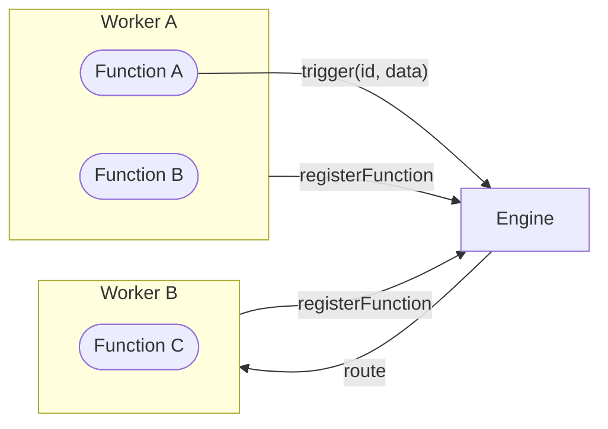

A Function is an async handler identified by a string ID. You write it in any language (TypeScript, Python, Rust), register it with the engine over WebSocket, and it becomes callable from **anywhere** in the system — other workers, other languages, other machines. The engine handles routing, serialization, and delivery.

<Callout title="Everything is a Function" type="info">
  HTTP endpoints, queue consumers, cron jobs, state operations — they're all Functions under the hood. A legacy API, a serverless function, or a simple local handler all become the same first-class citizen once registered.
</Callout>



## Register a Function

<Tabs items={["TypeScript", "Python", "Rust"]}>
<Tab value="TypeScript">
```typescript
import { init } from 'iii-sdk'

const iii = init('ws://localhost:49134')

iii.registerFunction(
  { id: 'math::add', description: 'Add two numbers' },
  async (input) => {
    return { result: input.a + input.b }
  }
)
```
</Tab>
<Tab value="Python">
```python
from iii import III

iii = III('ws://localhost:49134')

async def add(data):
    return {'result': data['a'] + data['b']}

iii.register_function('math::add', add)
await iii.connect()
```
</Tab>
<Tab value="Rust">
```rust
use iii::III;
use serde_json::json;

let iii = III::new("ws://localhost:49134");

iii.register_function("math::add", |input| async move {
    let a = input["a"].as_i64().unwrap_or(0);
    let b = input["b"].as_i64().unwrap_or(0);
    Ok(json!({ "result": a + b }))
});

iii.connect().await?;
```
</Tab>
</Tabs>

Once registered, `math::add` is available to the entire system.

## Use a Function

There are three ways to invoke a registered Function:

### `trigger()` — call and get the result

```typescript
const result = await iii.trigger('math::add', { a: 2, b: 3 })
// result = { result: 5 }
```

### `triggerVoid()` — fire and forget

```typescript
iii.triggerVoid('notifications::send', {
  to: 'alice@example.com',
  message: 'Welcome!',
})
// returns immediately, doesn't wait for result
```

### `registerTrigger()` — automatic invocation

Bind a Function to an event source so it fires automatically when something happens:

```typescript
iii.registerTrigger({
  type: 'http',
  function_id: 'users::create',
  config: { api_path: '/users', http_method: 'POST' },
})

// Now POST /users automatically triggers users::create
```

| Method | Returns | Use when |
|--------|---------|----------|
| `trigger(id, data)` | The function's result | You need the response |
| `triggerVoid(id, data)` | Nothing | Fire-and-forget, don't block |
| `registerTrigger()` | n/a | Automatic: HTTP, cron, queue, stream events |

## Cross-language calling

A Python worker can call a TypeScript function and vice versa. The engine handles serialization and routing transparently:

```python
# Python worker calling a TypeScript function
result = await iii.trigger('math::add', {'a': 2, 'b': 3})
```

```rust
// Rust worker calling the same function
let result = iii.trigger("math::add", json!({"a": 2, "b": 3})).await?;
```

The caller doesn't know or care what language the target function is written in.

## Built-in Functions

The iii engine provides built-in Functions through its modules. These are available automatically — no registration needed:

| Function | Module | Purpose |
|----------|--------|---------|
| `enqueue` | Queue | Publish a message to a topic |
| `state::set` | State | Store a value by scope + key |
| `state::get` | State | Retrieve a value by scope + key |
| `state::list` | State | List values in a scope |
| `state::delete` | State | Delete a value |
| `stream::set` | Stream | Set data on a real-time stream |
| `stream::get` | Stream | Get current stream data |
| `stream::delete` | Stream | Remove stream data |
| `stream::list` | Stream | List entries in a stream |
| `state::list_groups` | State | List all state scopes |

```typescript
// Using built-in functions — same trigger() API
await iii.trigger('enqueue', {
  topic: 'user.created',
  data: { userId: '123' },
})

await iii.trigger('state::set', {
  scope: 'users',
  key: '123',
  data: { name: 'Alice' },
})
```

## Function IDs

Function IDs use a `namespace::name` convention to organize related functions:

```
math::add
math::multiply
orders::process
notifications::send
```

The `engine::` prefix is reserved for internal engine functions.

<Card icon={<Zap />} title="Triggers" href="/docs/concepts/trigger">
  Learn all the ways to invoke a Function.
</Card>

<Card icon={<Code />} title="SDK Reference" href="/docs/api-reference/iii-sdk">
  Full API reference for registerFunction, trigger, and more.
</Card>
