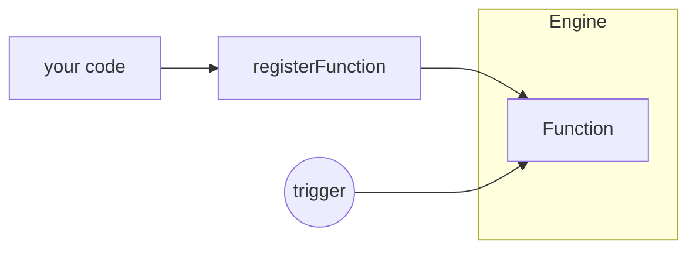

A Function is anything that can receive a request and optionally return a response. Once registered with the iii engine, a Function becomes available from anywhere in the system, regardless of where it lives, what language it's written in, or how it was registered.



<Callout title="Everything is a Function" type="info">
  Existing systems can be incorporated into iii without rewriting them. A legacy API, serverless function, or a simple
  local function all become the same first-class citizen within the Engine.
</Callout>

## Registering a Function

```typescript
import { init } from '@iii-dev/sdk'

const { registerFunction } = init('ws://engine:8080')

registerFunction(
  { id: 'users::create' },
  async (input) => {
    const user = await db.insert(input)
    return { id: user.id, name: user.name }
  }
)
```

Once registered, `users::create` can be triggered from any worker, any language, or any module.

## Built-in Functions

The iii engine provides built-in Functions through its modules, available automatically without registration:

| Function | Purpose |
|----------|---------|
| `enqueue` | Enqueue a message to a topic |
| `state::set` / `state::get` / `state::list` | Key-value state storage |
| `stream::set` / `stream::get` / `stream::delete` | Real-time stream data |
| `log::info` / `log::warn` / `log::error` | Structured logging |

<Card icon={<Zap />} title="Triggers" href={`/docs/concepts/trigger`}>
  Learn the three ways to invoke a Function.
</Card>
