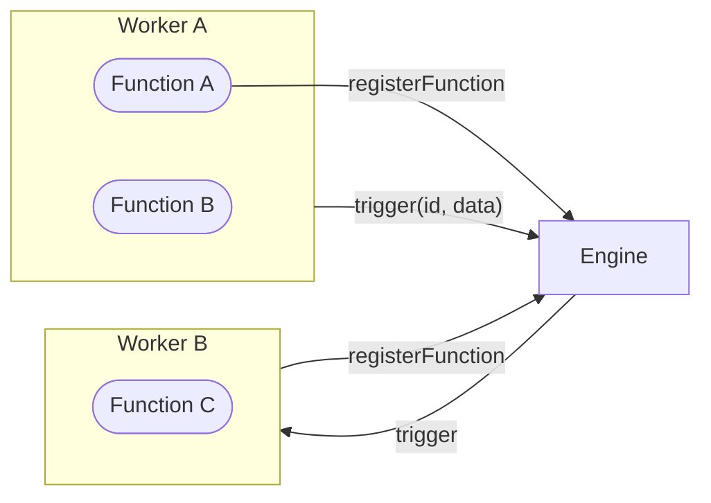

A **Function** is anything that can be triggered to do work; it receives input, and optionally returns output.
It can exist anywhere be it locally, on cloud, on serverless, or even as a 3rd party HTTP endpoint. It can mutate state,
invoke other functions, modify databases, and do anything that a typical function can do. 
All application level Functions are treated the same within iii. 

A **Trigger** is what causes a Function to run — either explicitly from code, or automatically from an event source
like an HTTP request or cron job.

<Callout title="Uncontrolled Endpoints" type="info">
iii's Functions are not magic. While uncontrolled 3rd party HTTP endpoints can be represented as Functions they won't have
the same access to invokation, state, and databases as other Functions do.
</Callout>

## Architecture

<Card icon={<BookOpen />} title="How to use Functions & Triggers" href="/docs/how-to/use-functions-and-triggers">
  Learn how to register functions, trigger them, and bind them to events.
</Card>
 
<Cards>
  <Card icon={<Terminal />} title="Quickstart" href="/docs/tutorials/quickstart">
    Follow the Quickstart and explore a live iii application.
  </Card>
  <Card icon={<Search />} title="Discovery" href="/docs/concepts/discovery">
    Learn how functions are discovered by the iii engine.
  </Card>
</Cards>
