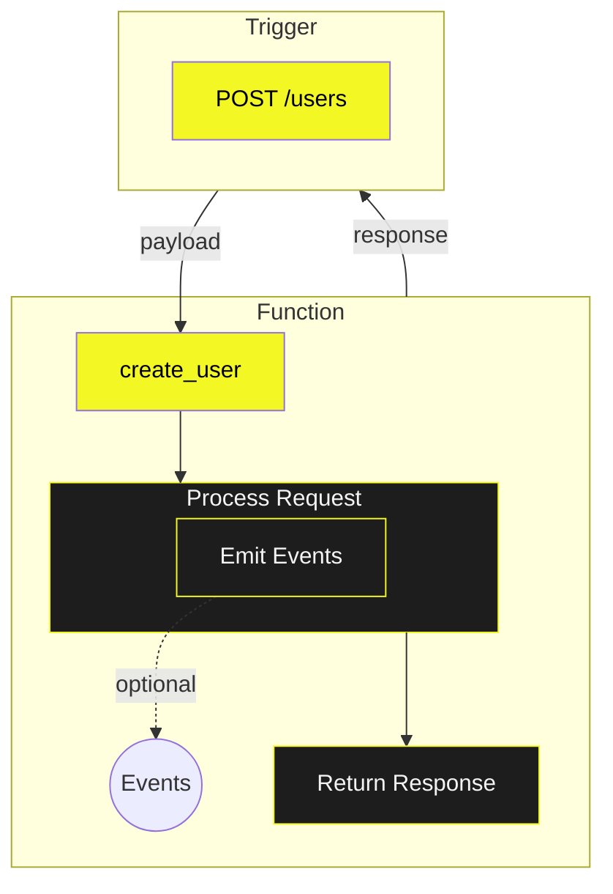

Functions are exactly what you'd expect them to be except they can run anywhere, be written in any language, and use anything available to the iii engine.

They accept a payload, and a context object, perform operations, and return a result.

The payload is the data that was passed from the Trigger to the function.

The context object is how you access the full application functionality such as state, logging, databasing, emitting events. If the iii engine has access to it then the context object will contain it.

