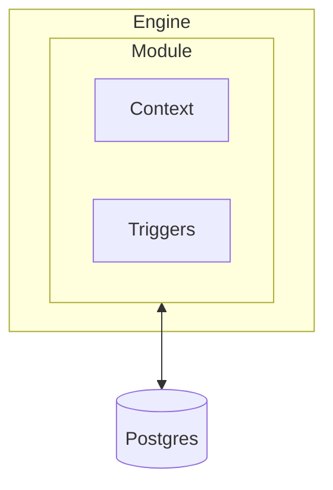

Modules are the actual interface between the Engine and the rest of the application. They are responsible for establishing connections to services and supplying application Context.

```mermaid
graph TB
    subgraph Engine[Engine]
        subgraph Module[Module]
            Context[Context]
            Triggers[Triggers]
        end
    end
    Module <--> Postgres[(Postgres)]
```
