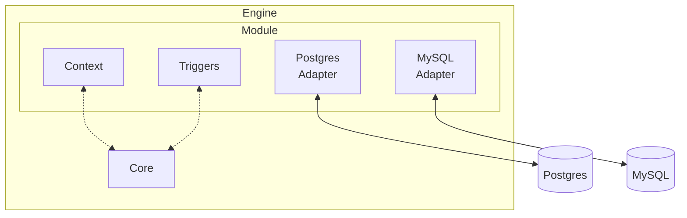

Modules are the actual interface between the Engine and Adapters. They are responsible for receiving and relaying Triggers and Context associated with their Adapters.

Modules and Adapters are structured this way because it allows for integration flexibility while minimizing the impact on application code.

In most cases a Module will contain a single Adapter. Multiple Adapters can be written for a single Module in cases where there is a desire to either unify two or more services into one from the application's point of view or to transition from one service to another without modifying the application code.

