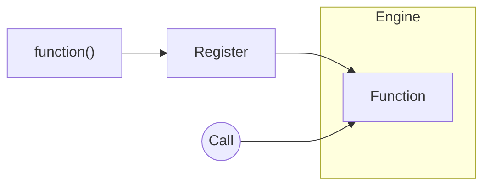

Register is the mechanism to make the Engine aware of functionality within your application. Any function, endpoint, or service can be registered and given a name. Once registered, it becomes callable from anywhere in the application.

<Callout title="Functions?" type="info">
  Existing systems can be incorporated into iii without rewriting them. A legacy API, serverless function, or a simple
  local function all become the same first-class citizen within the Engine. This makes it possible to connect existing
  systems to new infrastructure without modification to the existing system.
</Callout>

<Card icon={<Terminal />} title="Start building" href={`/tutorials/quickstart`}>
  Call and Register are all you need to know to start building. Go to the Quickstart Tutorial and start building right
  away.
</Card>
