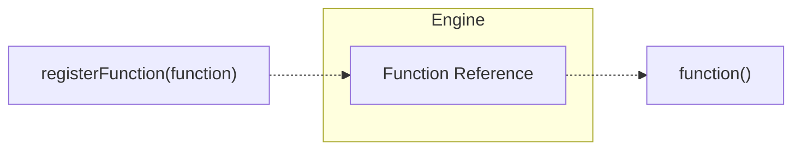

Registration is the mechanism to make the Engine aware of functionality within an application.
Any function, endpoint, or service can be registered during runtime and unregistered as needed.
Registration is dynamic and the iii engine is the long running daemon that enables seamless interoperability.

This mechanism is also what enables existing systems to be dynamically linked to iii without modifying them.
A legacy API, serverless function, or a simple local function all become the same interoperable "thing".

The most common type of registration an application developer will encounter is **Function Registration**.
Once a function is registered, the iii engine stores a reference to it.
This reference is what makes any function callable from anywhere in the backend, across domains, languages, and services.

<Callout title="Other registration types" type="info">
  iii supports additional registration types beyond Function Registration such as for Workers and other engine-level constructs.
  Function Registration is all that's required for application development.
</Callout>

<Card icon={<Terminal />} title="Start building" href={`/docs/tutorials/quickstart`}>
  Function Registration and Call are all you need to know to start building.
  Go to the Quickstart Tutorial and start building right away.
</Card>
