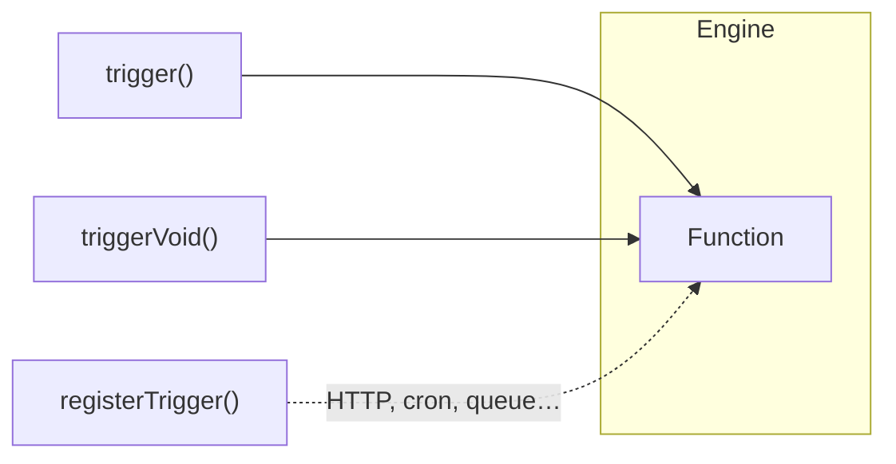

A Trigger is how a Function gets executed. There are three ways to trigger a Function in iii.



## Three Ways to Trigger

| Method | Returns | Use Case |
|--------|---------|----------|
| `trigger(id, data)` | Result from the Function | When you need the response |
| `triggerVoid(id, data)` | Nothing (fire-and-forget) | When you don't need the response |
| `registerTrigger()` | — | Automatic invocation via HTTP, cron, queue, etc. |

### `trigger()` — Invoke and await result

```typescript
import { init } from '@iii-dev/sdk'

const { trigger } = init('ws://engine:8080')

const user = await trigger('users::create', {
  name: 'Alice',
  email: 'alice@example.com'
})
```

### `triggerVoid()` — Fire and forget

```typescript
import { init } from '@iii-dev/sdk'

const { triggerVoid } = init('ws://engine:8080')

triggerVoid('enqueue', {
  topic: 'user.created',
  data: { userId: '123' }
})
```

### `registerTrigger()` — Automatic invocation

Bind a Function to an event source so it fires automatically:

```typescript
import { init } from '@iii-dev/sdk'

const { registerTrigger } = init('ws://engine:8080')

registerTrigger({
  type: 'http',
  function_id: 'users::create',
  config: {
    api_path: '/users',
    http_method: 'POST'
  }
})
```

Now `POST /users` automatically triggers `users::create`.

## Trigger Types

Each type is provided by a module in the iii engine:

| Type | When it fires | Module |
|------|---------------|--------|
| `http` | HTTP request | REST API |
| `queue` | Message on a topic | Queue |
| `cron` | Cron schedule | Cron |
| `log` | Log entry matches | Observability |
| `streams:join` | Client connects | Stream |
| `streams:leave` | Client disconnects | Stream |

<Card icon={<Terminal />} title="Start building" href={`/docs/tutorials/quickstart`}>
  Function and Trigger are all you need to know to start building. Go to the Quickstart Tutorial and start building right away.
</Card>
