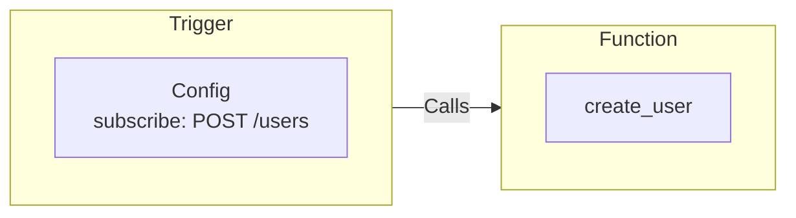

Triggers subscribe to and define triggering conditions for events. When the Trigger's conditions are met it informs the iii engine that Function(s) need to be called with the payload of the event.

