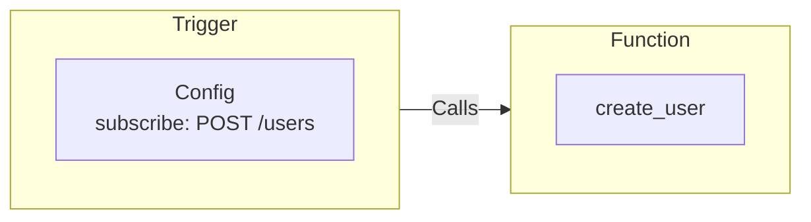

Triggers define conditions and subscribe to "events". When the Trigger's conditions are met it calls Function(s) and with the payload of the event that triggered it. This architecture is what enables your application code to be decoupled from the architecture it runs on.

