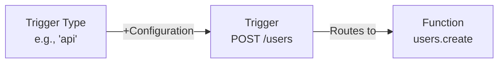

Triggers connect Trigger Types to Functions, creating the link between events and execution.

## What are Triggers?

A **Trigger** is a configured instance of a **Trigger Type** that routes invocations to a specific **Function**.

**Key Concept**: Triggers decouple _what initiates an action_ (Trigger Type) from _what logic runs_ (Function).
