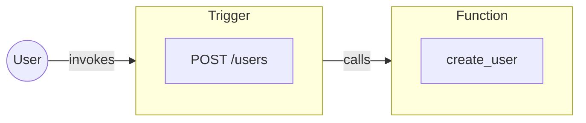

Triggers are the entrypoint of a iii-powered application.

Each Trigger defines the conditions which will cause it to fire, a payload it accepts, and a Function that it will invoke. When the Trigger does fire the Function is invoked with that payload.

From the application developer standpoint it functions something like this. Although there are a few more layers inbetween and Functions are a more abstract concept within iii.

<Callout title="Unrolling the backend" type="info">
  Due to the way iii is structured there can be any amount of "entrypoints" into a iii application. This makes
  modification simpler, reduces complexity, and allows the adoption of any programming pattern into an existing
  application.
</Callout>
