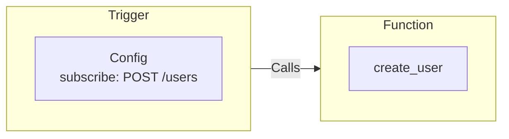

Triggers define conditions and subscribe to "events". When the Trigger's conditions are met it calls Function(s) and with the payload of the event that triggered it. This architecture is what enables your application code to be decoupled from the architecture it runs on.

<Callout title="Events?" type="info">
  The term "event" is used loosely here and is much broader than the common definition. In iii's case an event is
  anything that causes something to happen. That "event" can be an HTTP request, a cron job, a traditional event, a
  database mutation, or anything else.
</Callout>

