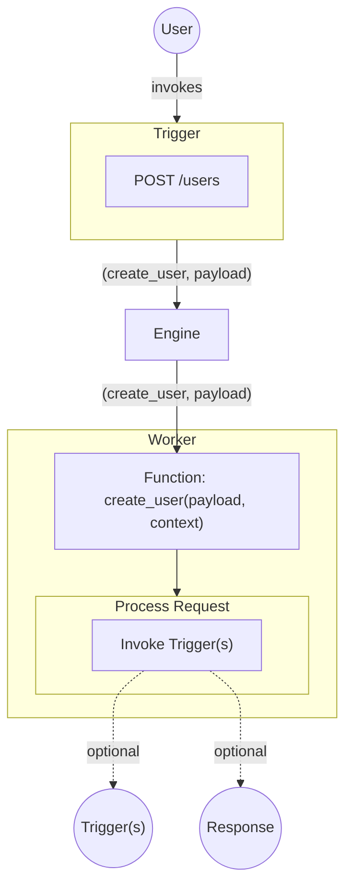

Workers are what handle Function invocation within iii.

When the Engine sends a Worker a request the Worker then executes that request and routes it to the correct Function. When the Function is done with its work it may optionally return a result to the Worker. If it does the Worker forwards this result back to the Engine as a new Trigger and the lifecycle of a iii operation starts over again.

Workers encapsulate the actual components of a iii application. A Worker can be anything from a single serverless function to a collection of long running processes split across multiple cloud providers, or a kvstore running in a server rack. They can encapsulate existing application infrastructure, external services, or brand new green field development.

Workers are what enables any sort of application architecture, with any combination of dependencies, services, and integrations.

