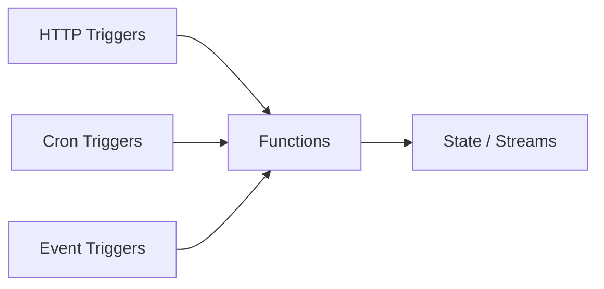

The Dashboard is the landing page of the iii Console. It provides an at-a-glance view of your running iii engine, including live metrics, system health, and quick navigation to every major feature.

<Image src="/console/dashboard.png" alt="Console dashboard showing live metrics, system health, and navigation cards" />

## Overview

When you open the console at `http://localhost:3113/`, the Dashboard shows:

- **System counters** — total registered Functions, Triggers, Workers, and Streams
- **Mini-charts** — real-time metric visualizations for recent activity
- **Application flow** — a high-level diagram showing how Triggers, Functions, and data flow through your system
- **Last update timestamp** — indicates when metrics were last refreshed

## System Status

The top section displays live counts pulled from the engine:

| Metric    | Description                                    |
|-----------|------------------------------------------------|
| Functions | Total number of registered functions           |
| Triggers  | Total number of registered triggers            |
| Workers   | Active worker processes connected to the engine |
| Streams   | Total number of streams in the system          |

These counters update automatically via WebSocket and reflect the current state of the engine.

## Application Flow Diagram

The Dashboard includes a visual diagram that shows the relationship between your system's components:

This gives you a quick mental model of how requests enter the system and where data flows.

## Quick Navigation

Each system counter on the Dashboard links directly to its dedicated page — click on **Functions** to jump to the Functions page, **Triggers** to the Triggers page, and so on.
