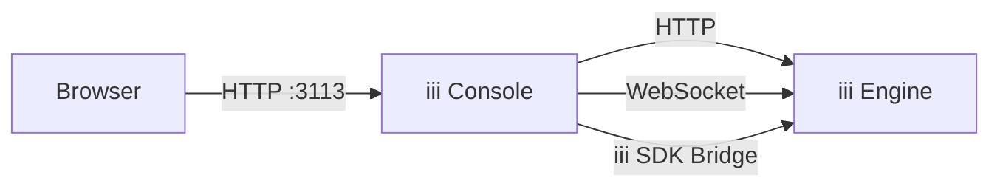

The iii Console is a standalone application that gives you full operational visibility into a running iii engine. It provides a web UI to inspect functions, triggers, state, streams, traces, and logs — all in real time.



## Installation

Install the console binary:

```bash
curl -fsSL https://install.iii.dev/console/main/install.sh | sh
```

Verify the installation:

```bash
iii-console --help
```

## Quick Start

Start the console while your iii engine is running:

```bash
iii-console
```

Then open your browser to [http://localhost:3113](http://localhost:3113).

<Image src="/docs/console/dashboard.png" alt="iii Console dashboard showing live metrics, system health, and navigation" />

<Callout title="Engine must be running" type="warn">
  The console connects to a running iii engine instance. Make sure your engine is started before launching the console.
  By default it expects the engine at `127.0.0.1:3111`.
</Callout>

## Features
