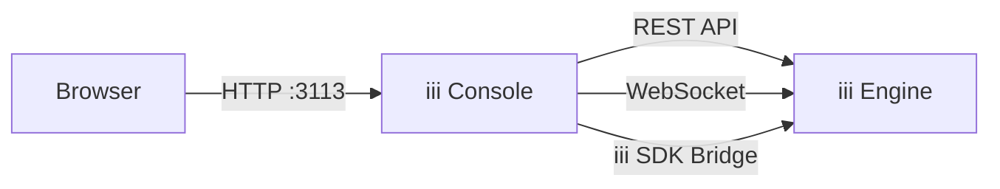

The iii Console is a standalone application that gives you full operational visibility into a running iii engine. It provides a web UI to inspect functions, triggers, state, streams, traces, and logs — all in real time.



## Installation

Install the console binary:

```bash
curl -fsSL https://install.iii.dev/console/main/install.sh | sh
```

Verify the installation:

```bash
iii-console --help
```

## Quick Start

Start the console while your iii engine is running:

```bash
iii-console
```

Then open your browser to [http://localhost:3113](http://localhost:3113).

<Callout title="Engine must be running" type="warn">
  The console connects to a running iii engine instance. Make sure your engine is started before launching the console.
  By default it expects the engine at `127.0.0.1:3111`.
</Callout>

## Features

<Cards>
  <Card title="Dashboard" href="/docs/console/dashboard">
    Real-time metrics overview with system status and mini-charts.
  </Card>
  <Card title="Functions" href="/docs/console/functions">
    List registered functions and invoke them directly with custom input.
  </Card>
  <Card title="Triggers" href="/docs/console/triggers">
    View and test HTTP, cron, and event triggers interactively.
  </Card>
  <Card title="States" href="/docs/console/states">
    Browse and manage key-value state groups and items.
  </Card>
  <Card title="Streams" href="/docs/console/streams">
    Discover and monitor streams in the system.
  </Card>
  <Card title="Traces" href="/docs/console/traces">
    Visualize OpenTelemetry traces with waterfall, flame graph, and service map views.
  </Card>
  <Card title="Logs" href="/docs/console/logs">
    Query and filter structured OpenTelemetry logs.
  </Card>
  <Card title="Flow" href="/docs/console/flow">
    Visual flow diagram showing your system architecture.
  </Card>
  <Card title="Configuration" href="/docs/console/configuration">
    CLI flags, environment variables, and connection settings.
  </Card>
</Cards>
