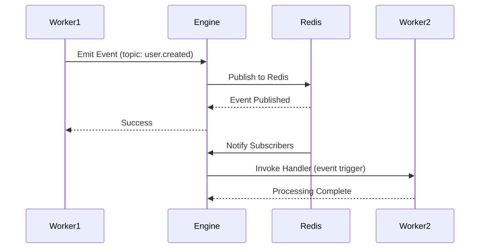

Redis-backed event bus for publish-subscribe messaging patterns.

```
modules::event::EventModule
```

## Sample Configuration

```yaml
  - class: modules::event::EventModule
    config:
      adapter:
        class: modules::event::adapters::RedisAdapter
        config:
          redis_url: ${REDIS_URL:redis://localhost:6379}
```

## Configuration

<ResponseField name="adapter" type="Adapter">
  The adapter to use for event persistence and distribution. The Redis adapter is recommended for production use.
</ResponseField>

## Adapters

### modules::event::adapters::RedisAdapter

Uses Redis Pub/Sub to handle event distribution across workers. This adapter ensures reliable message delivery in distributed environments.

```yaml
  class: modules::event::adapters::RedisAdapter
  config:
    redis_url: ${REDIS_URL:redis://localhost:6379}
```

#### Configuration

<ResponseField name="redis_url" type="string">
  The URL of the Redis instance to use for event distribution.
</ResponseField>

## Functions

<ResponseField name="event.emit" type="function">
  Publishes an event to a specific topic.

  <AccordionGroup>
    <Accordion iconName="settings" title="Parameters">
      <ResponseField name="topic" type="string" required>
        The topic to publish the event to.
      </ResponseField>
      <ResponseField name="data" type="any" required>
        The event payload to publish.
      </ResponseField>
    </Accordion>
    <Accordion title="Returns">
      <ResponseField name="success" type="boolean">
        Indicates whether the event was successfully emitted.
      </ResponseField>
    </Accordion>
  </AccordionGroup>
</ResponseField>

## Trigger Type

This Module adds a new Trigger Type: `event`.

<Expandable title="Trigger Config">
  <ResponseField name="subscribes" type="string[]" required>
    List of topics to subscribe to. The function will be invoked whenever an event is published to any of these topics.
  </ResponseField>
</Expandable>

### Sample Code

```typescript
// Register a function to handle events
bridge.registerFunction({
  function_path: 'events.onUserCreated',
  handler: async (data) => {
    console.log('User created:', data);
    // Process the event
  },
});

// Subscribe to the 'user.created' topic
bridge.registerTrigger({
  trigger_type: 'event',
  function_path: 'events.onUserCreated',
  config: {
    subscribes: ['user.created'],
  },
});

// Emit an event
await bridge.invokeFunction({
  function_path: 'event.emit',
  data: {
    topic: 'user.created',
    data: { id: '123', email: 'user@example.com' },
  },
});
```

## Event Flow


