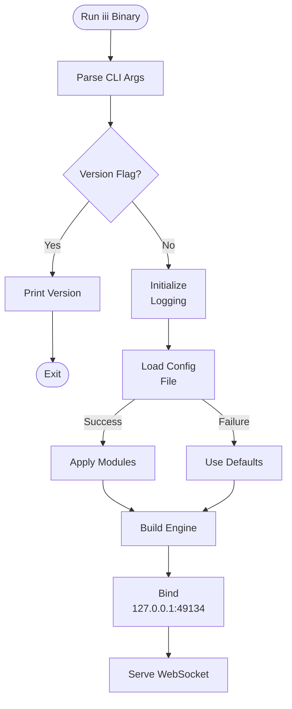
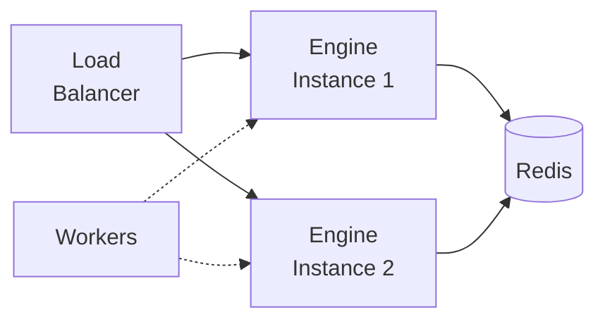

This guide covers deploying the iii Engine and configuring it for production use.

## Installation

Install the iii Engine binary:

```bash
curl -fsSL https://install.iii.dev | bash
```

Or run directly with Cargo:

```bash
cargo install iii-engine
```

## Running the Engine

The engine accepts the following CLI arguments:

| Argument | Short | Default | Description |
|----------|-------|---------|-------------|
| `--config` | `-c` | `config.yaml` | Path to configuration file |
| `--version` | `-v` | - | Print version and exit |

Start the engine:

```bash
# Using default config.yaml
iii

# With custom config
iii --config /path/to/config.yaml

# Check version
iii --version
```

## Configuration File

The engine uses a YAML configuration file to define active modules and their settings.

### Basic Structure

```yaml
modules:
  - class: modules::api::RestApiModule
    config:
      host: 0.0.0.0
      port: 3111

  - class: modules::streams::StreamModule
    config:
      host: 0.0.0.0
      port: 31112
      adapter:
        class: modules::streams::adapters::RedisAdapter
        config:
          redis_url: redis://localhost:6379
```

### Environment Variables

Configuration supports environment variable expansion using `${VAR_NAME:default_value}`:

```yaml
modules:
  - class: modules::api::RestApiModule
    config:
      host: ${API_HOST:127.0.0.1}
      port: ${API_PORT:3111}

  - class: modules::event::EventModule
    config:
      adapter:
        class: modules::event::adapters::RedisAdapter
        config:
          redis_url: ${REDIS_URL:redis://localhost:6379}
```

**Behavior:**
- If `REDIS_URL` is set, uses that value
- If not set, uses the default (`redis://localhost:6379`)
- If no default provided and variable is missing, engine logs an error

## Production Configuration

Example production setup with all common modules:

```yaml
modules:
  # REST API
  - class: modules::api::RestApiModule
    config:
      host: 0.0.0.0
      port: ${API_PORT:3111}
      cors:
        allowed_origins:
          - ${FRONTEND_URL:http://localhost:3000}
        allowed_methods:
          - GET
          - POST
          - PUT
          - DELETE
          - OPTIONS

  # Streams
  - class: modules::streams::StreamModule
    config:
      host: 0.0.0.0
      port: ${STREAMS_PORT:31112}
      auth_function: auth.verifyToken
      adapter:
        class: modules::streams::adapters::RedisAdapter
        config:
          redis_url: ${REDIS_URL:redis://localhost:6379}

  # Events
  - class: modules::event::EventModule
    config:
      adapter:
        class: modules::event::adapters::RedisAdapter
        config:
          redis_url: ${REDIS_URL:redis://localhost:6379}

  # Cron
  - class: modules::cron::CronModule
    config:
      adapter:
        class: modules::cron::adapters::RedisAdapter
        config:
          redis_url: ${REDIS_URL:redis://localhost:6379}

  # Logging
  - class: modules::observability::LoggingModule
    config:
      level: ${LOG_LEVEL:info}
      format: json
      adapter:
        class: modules::observability::adapters::RedisLogger
        config:
          redis_url: ${REDIS_URL:redis://localhost:6379}
```

## Default Modules

If no configuration file is provided, the engine loads these default modules:

- **RestApiModule** - Host: 127.0.0.1, Port: 3111
- **EventModule** - Redis at localhost:6379
- **LoggingModule** - Level: info
- **CronModule** - Redis at localhost:6379
- **StreamsModule** - Stream API at 127.0.0.1:31112

## Startup Flow



## Multi-Instance Deployment

When running multiple engine instances:

1. **Redis Required**: Use Redis adapters for Events, Cron, Streams, and Logging
2. **Load Balancing**: Use a load balancer for API endpoints
3. **Distributed Locking**: Cron module uses Redis locks to prevent duplicate execution
4. **Session Affinity**: Not required - workers connect to any engine instance



## Health Checks

Monitor engine health by checking:

1. **WebSocket Port**: Engine listens on `127.0.0.1:49134` by default
2. **Module Ports**: REST API (3111), Streams (31112)
3. **Redis Connection**: If using Redis adapters

Example health check:

```bash
# Check if WebSocket is listening
nc -zv 127.0.0.1 49134

# Check REST API
curl http://localhost:3111/health
```

## Logging

Configure logging verbosity:

```yaml
modules:
  - class: modules::observability::LoggingModule
    config:
      level: debug  # trace, debug, info, warn, error
      format: json  # or default
```

Or via environment variable:

```bash
RUST_LOG=debug iii
```
