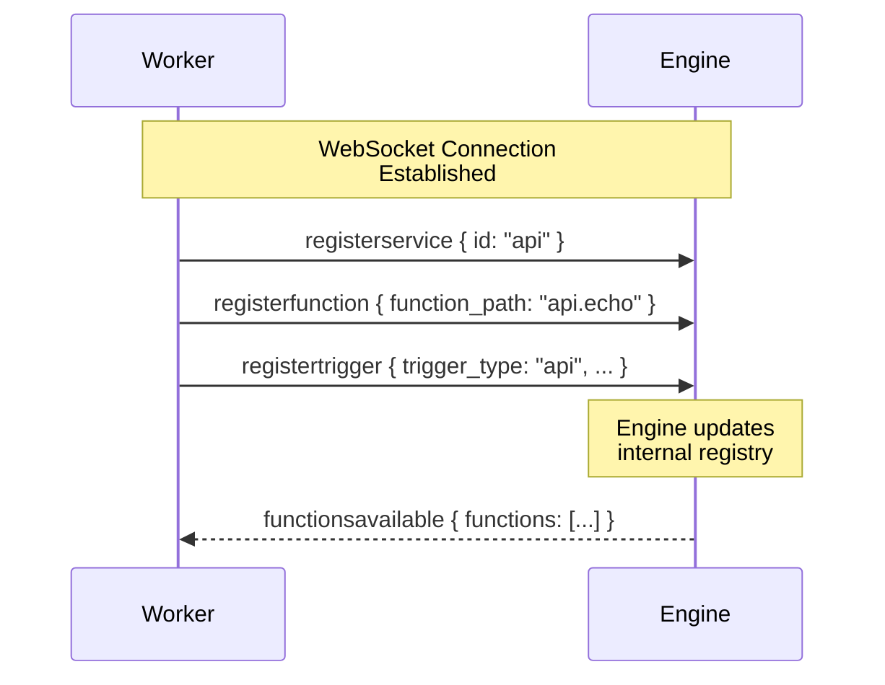
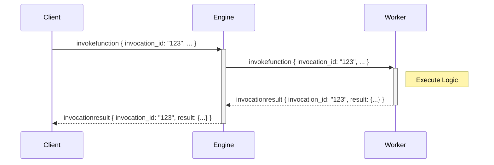

The iii Engine uses a WebSocket-based JSON protocol for communication between the engine and workers.

## Message Types

The protocol defines specific message types for different operations:

| Message Type | Direction | Description |
|--------------|-----------|-------------|
| `registerfunction` | Worker → Engine | Declares a function available for execution |
| `registerservice` | Worker → Engine | Groups functions under a logical service |
| `registertrigger` | Worker → Engine | Configures a trigger (API route, event, cron) |
| `invokefunction` | Bidirectional | Requests execution of a specific function |
| `invocationresult` | Bidirectional | Returns the result of a function execution |
| `ping` / `pong` | Bidirectional | Keep-alive mechanism |

## Connection Flow

When a worker connects, it must register its capabilities:



## Invocation Lifecycle

Functions can be invoked synchronously (with response) or asynchronously (fire-and-forget):



## Register Function

Register a callable function with the engine:

```typescript
{
  type: 'registerfunction',
  function_path: 'service.function',  // e.g., "api.echo"
  description?: 'Function description',
  request_format?: { ... },  // JSON schema for input
  response_format?: { ... }, // JSON schema for output
  metadata?: { ... }
}
```

## Register Trigger

Configure a trigger that maps to a function:

```typescript
{
  type: 'registertrigger',
  id: 'unique-trigger-id',
  trigger_type: 'api' | 'event' | 'cron' | 'log',
  function_path: 'service.function',
  config: {
    // Trigger-specific configuration
    // For 'api': { api_path: '/path', http_method: 'GET' }
    // For 'event': { subscribes: ['topic1', 'topic2'] }
    // For 'cron': { cron: '0 * * * *' }
    // For 'log': { level: 'error' }
  }
}
```

## Invoke Function

Request execution of a registered function:

```typescript
{
  type: 'invokefunction',
  invocation_id?: 'unique-id',  // Optional, required for sync calls
  function_path: 'service.function',
  data: { ... }  // Function input
}
```

## Invocation Result

Return the result of a function execution:

```typescript
{
  type: 'invocationresult',
  invocation_id: 'unique-id',
  result?: { ... },  // Success result
  error?: {          // Error result
    message: 'Error description',
    code: 'ERROR_CODE'
  }
}
```

## Stream Protocol

The Streams module uses a specialized sub-protocol for real-time state synchronization.

### Incoming Messages (Client → Engine)

```typescript
// Subscribe to a stream
{
  type: 'Join',
  subscription_id: 'sub-123',
  stream_name: 'todos',
  group_id: 'user-456',
  id: 'item-789'
}

// Unsubscribe from a stream
{
  type: 'Leave',
  subscription_id: 'sub-123'
}
```

### Outbound Messages (Engine → Client)

```typescript
{
  timestamp: 1234567890,
  stream_name: 'todos',
  group_id: 'user-456',
  event: {
    type: 'Sync' | 'Create' | 'Update' | 'Delete' | 'Event',
    data: { ... }
  }
}
```
