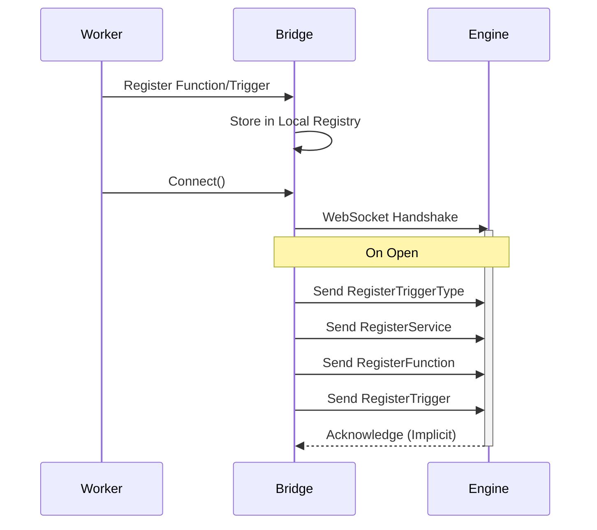
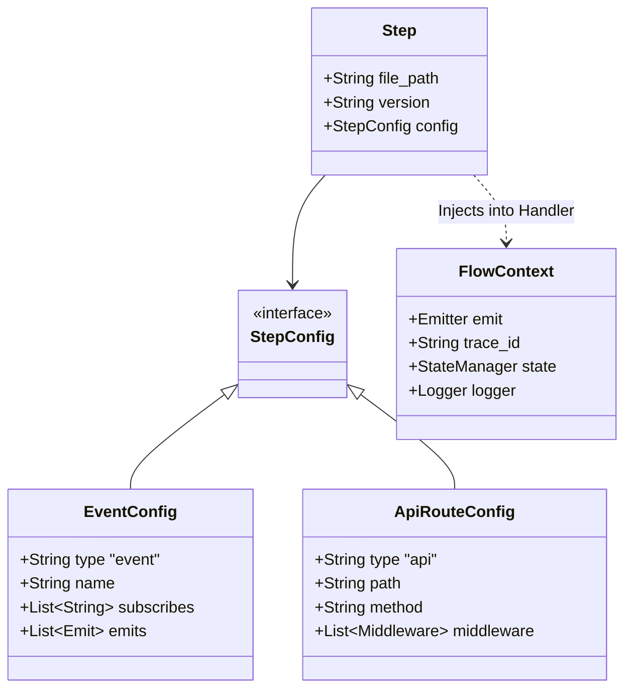

The iii SDK is available in both Python and Node.js, providing a bridge between your application and the iii Engine via WebSocket communication.

## SDK Architecture

The SDKs follow a bridge pattern where the SDK acts as a client, maintaining a persistent WebSocket connection to the engine to exchange JSON messages for function registration, trigger setup, and remote procedure calls.


## Core Bridge Architecture

The `Bridge` is the central component in both SDKs. It manages the WebSocket lifecycle, message routing, and the registry of local functions available to the engine.

### Connection Lifecycle

The Bridge establishes a WebSocket connection to the engine (defaulting to `ws://127.0.0.1:49134`). Upon connection, it flushes any pending registration messages (triggers, functions, services) to ensure the engine is aware of the worker's capabilities.



### Message Types and Protocol

The SDKs implement specific message types to communicate with the engine. These are defined as Pydantic models in Python and TypeScript interfaces in Node.js.

| Message Type | Description | Key Fields |
|--------------|-------------|------------|
| `RegisterFunction` | Registers a callable function with the engine | `function_path`, `description` |
| `RegisterTrigger` | Binds a specific configuration to a trigger type | `trigger_type`, `function_path`, `config` |
| `InvokeFunction` | Requests the engine to execute a function | `function_path`, `data` |
| `InvocationResult` | Returns the result of a function execution | `invocation_id`, `result`, `error` |

## Python Implementation

The Python implementation is divided into two layers: the low-level SDK (`iii`) and the high-level framework (`motia`).

### Low-Level SDK (`iii`)

The `iii` package provides the raw `Bridge` class and type definitions. It handles the async event loop integration using `asyncio` and `websockets`.

#### Installation

```bash
pip install iii
```

#### Key Components

<AccordionGroup>
  <Accordion title="Bridge" icon="network-wired">
    Manages `ClientConnection`, stores `_functions` and `_triggers` dictionaries, and handles reconnection logic.

    ```python
    from iii import Bridge

    # Create bridge instance
    bridge = Bridge(url='ws://127.0.0.1:49134')

    # Connect to engine
    await bridge.connect()
    ```
  </Accordion>

  <Accordion title="Logger" icon="file-text">
    A specialized logger that sends log events back to the engine via the bridge using `logger.info` style invocations.

    ```python
    from iii import Logger

    logger = Logger(bridge)
    logger.info("Processing started")
    logger.error("An error occurred", exc_info=True)
    ```
  </Accordion>

  <Accordion title="Types" icon="code">
    Uses `TypeVar` and `Generic` to provide type safety for Inputs and Outputs.

    ```python
    from iii.types import ApiRequest, ApiResponse
    from typing import TypeVar, Generic

    TInput = TypeVar('TInput')
    TOutput = TypeVar('TOutput')
    ```
  </Accordion>
</AccordionGroup>

#### Basic Usage

```python
from iii import Bridge

# Create and connect bridge
bridge = Bridge()
await bridge.connect()

# Register a function
async def my_handler(data):
    return {"result": "success"}

bridge.register_function(
    function_path="service.action",
    handler=my_handler,
    description="My custom function"
)

# Register a trigger
bridge.register_trigger(
    trigger_type="api",
    function_path="service.action",
    config={
        "api_path": "/my-endpoint",
        "http_method": "POST"
    }
)
```

### High-Level Framework (`motia`)

`motia` builds upon `iii` to provide a declarative workflow definition system. It wraps raw function handlers into structured "Steps".

#### Installation

```bash
pip install motia
```

#### Step Architecture

A `Step` in Motia encapsulates configuration (Event, API, Cron) and the handler logic. The `step_wrapper` function automatically registers the step with the bridge and injects a `FlowContext`.



#### Context and State

The `FlowContext` passed to handlers provides access to:

<ResponseField name="emit" type="function">
  A function to publish events to topics.

  ```python
  await ctx.emit("user.created", {"id": "123"})
  ```
</ResponseField>

<ResponseField name="state" type="InternalStateManager">
  An internal state manager for configuration and internal data.

  ```python
  await ctx.state.set("config", "theme", "dark")
  theme = await ctx.state.get("config", "theme")
  ```
</ResponseField>

<ResponseField name="streams" type="dict[str, Stream]">
  Access to distributed streams (get/set/delete).

  ```python
  todo_stream = Stream("todos")
  await todo_stream.set("inbox", "item-1", {"title": "Buy milk"})
  ```
</ResponseField>

<ResponseField name="logger" type="Logger">
  Context-aware logging with trace ID.

  ```python
  ctx.logger.info("Processing started")
  ctx.logger.error("An error occurred", exc_info=True)
  ```
</ResponseField>

## Node.js Implementation

The Node.js SDK (`@iii-dev/sdk`) utilizes TypeScript to provide type safety and follows a similar bridge pattern but uses callbacks and hooks for integration.

### Installation

```bash
npm install @iii-dev/sdk
```

### Bridge Implementation

The Node.js `Bridge` class uses the `ws` library. It maintains queues for messages sent before the socket is open (`messagesToSend`) and handles automatic reconnection intervals.

```typescript
import { createBridge } from '@iii-dev/sdk';

// Create bridge instance
const bridge = createBridge({
  url: 'ws://127.0.0.1:49134'
});

// Connect to engine
await bridge.connect();

// Register a function
bridge.registerFunction({
  functionPath: 'service.action',
  handler: async (data) => {
    return { result: 'success' };
  },
  description: 'My custom function'
});

// Register a trigger
bridge.registerTrigger({
  triggerType: 'api',
  functionPath: 'service.action',
  config: {
    api_path: '/my-endpoint',
    http_method: 'POST'
  }
});
```

#### Conceptual Structure

```typescript
// Conceptual structure based on packages/node/iii/src/bridge.ts
class Bridge {
  private ws?: WebSocket
  private functions = new Map<string, RemoteFunctionData>()
  private messagesToSend: BridgeMessage[] = []

  registerFunction(message, handler) {
    this.sendMessage(MessageType.RegisterFunction, message, true)
    this.functions.set(message.function_path, { message, handler })
  }
}
```

### React-like Hooks

The Node ecosystem includes higher-level abstractions that mimic React hooks for defining triggers:

<AccordionGroup>
  <Accordion title="useApi" icon="globe">
    Registers a function and immediately binds it to an API trigger configuration.

    ```typescript
    import { useApi } from '@iii-dev/sdk/hooks';

    useApi({
      path: '/users/:id',
      method: 'GET',
      handler: async (req) => {
        return {
          status: 200,
          body: { user: { id: req.path_params.id } }
        };
      }
    });
    ```
  </Accordion>

  <Accordion title="useOnLog" icon="file-text">
    Registers a handler for log events.

    ```typescript
    import { useOnLog } from '@iii-dev/sdk/hooks';

    useOnLog({
      level: 'error',
      handler: async (log) => {
        console.error('Error logged:', log);
      }
    });
    ```
  </Accordion>
</AccordionGroup>

## Stream Management

Both SDKs provide abstractions for interacting with the Engine's Stream module, which handles distributed state and grouping.

### Stream Operations

Streams are accessed via the `streams.` namespace functions invoked over the bridge.

| Operation | SDK Function | Bridge Target | Description |
|-----------|-------------|---------------|-------------|
| **Get** | `stream.get(group, id)` | `streams.get` | Retrieves an item from a group |
| **Set** | `stream.set(group, id, val)` | `streams.set` | Saves an item to a group |
| **Delete** | `stream.delete(group, id)` | `streams.delete` | Removes an item |
| **Get Group** | `stream.get_group(group)` | `streams.getGroup` | Retrieves all items in a group |

### Python Stream Class

In Python, the `Stream` class is generic (`Stream[TData]`) and lazy-loads the bridge instance to perform RPC calls.

```python
from motia import Stream

# Define stream
todo_stream = Stream("todos")

# Get item
async def get(self, group_id: str, item_id: str) -> TData | None:
    return await self._get_bridge().invoke_function(
        "streams.get",
        {
            "stream_name": self.stream_name,
            "group_id": group_id,
            "item_id": item_id,
        },
    )
```

### Node.js Stream Usage

```typescript
import { Stream } from '@iii-dev/sdk';

// Define stream
const todoStream = new Stream('todos');

// Set item
await todoStream.set('inbox', 'item-1', {
  title: 'Buy milk',
  completed: false
});

// Get item
const item = await todoStream.get('inbox', 'item-1');

// Get all items in group
const allItems = await todoStream.getGroup('inbox');
```

## Request and Response Models

The SDKs standardize how HTTP requests and responses are handled when using API triggers.

### API Request

The `ApiRequest` model normalizes incoming HTTP data.

<ResponseField name="path_params" type="dict">
  Dictionary of URL path parameters.

  ```python
  # Route: /users/:userId/posts/:postId
  # Request: GET /users/123/posts/456
  req.path_params  # {"userId": "123", "postId": "456"}
  ```
</ResponseField>

<ResponseField name="query_params" type="dict">
  Dictionary of query string arguments.

  ```python
  # Request: GET /users?status=active&limit=10
  req.query_params  # {"status": "active", "limit": "10"}
  ```
</ResponseField>

<ResponseField name="body" type="Any">
  The request payload (parsed JSON).

  ```python
  # POST /users with {"name": "Alice"}
  req.body  # {"name": "Alice"}
  ```
</ResponseField>

<ResponseField name="headers" type="dict">
  Request headers.

  ```python
  req.headers.get("authorization")
  ```
</ResponseField>

### API Response

The `ApiResponse` model dictates how handlers should return data to the engine to be sent back to the HTTP client.

<ResponseField name="status" type="int">
  HTTP status code.

  ```python
  return ApiResponse(status=200, body={...})
  ```
</ResponseField>

<ResponseField name="body" type="Any">
  Response payload (will be serialized to JSON).

  ```python
  return ApiResponse(status=200, body={"message": "Success"})
  ```
</ResponseField>

<ResponseField name="headers" type="dict">
  Response headers (optional).

  ```python
  return ApiResponse(
      status=200,
      body={...},
      headers={"X-Custom-Header": "value"}
  )
  ```
</ResponseField>

## Middleware Composition (Python)

The Motia framework includes logic to compose middleware for API steps. This allows intercepting requests before they reach the main handler.


The `_compose_middleware` function recursively wraps handlers, creating an execution chain where each middleware can perform actions before and after the `next` handler is awaited.

### Example Middleware

```python
from motia import ApiRouteConfig, ApiRequest, ApiResponse, FlowContext, step_wrapper

# Define middleware
async def auth_middleware(req: ApiRequest, ctx: FlowContext, next_handler):
    # Before handler
    token = req.headers.get("authorization")
    if not token:
        return ApiResponse(status=401, body={"error": "Unauthorized"})

    # Validate token
    user = await validate_token(token)
    if not user:
        return ApiResponse(status=401, body={"error": "Invalid token"})

    # Inject into context
    ctx.user = user

    # Call next handler
    response = await next_handler(req, ctx)

    # After handler (optional)
    response.headers["X-Request-ID"] = ctx.trace_id

    return response

# Use middleware in step
config = ApiRouteConfig(
    type="api",
    name="protected-route",
    path="/protected",
    method="GET",
    middleware=[auth_middleware]
)

async def handler(req: ApiRequest, ctx: FlowContext) -> ApiResponse:
    # ctx.user is available here
    return ApiResponse(
        status=200,
        body={"message": f"Hello, {ctx.user['name']}"}
    )

step_wrapper(config, __file__, handler)
```

## Complete Examples

### Python Example

```python
from iii import Bridge

# Create bridge
bridge = Bridge()

# Register function
async def create_user(data):
    user = {"id": "123", **data}
    return {"status": 201, "body": user}

bridge.register_function(
    function_path="users.create",
    handler=create_user
)

# Register API trigger
bridge.register_trigger(
    trigger_type="api",
    function_path="users.create",
    config={
        "api_path": "/users",
        "http_method": "POST"
    }
)

# Connect and run
await bridge.connect()
```

### Node.js Example

```typescript
import { createBridge } from '@iii-dev/sdk';

const bridge = createBridge();

// Register function
bridge.registerFunction({
  functionPath: 'users.create',
  handler: async (data) => {
    const user = { id: '123', ...data };
    return { status: 201, body: user };
  }
});

// Register API trigger
bridge.registerTrigger({
  triggerType: 'api',
  functionPath: 'users.create',
  config: {
    api_path: '/users',
    http_method: 'POST'
  }
});

// Connect and run
await bridge.connect();
```

## Best Practices

<AccordionGroup>
  <Accordion title="Type Safety">
    Leverage type hints and generics for better IDE support and fewer runtime errors.

    ```python
    from typing import TypeVar, Generic
    from iii.types import ApiRequest, ApiResponse

    async def handler(
        req: ApiRequest,
        ctx: FlowContext
    ) -> ApiResponse:
        # Type-safe implementation
        return ApiResponse(status=200, body={...})
    ```
  </Accordion>

  <Accordion title="Error Handling">
    Always handle errors gracefully and return appropriate HTTP status codes.

    ```python
    async def handler(req: ApiRequest, ctx: FlowContext) -> ApiResponse:
        try:
            result = await process_data(req.body)
            return ApiResponse(status=200, body=result)
        except ValueError as e:
            ctx.logger.error(f"Validation error: {e}")
            return ApiResponse(status=400, body={"error": str(e)})
        except Exception as e:
            ctx.logger.error(f"Unexpected error: {e}", exc_info=True)
            return ApiResponse(status=500, body={"error": "Internal error"})
    ```
  </Accordion>

  <Accordion title="Connection Management">
    The bridge handles reconnection automatically, but you should implement proper shutdown.

    ```python
    try:
        await bridge.connect()
        # Your application logic
    finally:
        await bridge.close()
    ```
  </Accordion>

  <Accordion title="Use High-Level Frameworks">
    For most applications, use Motia (Python) or hooks (Node.js) instead of the raw Bridge API for better developer experience.

    ```python
    # Prefer Motia
    from motia import step_wrapper, ApiRouteConfig

    # Over raw Bridge
    from iii import Bridge
    ```
  </Accordion>
</AccordionGroup>

## Next Steps

<Columns cols={2}>
  <Card icon="Code" title="Motia Framework" href="/docs/quickstart/motia-framework">
    Learn about the high-level Python framework
  </Card>
  <Card icon="Zap" title="Remote Functions" href="/docs/remote-functions">
    Understand function registration and invocation
  </Card>
</Columns>
