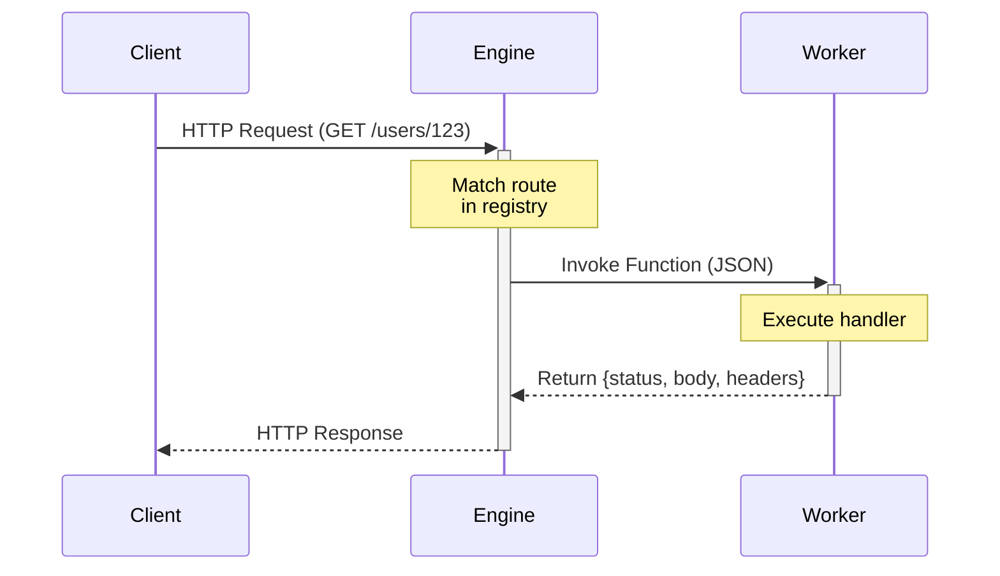

The REST API Module is a module that allows you to build REST APIs with ease.

```
modules::rest_api::RestApiModule
```

## Sample Configuration

```yaml
  - class: modules::api::RestApiModule
    config:
      port: 3111
      host: 0.0.0.0
      cors:
        allowed_origins:
          - http://localhost:3000
          - http://localhost:5173
        allowed_methods:
          - GET
          - POST
          - PUT
          - DELETE
          - OPTIONS
```

## Configuration

<ResponseField name="port" type="number">
  The port to listen on. Defaults to `3111`.
</ResponseField>

<ResponseField name="host" type="string">
  The host to listen on. Defaults to `0.0.0.0`.
</ResponseField>

<ResponseField name="cors" type="Cors">
  The CORS configuration.

  <Expandable title="Cors">
    <ResponseField name="allowed_origins" type="string[]" required>
      The allowed origins.
    </ResponseField>
    <ResponseField name="allowed_methods" type="string[]" required>
      The allowed methods.
    </ResponseField>
  </Expandable>
</ResponseField>


## Trigger Type

This Module add a new Trigger Type: `api`.

<Expandable title="Trigger Config">
  <ResponseField name="api_path" type="string" required>
    The path of the API.
  </ResponseField>
  <ResponseField name="http_method" type="string" required>
    The HTTP method of the API.
  </ResponseField>
</Expandable>

### Sample code

```typescript
bridge.registerTrigger({
  triggerType: 'api',
  functionPath,
  config: {
    api_path: '/api/v1/users',
    http_method: 'GET',
  },
})
```

## Request & Response Objects

### ApiRequest

When an API trigger fires, the function receives an `ApiRequest` object:

<ResponseField name="path_params" type="Record&lt;string, string&gt;">
  Variables extracted from the URL path (e.g., `/users/:id`).
</ResponseField>

<ResponseField name="query_params" type="Record&lt;string, string | string[]&gt;">
  URL query string parameters.
</ResponseField>

<ResponseField name="body" type="any">
  The parsed request body (JSON).
</ResponseField>

<ResponseField name="headers" type="Record&lt;string, string | string[]&gt;">
  HTTP request headers.
</ResponseField>

### ApiResponse

Functions must return an `ApiResponse` object:

<ResponseField name="status" type="number">
  HTTP status code (e.g., 200, 404, 500).
</ResponseField>

<ResponseField name="body" type="any">
  The response payload.
</ResponseField>

<ResponseField name="headers" type="Record&lt;string, string&gt;">
  HTTP response headers (optional).
</ResponseField>

## Request Lifecycle



## Example Handler

```typescript
import { ApiRequest, ApiResponse } from '@iii-dev/sdk';

async function getUser(req: ApiRequest) {
  const userId = req.path_params.id;
  const user = await database.findUser(userId);

  return {
    status: 200,
    body: { user },
    headers: {
      'Content-Type': 'application/json',
    },
  };
}

bridge.registerFunction({
  functionPath: 'api.getUser',
  handler: getUser,
});

bridge.registerTrigger({
  triggerType: 'api',
  functionPath: 'api.getUser',
  config: {
    api_path: '/users/:id',
    http_method: 'GET',
  },
});
```