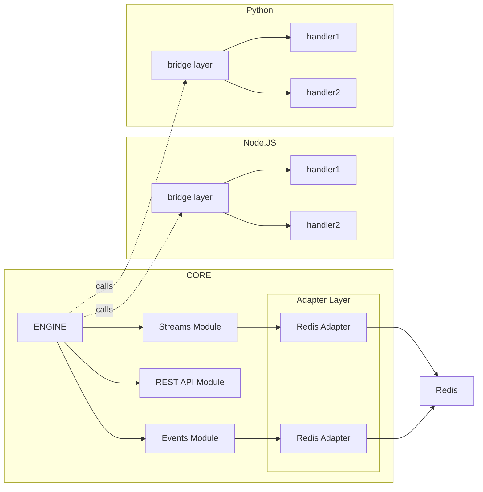

The Name iii stands for three core primitives as described below.

<Card horizontal iconName="Rocket" title="Start here" href="/docs/quickstart" description="Already know what iii is? Jump to the next section to build your first iii application." />

### Infrastructure
- **Workers**: Consumers of the iii architecture and can use all features of iii
- **Core Modules**: Similar to Workers, but they live INSIDE the iii Engine, can use the all features of iii

### Implementation
- **Remote Functions**: Register arbitrary functions that can be executed anywhere

### Invocation
- **Trigger Types**: to configure different trigger types where triggers can be added (example: api, event, cron)
- **Triggers**: It's a link between a Trigger Type using a specific configuration, and a Remote Function.

## Understanding Architecture

iii is composed of a few layers

- **Core Modules**: There are a lot of Core Modules, each one solves a specific problem.
- **Adapters**: iii it built with Adapters by default, modules can have adapters to integrate with external systems.
- **Workers**: External services connected to the iii Engine, can be used to trigger functions, receive events, etc.

## Concepts

Check the sections below to understand the different concepts of iii.

<Columns cols={2}>
  <Card iconName="Blocks" title="Core Modules" href="/docs/core-modules" description="Core Modules are the building blocks of iii." />
  <Card iconName="Cog" title="Adapters" href="/docs/adapters" description="Integrate with external systems." />
  <Card iconName="Handshake" title="Workers" href="/docs/workers" description="External services connected to the iii Engine." />
  <Card iconName="Zap" title="Trigger Types" href="/docs/trigger-types" description="Configure different trigger types." />
  <Card iconName="Recycle" title="Triggers" href="/docs/triggers" description="Link a Trigger Type with a function." />
  <Card iconName="Parentheses" title="Remote Functions" href="/docs/remote-functions" description="Arbitrary functions that can be executed anywhere." />
</Columns>

## Need inspiration?

<Card title="See complete examples" icon="stars" href="https://mintlify.com/customers" description="Browse our showcase of exceptional documentation sites." />
  