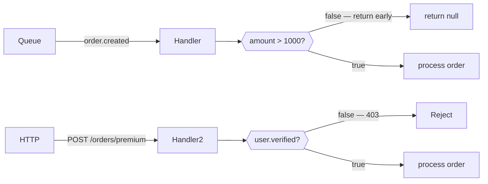

The iii SDK has no built-in condition API on triggers. Instead, add guard logic at the **top of your handler**: check the input and return early (or return an error response) if the condition is not satisfied.

This pattern is intentionally explicit — the logic lives in code, is testable, and requires no framework-specific abstractions.



## Single guard

<Tabs items={['TypeScript', 'Python', 'Rust']}>
  <Tab value="TypeScript">

```typescript
import { init, getContext, type ApiRequest } from 'iii-sdk'

const iii = init(process.env.III_BRIDGE_URL ?? 'ws://localhost:49134')

iii.registerFunction(
  { id: 'orders.premium', description: 'Processes premium orders from verified users' },
  async (req: ApiRequest<{ user: { verified: boolean }; amount: number; description: string }>) => {
    const ctx = getContext()
    const { amount, description, user } = req.body ?? {}

    // Guard: amount must be above threshold
    if (!amount || amount <= 1000) {
      ctx.logger.info('Order below threshold — skipping', { amount })
      return { status_code: 422, body: { error: 'Amount must exceed 1000' } }
    }

    // Guard: user must be verified
    if (!user?.verified) {
      ctx.logger.info('Unverified user — rejecting', { verified: user?.verified })
      return { status_code: 403, body: { error: 'User must be verified' } }
    }

    ctx.logger.info('Processing premium order', { amount })

    return { status_code: 200, body: { message: 'Premium order processed', description } }
  },
)

iii.registerTrigger({
  type: 'http',
  function_id: 'orders.premium',
  config: { api_path: 'orders/premium', http_method: 'POST' },
})
```

  </Tab>
  <Tab value="Python">

```python
from iii import III, InitOptions, ApiRequest, ApiResponse, get_context

iii = III(address="ws://localhost:49134", options=InitOptions(worker_name="orders-worker"))


async def orders_premium(req: ApiRequest, ctx) -> ApiResponse:
    body = req.body or {}
    amount = body.get("amount", 0)
    user = body.get("user", {})

    # Guard: amount must be above threshold
    if amount <= 1000:
        ctx.logger.info("Order below threshold — skipping", {"amount": amount})
        return ApiResponse(statusCode=422, body={"error": "Amount must exceed 1000"})

    # Guard: user must be verified
    if not user.get("verified", False):
        ctx.logger.info("Unverified user — rejecting")
        return ApiResponse(statusCode=403, body={"error": "User must be verified"})

    ctx.logger.info("Processing premium order", {"amount": amount})
    return ApiResponse(statusCode=200, body={"message": "Premium order processed"})


iii.register_function("orders.premium", lambda data: orders_premium(
    ApiRequest(**data) if isinstance(data, dict) else data, get_context()
))
iii.register_trigger(
    type="http", function_id="orders.premium",
    config={"api_path": "orders/premium", "http_method": "POST"},
)
```

  </Tab>
  <Tab value="Rust">

```rust
iii.register_function("orders.premium", |input| async move {
    let ctx = get_context();
    let req: ApiRequest = serde_json::from_value(input)?;

    let amount = req.body["amount"].as_f64().unwrap_or(0.0);
    let verified = req.body["user"]["verified"].as_bool().unwrap_or(false);

    // Guard: amount must be above threshold
    if amount <= 1000.0 {
        ctx.logger.info("Order below threshold — skipping", Some(json!({ "amount": amount })));
        return Ok(json!({ "status_code": 422, "body": { "error": "Amount must exceed 1000" } }));
    }

    // Guard: user must be verified
    if !verified {
        ctx.logger.info("Unverified user — rejecting", None);
        return Ok(json!({ "status_code": 403, "body": { "error": "User must be verified" } }));
    }

    ctx.logger.info("Processing premium order", Some(json!({ "amount": amount })));

    Ok(json!({ "status_code": 200, "body": { "message": "Premium order processed" } }))
});

iii.register_trigger("http", "orders.premium", json!({
    "api_path": "orders/premium",
    "http_method": "POST",
}))?;
```

  </Tab>
</Tabs>

## Guards on queue handlers

Queue handlers use the same pattern. Return early (with `null` / `None` / `json!(null)`) to silently skip without raising an error.

<Tabs items={['TypeScript', 'Python', 'Rust']}>
  <Tab value="TypeScript">

```typescript
iii.registerFunction(
  { id: 'orders.high_value', description: 'Processes only high-value orders from queue' },
  async (data: { amount: number; description: string }) => {
    const ctx = getContext()

    // Silent skip — low-value orders are ignored
    if (data.amount <= 1000) {
      ctx.logger.info('Low-value order — skipping', { amount: data.amount })
      return
    }

    ctx.logger.info('Processing high-value order', { amount: data.amount })

    await iii.call('queue::enqueue', {
      topic: 'order.processed',
      data: { ...data, processedAt: new Date().toISOString() },
    })
  },
)

iii.registerTrigger({
  type: 'queue',
  function_id: 'orders.high_value',
  config: { topic: 'order.created' },
})
```

  </Tab>
  <Tab value="Python">

```python
async def orders_high_value(data: dict, ctx) -> None:
    amount = data.get("amount", 0)

    # Silent skip
    if amount <= 1000:
        ctx.logger.info("Low-value order — skipping", {"amount": amount})
        return

    ctx.logger.info("Processing high-value order", {"amount": amount})

    await iii.call("queue::enqueue", {
        "topic": "order.processed",
        "data": {**data, "processedAt": __import__("datetime").datetime.utcnow().isoformat()},
    })


iii.register_function("orders.high_value", lambda data: orders_high_value(data, get_context()))
iii.register_trigger(type="queue", function_id="orders.high_value", config={"topic": "order.created"})
```

  </Tab>
  <Tab value="Rust">

```rust
iii.register_function("orders.high_value", |input| async move {
    let ctx = get_context();
    let amount = input["amount"].as_f64().unwrap_or(0.0);

    // Silent skip
    if amount <= 1000.0 {
        ctx.logger.info("Low-value order — skipping", Some(json!({ "amount": amount })));
        return Ok(json!(null));
    }

    ctx.logger.info("Processing high-value order", Some(json!({ "amount": amount })));

    iii.call_void("queue::enqueue", json!({
        "topic": "order.processed",
        "data": { "amount": amount, "processedAt": chrono::Utc::now().to_rfc3339() },
    }))?;

    Ok(json!(null))
});

iii.register_trigger("queue", "orders.high_value", json!({ "topic": "order.created" }))?;
```

  </Tab>
</Tabs>

## Business-hours guard

Guards can use any runtime information — time, env variables, external state, etc.

<Tabs items={['TypeScript', 'Python', 'Rust']}>
  <Tab value="TypeScript">

```typescript
iii.registerFunction(
  { id: 'api.business_hours' },
  async (req: ApiRequest) => {
    const hour = new Date().getUTCHours()
    if (hour < 9 || hour >= 17) {
      return { status_code: 503, body: { error: 'Service unavailable outside business hours' } }
    }
    // ... normal processing
    return { status_code: 200, body: { ok: true } }
  },
)
```

  </Tab>
  <Tab value="Python">

```python
from datetime import datetime


async def business_hours_handler(req: ApiRequest, ctx) -> ApiResponse:
    now = datetime.utcnow()
    if not (9 <= now.hour < 17):
        return ApiResponse(statusCode=503, body={"error": "Service unavailable outside business hours"})
    # ... normal processing
    return ApiResponse(statusCode=200, body={"ok": True})
```

  </Tab>
  <Tab value="Rust">

```rust
iii.register_function("api.business_hours", |input| async move {
    let hour = chrono::Utc::now().hour();
    if hour < 9 || hour >= 17 {
        return Ok(json!({
            "status_code": 503,
            "body": { "error": "Service unavailable outside business hours" },
        }));
    }
    // ... normal processing
    Ok(json!({ "status_code": 200, "body": { "ok": true } }))
});
```

  </Tab>
</Tabs>

## Key concepts

- There is no `condition` parameter on trigger registration. Guard logic lives inside the handler and is plain code.
- For HTTP handlers, return an error response (`4xx` / `5xx`) when the guard fails.
- For queue and cron handlers, return `undefined` / `None` / `json!(null)` to silently skip — no error is surfaced.
- Extracting guard functions (e.g. `isHighValue`, `isVerifiedUser`) keeps handlers readable and makes the conditions unit-testable independently.
