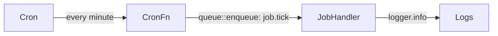

The `cron` trigger type fires a registered function on a schedule. The function receives `null` / `None` input — the invocation itself is the signal. Work is typically fanned out by calling `queue::enqueue` to downstream queue handlers.



## Minimal cron function

<Tabs items={['TypeScript', 'Python', 'Rust']}>
  <Tab value="TypeScript">

```typescript
import { init, getContext } from 'iii-sdk'

const iii = init(process.env.III_BRIDGE_URL ?? 'ws://localhost:49134')

iii.registerFunction(
  { id: 'cron.periodic_job', description: 'Fires on schedule and enqueues work' },
  async () => {
    const ctx = getContext()
    ctx.logger.info('Periodic job fired')

    await iii.trigger('queue::enqueue', {
      topic: 'job.tick',
      data: { firedAt: new Date().toISOString(), message: 'Periodic job executed' },
    })
  },
)

iii.registerTrigger({
  type: 'cron',
  function_id: 'cron.periodic_job',
  config: { expression: '* * * * *' }, // every minute
})
```

  </Tab>
  <Tab value="Python">

```python
import asyncio
from datetime import datetime, timezone
from iii import III, InitOptions, get_context

iii = III(address="ws://localhost:49134", options=InitOptions(worker_name="cron-worker"))


async def periodic_job(_data, ctx) -> None:
    ctx.logger.info("Periodic job fired")

    await iii.trigger("queue::enqueue", {
        "topic": "job.tick",
        "data": {
            "firedAt": datetime.now(timezone.utc).isoformat(),
            "message": "Periodic job executed",
        },
    })


iii.register_function("cron.periodic_job", lambda data: periodic_job(data, get_context()))
iii.register_trigger(
    type="cron",
    function_id="cron.periodic_job",
    config={"expression": "* * * * *"},  # every minute
)
```

  </Tab>
  <Tab value="Rust">

```rust
use iii_sdk::{III, get_context};
use serde_json::json;

let iii = III::new("ws://127.0.0.1:49134");

iii.register_function("cron.periodic_job", |_input| async move {
    let ctx = get_context();
    ctx.logger.info("Periodic job fired", None);

    iii.trigger_void("queue::enqueue", json!({
        "topic": "job.tick",
        "data": {
            "firedAt": chrono::Utc::now().to_rfc3339(),
            "message": "Periodic job executed",
        },
    }))?;

    Ok(json!(null))
});

iii.register_trigger("cron", "cron.periodic_job", json!({
    "expression": "* * * * *",
}))?;

iii.connect().await?;
```

  </Tab>
</Tabs>

## Downstream queue handler

The function that consumes the cron's emitted event:

<Tabs items={['TypeScript', 'Python', 'Rust']}>
  <Tab value="TypeScript">

```typescript
iii.registerFunction(
  { id: 'job.handle_tick', description: 'Processes the periodic job event' },
  async (data: { firedAt: string; message: string }) => {
    const ctx = getContext()
    ctx.logger.info('Periodic job processed', { firedAt: data.firedAt, message: data.message })
  },
)

iii.registerTrigger({
  type: 'queue',
  function_id: 'job.handle_tick',
  config: { topic: 'job.tick' },
})
```

  </Tab>
  <Tab value="Python">

```python
async def handle_tick(data: dict, ctx) -> None:
    ctx.logger.info("Periodic job processed", {
        "firedAt": data.get("firedAt"),
        "message": data.get("message"),
    })


iii.register_function("job.handle_tick", lambda data: handle_tick(data, get_context()))
iii.register_trigger(type="queue", function_id="job.handle_tick", config={"topic": "job.tick"})
```

  </Tab>
  <Tab value="Rust">

```rust
iii.register_function("job.handle_tick", |input| async move {
    let ctx = get_context();
    ctx.logger.info("Periodic job processed", Some(input));
    Ok(json!(null))
});

iii.register_trigger("queue", "job.handle_tick", json!({ "topic": "job.tick" }))?;
```

  </Tab>
</Tabs>

## State sweep cron

A common pattern: read all records in a state scope, filter them by a business rule, and emit events for those that need action.

<Tabs items={['TypeScript', 'Python', 'Rust']}>
  <Tab value="TypeScript">

```typescript
iii.registerFunction(
  { id: 'cron.orders_sweep', description: 'Checks for overdue orders every 5 minutes' },
  async () => {
    const ctx = getContext()

    const orders = await iii.trigger<{
      id: string
      shipDate: string
      complete: boolean
      status: string
    }[]>('state::list', { scope: 'orders' })

    let swept = 0

    for (const order of orders ?? []) {
      if (!order.complete && new Date() > new Date(order.shipDate)) {
        ctx.logger.warn('Order overdue', { orderId: order.id, shipDate: order.shipDate })

        await iii.trigger('queue::enqueue', {
          topic: 'notification',
          data: {
            orderId: order.id,
            templateId: 'order-audit-warning',
            status: order.status,
            shipDate: order.shipDate,
          },
        })

        swept++
      }
    }

    ctx.logger.info('Sweep complete', { checked: orders?.length ?? 0, swept })
  },
)

iii.registerTrigger({
  type: 'cron',
  function_id: 'cron.orders_sweep',
  config: { expression: '*/5 * * * *' },
})
```

  </Tab>
  <Tab value="Python">

```python
from datetime import datetime, timezone


async def orders_sweep(_data, ctx) -> None:
    orders = await iii.trigger("state::list", {"scope": "orders"}) or []
    swept = 0

    for order in orders:
        complete = order.get("complete", False)
        ship_date_str = order.get("shipDate") or order.get("ship_date", "2099-01-01T00:00:00Z")

        try:
            ship_date = datetime.fromisoformat(ship_date_str.replace("Z", "+00:00"))
        except ValueError:
            continue

        if not complete and datetime.now(timezone.utc) > ship_date:
            ctx.logger.warn("Order overdue", {"orderId": order.get("id")})

            await iii.trigger("queue::enqueue", {
                "topic": "notification",
                "data": {
                    "orderId": order.get("id"),
                    "templateId": "order-audit-warning",
                    "status": order.get("status"),
                },
            })
            swept += 1

    ctx.logger.info("Sweep complete", {"checked": len(orders), "swept": swept})


iii.register_function("cron.orders_sweep", lambda data: orders_sweep(data, get_context()))
iii.register_trigger(type="cron", function_id="cron.orders_sweep", config={"expression": "*/5 * * * *"})
```

  </Tab>
  <Tab value="Rust">

```rust
iii.register_function("cron.orders_sweep", |_input| async move {
    let ctx = get_context();

    let orders_val = iii.trigger("state::list", json!({ "scope": "orders" })).await?;
    let orders = orders_val.as_array().cloned().unwrap_or_default();
    let mut swept = 0usize;

    for order in &orders {
        let complete = order["complete"].as_bool().unwrap_or(false);
        let ship_date_str = order["shipDate"].as_str().unwrap_or("2099-01-01T00:00:00Z");

        if let Ok(ship_date) = chrono::DateTime::parse_from_rfc3339(ship_date_str) {
            if !complete && chrono::Utc::now() > ship_date {
                ctx.logger.warn("Order overdue", Some(json!({ "orderId": order["id"] })));

                iii.trigger_void("queue::enqueue", json!({
                    "topic": "notification",
                    "data": {
                        "orderId": order["id"],
                        "templateId": "order-audit-warning",
                    },
                }))?;

                swept += 1;
            }
        }
    }

    ctx.logger.info("Sweep complete", Some(json!({
        "checked": orders.len(),
        "swept": swept,
    })));

    Ok(json!(null))
});

iii.register_trigger("cron", "cron.orders_sweep", json!({ "expression": "*/5 * * * *" }))?;
```

  </Tab>
</Tabs>

## Cron expression format

iii uses a six-field extended cron format. The optional leading field is seconds.

```
┌──────────── second (0-59, optional)
│ ┌────────── minute (0-59)
│ │ ┌──────── hour (0-23)
│ │ │ ┌────── day of month (1-31)
│ │ │ │ ┌──── month (1-12)
│ │ │ │ │ ┌── day of week (0-7)
│ │ │ │ │ │
* * * * * *
```

| Expression | Meaning |
|---|---|
| `* * * * *` | Every minute |
| `0 * * * *` | Every hour |
| `0 9 * * 1-5` | 09:00 on weekdays |
| `*/5 * * * *` | Every 5 minutes |
| `0/5 * * * * *` | Every 5 seconds (with seconds field) |

## Key concepts

- The cron function receives `null` / `None` input. Never rely on input data in a cron handler.
- Keep cron handlers lightweight. Use `queue::enqueue` to fan out work to queue handlers that can run in parallel.
- Combine `state::list` with cron for periodic sweeps over accumulated data — the state sweep pattern above is the idiomatic approach.
