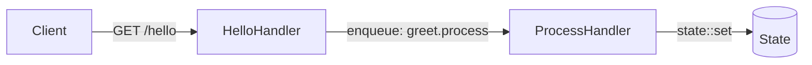

This example shows the two-step pattern at the heart of most iii workflows: an **HTTP handler** accepts a request and publishes an event to the queue, then a **queue handler** processes that event in the background and persists the result to state.



## Worker setup

Every iii worker starts by initialising the SDK and connecting to the engine.

<Tabs items={['TypeScript', 'Python', 'Rust']}>
  <Tab value="TypeScript">

```typescript
// worker.ts
import { init, getContext, type ApiRequest, type ApiResponse } from 'iii-sdk'

const iii = init(process.env.III_BRIDGE_URL ?? 'ws://localhost:49134')
```

  </Tab>
  <Tab value="Python">

```python
# worker.py
import asyncio
from iii import III, InitOptions, ApiRequest, ApiResponse, get_context

iii = III(
    address="ws://localhost:49134",
    options=InitOptions(worker_name="hello-worker"),
)
```

  </Tab>
  <Tab value="Rust">

```rust
// main.rs
use iii_sdk::{III, get_context};
use serde_json::json;

#[tokio::main]
async fn main() -> Result<(), Box<dyn std::error::Error>> {
    let iii = III::new("ws://127.0.0.1:49134");
    iii.connect().await?;
    // ... register functions
    loop { tokio::time::sleep(std::time::Duration::from_secs(60)).await; }
}
```

  </Tab>
</Tabs>

## Step 1 — HTTP handler

Registers a function and binds it to an HTTP trigger. Returns immediately after publishing to the queue.

<Tabs items={['TypeScript', 'Python', 'Rust']}>
  <Tab value="TypeScript">

```typescript
iii.registerFunction(
  { id: 'hello.api', description: 'Receives hello request' },
  async (req: ApiRequest) => {
    const ctx = getContext()
    const appName = 'III App'
    const requestId = Math.random().toString(36).substring(7)

    ctx.logger.info('Hello API called', { appName, requestId })

    await iii.trigger('queue::enqueue', {
      topic: 'greet.process',
      data: {
        requestId,
        appName,
        greetingPrefix: process.env.GREETING_PREFIX ?? 'Hello',
        timestamp: new Date().toISOString(),
      },
    })

    return {
      status_code: 200,
      body: {
        message: 'Hello request received! Processing in background.',
        status: 'processing',
        appName,
      },
    } satisfies ApiResponse
  },
)

iii.registerTrigger({
  type: 'http',
  function_id: 'hello.api',
  config: { api_path: 'hello', http_method: 'GET' },
})
```

  </Tab>
  <Tab value="Python">

```python
import os
import random
import string
from datetime import datetime, timezone


async def hello_api(req: ApiRequest, ctx) -> ApiResponse:
    app_name = "III App"
    request_id = "".join(random.choices(string.ascii_lowercase + string.digits, k=7))

    ctx.logger.info("Hello API called", {"appName": app_name, "requestId": request_id})

    await iii.trigger("queue::enqueue", {
        "topic": "greet.process",
        "data": {
            "requestId": request_id,
            "appName": app_name,
            "greetingPrefix": os.environ.get("GREETING_PREFIX", "Hello"),
            "timestamp": datetime.now(timezone.utc).isoformat(),
        },
    })

    return ApiResponse(
        statusCode=200,
        body={
            "message": "Hello request received! Processing in background.",
            "status": "processing",
            "appName": app_name,
        },
    )


iii.register_function("hello.api", lambda data: hello_api(
    ApiRequest(**data) if isinstance(data, dict) else data,
    get_context(),
))
iii.register_trigger(
    type="http",
    function_id="hello.api",
    config={"api_path": "hello", "http_method": "GET"},
)
```

  </Tab>
  <Tab value="Rust">

```rust
use iii_sdk::{III, get_context, types::ApiRequest};

iii.register_function("hello.api", |input| async move {
    let ctx = get_context();
    let app_name = "III App";
    let request_id = uuid::Uuid::new_v4().to_string();

    ctx.logger.info("Hello API called", Some(json!({
        "appName": app_name,
        "requestId": request_id,
    })));

    iii.trigger_void("queue::enqueue", json!({
        "topic": "greet.process",
        "data": {
            "requestId": request_id,
            "appName": app_name,
            "greetingPrefix": "Hello",
            "timestamp": chrono::Utc::now().to_rfc3339(),
        },
    }))?;

    Ok(json!({
        "status_code": 200,
        "body": {
            "message": "Hello request received! Processing in background.",
            "status": "processing",
            "appName": app_name,
        },
    }))
});

iii.register_trigger("http", "hello.api", json!({
    "api_path": "hello",
    "http_method": "GET",
}))?;
```

  </Tab>
</Tabs>

## Step 2 — Queue handler

Consumes the event, builds the greeting, and persists it to state.

<Tabs items={['TypeScript', 'Python', 'Rust']}>
  <Tab value="TypeScript">

```typescript
iii.registerFunction(
  { id: 'greet.process', description: 'Processes greeting in background' },
  async (data) => {
    const ctx = getContext()
    const { requestId, appName, greetingPrefix, timestamp } = data as {
      requestId: string
      appName: string
      greetingPrefix: string
      timestamp: string
    }

    ctx.logger.info('Processing greeting', { requestId, appName })

    const greeting = `${greetingPrefix} ${appName}!`

    await iii.trigger('state::set', {
      scope: 'greetings',
      key: requestId,
      data: {
        greeting,
        processedAt: new Date().toISOString(),
        originalTimestamp: timestamp,
      },
    })

    ctx.logger.info('Greeting processed', { requestId, greeting })
  },
)

iii.registerTrigger({
  type: 'queue',
  function_id: 'greet.process',
  config: { topic: 'greet.process' },
})
```

  </Tab>
  <Tab value="Python">

```python
from datetime import datetime, timezone


async def greet_process(data: dict, ctx) -> None:
    request_id = data.get("requestId", "unknown")
    app_name = data.get("appName", "III App")
    greeting_prefix = data.get("greetingPrefix", "Hello")
    timestamp = data.get("timestamp", "")

    ctx.logger.info("Processing greeting", {"requestId": request_id, "appName": app_name})

    greeting = f"{greeting_prefix} {app_name}!"

    await iii.trigger("state::set", {
        "scope": "greetings",
        "key": request_id,
        "data": {
            "greeting": greeting,
            "processedAt": datetime.now(timezone.utc).isoformat(),
            "originalTimestamp": timestamp,
        },
    })

    ctx.logger.info("Greeting processed", {"requestId": request_id, "greeting": greeting})


iii.register_function("greet.process", lambda data: greet_process(data, get_context()))
iii.register_trigger(
    type="queue",
    function_id="greet.process",
    config={"topic": "greet.process"},
)
```

  </Tab>
  <Tab value="Rust">

```rust
iii.register_function("greet.process", |input| async move {
    let ctx = get_context();
    let request_id = input["requestId"].as_str().unwrap_or("unknown");
    let app_name = input["appName"].as_str().unwrap_or("III App");
    let prefix = input["greetingPrefix"].as_str().unwrap_or("Hello");
    let timestamp = input["timestamp"].as_str().unwrap_or("");

    ctx.logger.info("Processing greeting", Some(json!({
        "requestId": request_id,
        "appName": app_name,
    })));

    let greeting = format!("{} {}!", prefix, app_name);

    iii.trigger_void("state::set", json!({
        "scope": "greetings",
        "key": request_id,
        "data": {
            "greeting": greeting,
            "processedAt": chrono::Utc::now().to_rfc3339(),
            "originalTimestamp": timestamp,
        },
    }))?;

    ctx.logger.info("Greeting processed", Some(json!({ "requestId": request_id })));

    Ok(json!(null))
});

iii.register_trigger("queue", "greet.process", json!({
    "topic": "greet.process",
}))?;
```

  </Tab>
</Tabs>

## Connect and run

<Callout title="Node.js connects automatically" type="info">
  The Node SDK establishes the WebSocket connection when you call `init()`. There is no separate `connect()` method. Keep the process alive so the worker stays registered.
</Callout>

<Tabs items={['TypeScript', 'Python', 'Rust']}>
  <Tab value="TypeScript">

```typescript
// Node SDK connects on init() — keep the process alive
await new Promise(() => {})
```

  </Tab>
  <Tab value="Python">

```python
async def main() -> None:
    await iii.connect()
    while True:
        await asyncio.sleep(60)

asyncio.run(main())
```

  </Tab>
  <Tab value="Rust">

```rust
// Already in the main() above — connect then event loop
iii.connect().await?;
loop {
    tokio::time::sleep(std::time::Duration::from_secs(60)).await;
}
```

  </Tab>
</Tabs>

## Test it

```bash
curl http://localhost:3111/hello
# {"message":"Hello request received! Processing in background.","status":"processing","appName":"III App"}
```

## Key concepts

- `iii.registerFunction` pairs a string ID with an async handler. The ID is referenced by all triggers bound to that function.
- `iii.registerTrigger` binds a trigger type + config to a function ID. A function can have multiple triggers.
- `iii.trigger('queue::enqueue', { topic, data })` publishes an event to the named topic. Any worker with a `queue` trigger on that topic will receive it.
- `iii.trigger('state::set', { scope, key, data })` persists data to the engine's key-value store, addressed by `scope` + `key`.
