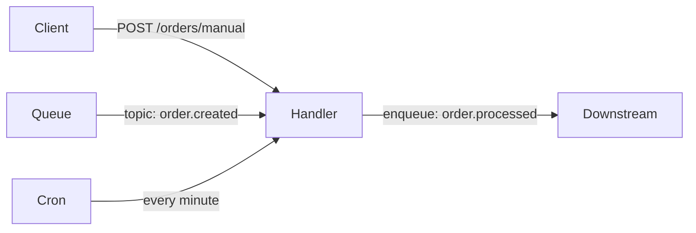

A single function can be bound to as many triggers as needed. Just call `registerTrigger` / `register_trigger` multiple times with the same `function_id`. Inside the handler, inspect the input shape to dispatch to the right branch.



## Register one function, three triggers

<Tabs items={['TypeScript', 'Python', 'Rust']}>
  <Tab value="TypeScript">

```typescript
import { init, getContext, type ApiRequest } from 'iii-sdk'

const iii = init(process.env.III_BRIDGE_URL ?? 'ws://localhost:49134')

iii.registerFunction(
  { id: 'orders.handle', description: 'Handles orders from API, queue, or cron' },
  async (input) => {
    const ctx = getContext()

    // HTTP trigger — input is an ApiRequest shape
    if (input && typeof input === 'object' && 'path_params' in input) {
      const req = input as ApiRequest<{ amount: number; description: string }>
      const orderId = `order-${Date.now()}`

      ctx.logger.info('Processing manual order via API', { amount: req.body?.amount })

      iii.triggerVoid('state::set', {
        scope: 'orders',
        key: orderId,
        data: { id: orderId, ...req.body, source: 'api', createdAt: new Date().toISOString() },
      })

      iii.triggerVoid('enqueue', {
        topic: 'order.processed',
        data: { orderId, source: 'api' },
      })

      return { status_code: 200, body: { message: 'Order processed', orderId } }
    }

    // Queue trigger — input is the event payload
    if (input && typeof input === 'object' && 'amount' in input) {
      const { amount, description } = input as { amount: number; description: string }
      const orderId = `order-${Date.now()}`

      ctx.logger.info('Processing order from queue', { amount })

      iii.triggerVoid('state::set', {
        scope: 'orders',
        key: orderId,
        data: { id: orderId, amount, description, source: 'queue', createdAt: new Date().toISOString() },
      })

      iii.triggerVoid('enqueue', {
        topic: 'order.processed',
        data: { orderId, amount, source: 'queue' },
      })

      return
    }

    // Cron trigger — input is null/empty
    ctx.logger.info('Processing scheduled order batch')

    const pendingOrders = await iii.trigger<{ id: string; amount: number }[]>('state::list', {
      scope: 'pending-orders',
    })

    for (const order of pendingOrders ?? []) {
      iii.triggerVoid('enqueue', {
        topic: 'order.processed',
        data: { orderId: order.id, amount: order.amount, source: 'cron' },
      })
    }

    ctx.logger.info('Batch complete', { count: pendingOrders?.length ?? 0 })
  },
)

// Bind all three trigger types to the same function ID
iii.registerTrigger({
  type: 'http',
  function_id: 'orders.handle',
  config: { api_path: 'orders/manual', http_method: 'POST' },
})

iii.registerTrigger({
  type: 'queue',
  function_id: 'orders.handle',
  config: { topic: 'order.created' },
})

iii.registerTrigger({
  type: 'cron',
  function_id: 'orders.handle',
  config: { expression: '* * * * *' },
})
```

  </Tab>
  <Tab value="Python">

```python
import asyncio
from iii import III, InitOptions, ApiRequest, ApiResponse, get_context

iii = III(address="ws://localhost:49134", options=InitOptions(worker_name="orders-worker"))


async def orders_handle(data, ctx) -> dict | None:
    # HTTP trigger — data has 'path_params', 'body', etc.
    if isinstance(data, dict) and "path_params" in data:
        req = ApiRequest(**data)
        order_id = f"order-{int(__import__('time').time() * 1000)}"

        ctx.logger.info("Processing manual order via API", {"amount": req.body.get("amount")})

        iii.trigger_void("state::set", {
            "scope": "orders",
            "key": order_id,
            "data": {**req.body, "id": order_id, "source": "api"},
        })
        iii.trigger_void("enqueue", {
            "topic": "order.processed",
            "data": {"orderId": order_id, "source": "api"},
        })

        return ApiResponse(
            statusCode=200, body={"message": "Order processed", "orderId": order_id}
        ).model_dump(by_alias=True)

    # Queue trigger — data is the event payload dict
    if isinstance(data, dict) and "amount" in data:
        amount = data.get("amount", 0)
        order_id = f"order-{int(__import__('time').time() * 1000)}"

        ctx.logger.info("Processing order from queue", {"amount": amount})

        iii.trigger_void("state::set", {
            "scope": "orders",
            "key": order_id,
            "data": {**data, "id": order_id, "source": "queue"},
        })
        iii.trigger_void("enqueue", {
            "topic": "order.processed",
            "data": {"orderId": order_id, "source": "queue"},
        })
        return None

    # Cron trigger — data is None or empty
    ctx.logger.info("Processing scheduled order batch")

    pending = await iii.trigger("state::list", {"scope": "pending-orders"}) or []
    for order in pending:
        iii.trigger_void("enqueue", {
            "topic": "order.processed",
            "data": {"orderId": order["id"], "source": "cron"},
        })

    ctx.logger.info("Batch complete", {"count": len(pending)})
    return None


iii.register_function("orders.handle", lambda data: orders_handle(data, get_context()))

iii.register_trigger(type="http", function_id="orders.handle",
                     config={"api_path": "orders/manual", "http_method": "POST"})
iii.register_trigger(type="queue", function_id="orders.handle",
                     config={"topic": "order.created"})
iii.register_trigger(type="cron", function_id="orders.handle",
                     config={"expression": "* * * * *"})
```

  </Tab>
  <Tab value="Rust">

```rust
use iii_sdk::{III, get_context, types::ApiRequest};
use serde_json::json;

iii.register_function("orders.handle", |input| async move {
    let ctx = get_context();

    // HTTP trigger — try to parse as ApiRequest
    if let Ok(req) = serde_json::from_value::<ApiRequest>(input.clone()) {
        let order_id = format!("order-{}", chrono::Utc::now().timestamp_millis());

        ctx.logger.info("Processing manual order via API", Some(json!({
            "amount": req.body["amount"]
        })));

        iii.trigger_void("state::set", json!({
            "scope": "orders",
            "key": order_id,
            "data": { "id": order_id, "source": "api", "amount": req.body["amount"] },
        }))?;

        iii.trigger_void("enqueue", json!({
            "topic": "order.processed",
            "data": { "orderId": order_id, "source": "api" },
        }))?;

        return Ok(json!({ "status_code": 200, "body": { "orderId": order_id } }));
    }

    // Queue trigger — input has "amount"
    if input.get("amount").is_some() {
        let amount = input["amount"].as_f64().unwrap_or(0.0);
        let order_id = format!("order-{}", chrono::Utc::now().timestamp_millis());

        ctx.logger.info("Processing order from queue", Some(json!({ "amount": amount })));

        iii.trigger_void("enqueue", json!({
            "topic": "order.processed",
            "data": { "orderId": order_id, "source": "queue" },
        }))?;

        return Ok(json!(null));
    }

    // Cron trigger
    ctx.logger.info("Processing scheduled batch", None);

    let pending = iii.trigger("state::list", json!({ "scope": "pending-orders" })).await?;
    let orders = pending.as_array().cloned().unwrap_or_default();

    for order in &orders {
        iii.trigger_void("enqueue", json!({
            "topic": "order.processed",
            "data": { "orderId": order["id"], "source": "cron" },
        }))?;
    }

    ctx.logger.info("Batch complete", Some(json!({ "count": orders.len() })));
    Ok(json!(null))
});

iii.register_trigger("http", "orders.handle", json!({
    "api_path": "orders/manual",
    "http_method": "POST",
}))?;
iii.register_trigger("queue", "orders.handle", json!({ "topic": "order.created" }))?;
iii.register_trigger("cron", "orders.handle", json!({ "expression": "* * * * *" }))?;
```

  </Tab>
</Tabs>

## Dual-trigger shorthand

When you only need two trigger types, the pattern is identical — just skip the third `registerTrigger` call.

<Tabs items={['TypeScript', 'Python', 'Rust']}>
  <Tab value="TypeScript">

```typescript
iii.registerTrigger({ type: 'queue', function_id: 'my.fn', config: { topic: 'events' } })
iii.registerTrigger({ type: 'http', function_id: 'my.fn', config: { api_path: 'events', http_method: 'POST' } })
```

  </Tab>
  <Tab value="Python">

```python
iii.register_trigger(type="queue", function_id="my.fn", config={"topic": "events"})
iii.register_trigger(type="http", function_id="my.fn", config={"api_path": "events", "http_method": "POST"})
```

  </Tab>
  <Tab value="Rust">

```rust
iii.register_trigger("queue", "my.fn", json!({ "topic": "events" }))?;
iii.register_trigger("http", "my.fn", json!({ "api_path": "events", "http_method": "POST" }))?;
```

  </Tab>
</Tabs>

## Key concepts

- There is no framework-level `ctx.match()` — distinguish trigger types by inspecting the input shape at runtime.
- HTTP trigger input always has `path_params`, `query_params`, `body`, and `headers` fields.
- Queue trigger input is the raw event payload you published with `enqueue`.
- Cron trigger input is `null` / `None` / `json!(null)` — the invocation itself is the signal.
- Registering the same `function_id` with multiple triggers is intentional and supported; the engine dispatches independently.
