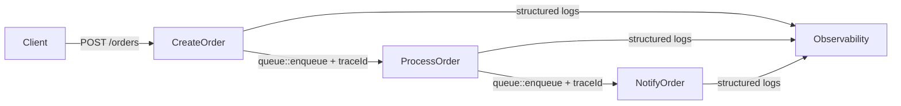

Every iii function invocation receives a `traceId` (via `getContext()`) that is automatically propagated to downstream queue handlers. All logs emitted through the context logger are structured JSON and correlated to the active trace.



## Multi-step workflow with trace correlation

<Tabs items={['TypeScript', 'Python', 'Rust']}>
  <Tab value="TypeScript">

```typescript
import { init, getContext, type ApiRequest } from 'iii-sdk'

const iii = init(process.env.III_BRIDGE_URL ?? 'ws://localhost:49134', {
  otel: {
    enabled: true,
    serviceName: 'orders-service',
    metricsEnabled: true,
  },
})

// Step 1 — HTTP handler
iii.registerFunction(
  { id: 'orders.create', description: 'Creates an order and starts the processing pipeline' },
  async (req: ApiRequest<{ customerId: string; amount: number; items: string[] }>) => {
    const ctx = getContext()
    const { customerId, amount, items } = req.body ?? {}

    if (!customerId || !amount) {
      return { status_code: 400, body: { error: 'customerId and amount are required' } }
    }

    const orderId = `order-${Date.now()}`

    ctx.logger.info('Order created', {
      orderId,
      customerId,
      amount,
      traceId: ctx.traceId, // same traceId will appear in downstream logs
    })

    await iii.call('state::set', {
      scope: 'orders',
      key: orderId,
      data: { id: orderId, customerId, amount, items, status: 'created', createdAt: new Date().toISOString() },
    })

    await iii.call('queue::enqueue', {
      topic: 'order.process',
      data: { orderId, amount, customerId, items },
    })

    return { status_code: 201, body: { orderId, status: 'processing' } }
  },
)

iii.registerTrigger({
  type: 'http',
  function_id: 'orders.create',
  config: { api_path: 'orders', http_method: 'POST' },
})
```

  </Tab>
  <Tab value="Python">

```python
import asyncio
from datetime import datetime, timezone
from iii import III, InitOptions, ApiRequest, ApiResponse, get_context

iii = III(address="ws://localhost:49134", options=InitOptions(worker_name="orders-service"))


async def create_order(req: ApiRequest, ctx) -> ApiResponse:
    body = req.body or {}
    customer_id = body.get("customerId")
    amount = body.get("amount")

    if not customer_id or not amount:
        return ApiResponse(statusCode=400, body={"error": "customerId and amount are required"})

    order_id = f"order-{int(__import__('time').time() * 1000)}"

    ctx.logger.info("Order created", {
        "orderId": order_id,
        "customerId": customer_id,
        "amount": amount,
        "traceId": ctx.trace_id,  # same traceId will appear in downstream logs
    })

    await iii.call("state::set", {
        "scope": "orders",
        "key": order_id,
        "data": {
            "id": order_id,
            "customerId": customer_id,
            "amount": amount,
            "status": "created",
            "createdAt": datetime.now(timezone.utc).isoformat(),
        },
    })

    await iii.call("queue::enqueue", {
        "topic": "order.process",
        "data": {"orderId": order_id, "amount": amount, "customerId": customer_id},
    })

    return ApiResponse(statusCode=201, body={"orderId": order_id, "status": "processing"})


iii.register_function("orders.create", lambda data: create_order(
    ApiRequest(**data) if isinstance(data, dict) else data, get_context()
))
iii.register_trigger(
    type="http", function_id="orders.create",
    config={"api_path": "orders", "http_method": "POST"},
)
```

  </Tab>
  <Tab value="Rust">

```rust
use iii_sdk::{III, get_context, types::ApiRequest};
use serde_json::json;

iii.register_function("orders.create", |input| async move {
    let ctx = get_context();
    let req: ApiRequest = serde_json::from_value(input)?;

    let customer_id = req.body["customerId"].as_str().unwrap_or("").to_string();
    let amount = req.body["amount"].as_f64().unwrap_or(0.0);

    if customer_id.is_empty() || amount == 0.0 {
        return Ok(json!({
            "status_code": 400,
            "body": { "error": "customerId and amount are required" },
        }));
    }

    let order_id = format!("order-{}", chrono::Utc::now().timestamp_millis());

    ctx.logger.info("Order created", Some(json!({
        "orderId": order_id,
        "customerId": customer_id,
        "amount": amount,
        "traceId": ctx.trace_id, // same traceId propagated to downstream handlers
    })));

    iii.call_void("state::set", json!({
        "scope": "orders",
        "key": order_id,
        "data": {
            "id": order_id,
            "customerId": customer_id,
            "amount": amount,
            "status": "created",
            "createdAt": chrono::Utc::now().to_rfc3339(),
        },
    }))?;

    iii.call_void("queue::enqueue", json!({
        "topic": "order.process",
        "data": { "orderId": order_id, "amount": amount, "customerId": customer_id },
    }))?;

    Ok(json!({ "status_code": 201, "body": { "orderId": order_id, "status": "processing" } }))
});

iii.register_trigger("http", "orders.create", json!({
    "api_path": "orders",
    "http_method": "POST",
}))?;
```

  </Tab>
</Tabs>

## Step 2 — Queue processor

<Tabs items={['TypeScript', 'Python', 'Rust']}>
  <Tab value="TypeScript">

```typescript
iii.registerFunction(
  { id: 'order.process', description: 'Processes a created order' },
  async (data: { orderId: string; amount: number; customerId: string }) => {
    const ctx = getContext()
    const { orderId, amount, customerId } = data

    ctx.logger.info('Processing order', { orderId, amount, customerId, traceId: ctx.traceId })

    await iii.call('state::set', {
      scope: 'orders',
      key: orderId,
      data: { status: 'processed', processedAt: new Date().toISOString() },
    })

    await iii.call('queue::enqueue', {
      topic: 'order.notify',
      data: { orderId, customerId, amount, status: 'processed' },
    })

    ctx.logger.info('Order processed', { orderId, traceId: ctx.traceId })
  },
)

iii.registerTrigger({
  type: 'queue',
  function_id: 'order.process',
  config: { topic: 'order.process' },
})
```

  </Tab>
  <Tab value="Python">

```python
async def process_order(data: dict, ctx) -> None:
    order_id = data.get("orderId")
    amount = data.get("amount")
    customer_id = data.get("customerId")

    ctx.logger.info("Processing order", {
        "orderId": order_id,
        "amount": amount,
        "traceId": ctx.trace_id,
    })

    await iii.call("state::set", {
        "scope": "orders",
        "key": order_id,
        "data": {
            "status": "processed",
            "processedAt": datetime.now(timezone.utc).isoformat(),
        },
    })

    await iii.call("queue::enqueue", {
        "topic": "order.notify",
        "data": {"orderId": order_id, "customerId": customer_id, "amount": amount, "status": "processed"},
    })

    ctx.logger.info("Order processed", {"orderId": order_id, "traceId": ctx.trace_id})


iii.register_function("order.process", lambda data: process_order(data, get_context()))
iii.register_trigger(type="queue", function_id="order.process", config={"topic": "order.process"})
```

  </Tab>
  <Tab value="Rust">

```rust
iii.register_function("order.process", |input| async move {
    let ctx = get_context();
    let order_id = input["orderId"].as_str().unwrap_or("unknown");

    ctx.logger.info("Processing order", Some(json!({
        "orderId": order_id,
        "traceId": ctx.trace_id,
    })));

    iii.call_void("queue::enqueue", json!({
        "topic": "order.notify",
        "data": { "orderId": order_id, "customerId": input["customerId"] },
    }))?;

    ctx.logger.info("Order processed", Some(json!({ "orderId": order_id })));
    Ok(json!(null))
});

iii.register_trigger("queue", "order.process", json!({ "topic": "order.process" }))?;
```

  </Tab>
</Tabs>

## Step 3 — Notification

<Tabs items={['TypeScript', 'Python', 'Rust']}>
  <Tab value="TypeScript">

```typescript
iii.registerFunction(
  { id: 'order.notify', description: 'Sends order notification' },
  async (data: { orderId: string; customerId: string; status: string; amount: number }) => {
    const ctx = getContext()
    const { orderId, customerId, status, amount } = data

    ctx.logger.info('Sending order notification', {
      orderId,
      customerId,
      status,
      amount,
      traceId: ctx.traceId,
    })

    // integrate with your notification service here
    ctx.logger.info('Order notification sent', { orderId, traceId: ctx.traceId })
  },
)

iii.registerTrigger({
  type: 'queue',
  function_id: 'order.notify',
  config: { topic: 'order.notify' },
})
```

  </Tab>
  <Tab value="Python">

```python
async def notify_order(data: dict, ctx) -> None:
    order_id = data.get("orderId")
    customer_id = data.get("customerId")

    ctx.logger.info("Sending order notification", {
        "orderId": order_id,
        "customerId": customer_id,
        "traceId": ctx.trace_id,
    })

    # integrate with your notification service here
    ctx.logger.info("Order notification sent", {"orderId": order_id, "traceId": ctx.trace_id})


iii.register_function("order.notify", lambda data: notify_order(data, get_context()))
iii.register_trigger(type="queue", function_id="order.notify", config={"topic": "order.notify"})
```

  </Tab>
  <Tab value="Rust">

```rust
iii.register_function("order.notify", |input| async move {
    let ctx = get_context();
    let order_id = input["orderId"].as_str().unwrap_or("unknown");

    ctx.logger.info("Sending order notification", Some(json!({
        "orderId": order_id,
        "traceId": ctx.trace_id,
    })));

    // integrate with your notification service here
    ctx.logger.info("Order notification sent", Some(json!({ "orderId": order_id })));
    Ok(json!(null))
});

iii.register_trigger("queue", "order.notify", json!({ "topic": "order.notify" }))?;
```

  </Tab>
</Tabs>

## OpenTelemetry setup

<Tabs items={['TypeScript', 'Python', 'Rust']}>
  <Tab value="TypeScript">

```typescript
// Pass otel config to init()
const iii = init('ws://localhost:49134', {
  otel: {
    enabled: true,
    serviceName: 'my-service',
    serviceVersion: '1.0.0',
    metricsEnabled: true,
    metricsExportIntervalMs: 10000,
    reconnectionConfig: {
      maxRetries: 10,
    },
  },
})
```

The iii SDK exports traces and metrics automatically via the engine's OpenTelemetry pipeline (OTLP over the WebSocket). No separate exporter configuration is required.

  </Tab>
  <Tab value="Python">

```python
# OTel is handled by the engine — just pass the worker name in InitOptions
iii = III(address="ws://localhost:49134", options=InitOptions(worker_name="my-service"))

# Traces are automatically correlated via ctx.trace_id
# Access trace_id in any handler:
ctx = get_context()
print(ctx.trace_id)
```

  </Tab>
  <Tab value="Rust">

```toml
# Cargo.toml — enable the telemetry feature
[dependencies]
iii-sdk = { version = "0.1", features = ["telemetry"] }
```

```rust
// Initialize OTLP before connecting
iii_sdk::telemetry::init_otlp("my-service").await?;

let iii = III::new("ws://127.0.0.1:49134");
iii.connect().await?;

// ctx.trace_id is available in every handler
let ctx = get_context();
ctx.logger.info("My message", Some(json!({ "traceId": ctx.trace_id })));
```

  </Tab>
</Tabs>

## Logger methods

| Method | TypeScript | Python | Rust |
|---|---|---|---|
| Info | `ctx.logger.info(msg, metadata?)` | `ctx.logger.info(msg, fields?)` | `ctx.logger.info(msg, Some(json!({...})))` |
| Warning | `ctx.logger.warn(msg, metadata?)` | `ctx.logger.warn(msg, fields?)` | `ctx.logger.warn(msg, None)` |
| Error | `ctx.logger.error(msg, metadata?)` | `ctx.logger.error(msg, fields?)` | `ctx.logger.error(msg, None)` |
| Debug | `ctx.logger.debug(msg, metadata?)` | `ctx.logger.debug(msg, fields?)` | `ctx.logger.debug(msg, None)` |

## Key concepts

- `ctx.traceId` / `ctx.trace_id` is the W3C trace-context ID for the current invocation. It is automatically propagated to all downstream workers when you emit an event — no manual header passing is needed.
- All logs are emitted as structured JSON via the engine's `log.info` / `log.warn` / `log.error` functions.
- The Node.js SDK supports OTel configuration directly in `init()`. Python and Rust use the engine's built-in OTLP pipeline.
- Log every step at entry and exit with the `traceId` to make multi-step flows fully observable.
