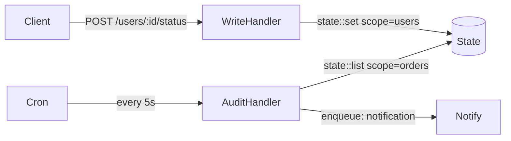

State in iii is a distributed key-value store addressed by `scope` (group) + `key` (item ID). Any worker can read and write state by triggering `state::get`, `state::set`, `state::delete`, and `state::list` through the engine.



## Writing state

<Tabs items={['TypeScript', 'Python', 'Rust']}>
  <Tab value="TypeScript">

```typescript
import { init, getContext, type ApiRequest } from 'iii-sdk'

const iii = init(process.env.III_BRIDGE_URL ?? 'ws://localhost:49134')

iii.registerFunction(
  { id: 'users.update_status', description: 'Update user status in state' },
  async (req: ApiRequest<{ status: string }>) => {
    const ctx = getContext()
    const userId = req.path_params?.id

    if (!userId) {
      return { status_code: 400, body: { error: 'Missing user ID' } }
    }

    const { status = 'active' } = req.body ?? {}

    // Write to state — addressed by scope + key
    iii.triggerVoid('state::set', {
      scope: 'users',
      key: userId,
      value: { status, updatedAt: new Date().toISOString() },
    })

    ctx.logger.info(`Updated user ${userId} status to ${status}`)

    return { status_code: 200, body: { userId, status } }
  },
)

iii.registerTrigger({
  type: 'http',
  function_id: 'users.update_status',
  config: { api_path: 'users/:id/status', http_method: 'POST' },
})
```

  </Tab>
  <Tab value="Python">

```python
from datetime import datetime, timezone
from iii import III, InitOptions, ApiRequest, ApiResponse, get_context

iii = III(address="ws://localhost:49134", options=InitOptions(worker_name="state-worker"))


async def update_user_status(req: ApiRequest, ctx) -> ApiResponse:
    user_id = req.path_params.get("id") if req.path_params else None

    if not user_id:
        return ApiResponse(statusCode=400, body={"error": "Missing user ID"})

    new_status = (req.body or {}).get("status", "active")

    # Write to state — addressed by scope + key
    iii.trigger_void("state::set", {
        "scope": "users",
        "key": user_id,
        "value": {"status": new_status, "updatedAt": datetime.now(timezone.utc).isoformat()},
    })

    ctx.logger.info(f"Updated user {user_id} status to {new_status}")

    return ApiResponse(statusCode=200, body={"userId": user_id, "status": new_status})


iii.register_function("users.update_status", lambda data: update_user_status(
    ApiRequest(**data) if isinstance(data, dict) else data, get_context()
))
iii.register_trigger(
    type="http", function_id="users.update_status",
    config={"api_path": "users/:id/status", "http_method": "POST"},
)
```

  </Tab>
  <Tab value="Rust">

```rust
use iii_sdk::{III, get_context, types::ApiRequest};
use serde_json::json;

iii.register_function("users.update_status", |input| async move {
    let ctx = get_context();
    let req: ApiRequest = serde_json::from_value(input)?;
    let user_id = req.path_params.get("id").cloned().unwrap_or_default();

    if user_id.is_empty() {
        return Ok(json!({ "status_code": 400, "body": { "error": "Missing user ID" } }));
    }

    let new_status = req.body["status"].as_str().unwrap_or("active").to_string();

    // Write to state — addressed by scope + key
    iii.trigger_void("state::set", json!({
        "scope": "users",
        "key": user_id,
        "value": {
            "status": new_status,
            "updatedAt": chrono::Utc::now().to_rfc3339(),
        },
    }))?;

    ctx.logger.info(&format!("Updated user {} status to {}", user_id, new_status), None);

    Ok(json!({ "status_code": 200, "body": { "userId": user_id, "status": new_status } }))
});

iii.register_trigger("http", "users.update_status", json!({
    "api_path": "users/:id/status",
    "http_method": "POST",
}))?;
```

  </Tab>
</Tabs>

## Reading state

<Tabs items={['TypeScript', 'Python', 'Rust']}>
  <Tab value="TypeScript">

```typescript
iii.registerFunction(
  { id: 'users.get_status', description: 'Read user status from state' },
  async (req: ApiRequest) => {
    const ctx = getContext()
    const userId = req.path_params?.id

    if (!userId) {
      return { status_code: 400, body: { error: 'Missing user id' } }
    }

    const user = await iii.trigger<{ status: string } | null>('state::get', {
      scope: 'users',
      key: userId,
    })

    if (!user) {
      return { status_code: 404, body: { error: 'User not found' } }
    }

    ctx.logger.info('Got user status', { userId, status: user.status })
    return { status_code: 200, body: user }
  },
)

iii.registerTrigger({
  type: 'http',
  function_id: 'users.get_status',
  config: { api_path: 'users/:id/status', http_method: 'GET' },
})
```

  </Tab>
  <Tab value="Python">

```python
async def get_user_status(req: ApiRequest, ctx) -> ApiResponse:
    user_id = req.path_params.get("id") if req.path_params else None

    user = await iii.trigger("state::get", {"scope": "users", "key": user_id}) if user_id else None

    if not user:
        return ApiResponse(statusCode=404, body={"error": "User not found"})

    ctx.logger.info("Got user status", {"userId": user_id, "status": user.get("status")})
    return ApiResponse(statusCode=200, body=user)


iii.register_function("users.get_status", lambda data: get_user_status(
    ApiRequest(**data) if isinstance(data, dict) else data, get_context()
))
iii.register_trigger(
    type="http", function_id="users.get_status",
    config={"api_path": "users/:id/status", "http_method": "GET"},
)
```

  </Tab>
  <Tab value="Rust">

```rust
iii.register_function("users.get_status", |input| async move {
    let ctx = get_context();
    let req: ApiRequest = serde_json::from_value(input)?;
    let user_id = req.path_params.get("id").cloned().unwrap_or_default();

    let user = iii.trigger("state::get", json!({
        "scope": "users",
        "key": user_id,
    })).await?;

    if user.is_null() {
        return Ok(json!({ "status_code": 404, "body": { "error": "User not found" } }));
    }

    ctx.logger.info("Got user status", Some(json!({ "userId": user_id })));
    Ok(json!({ "status_code": 200, "body": user }))
});

iii.register_trigger("http", "users.get_status", json!({
    "api_path": "users/:id/status",
    "http_method": "GET",
}))?;
```

  </Tab>
</Tabs>

## Batch read with state::list

`state::list` returns all keys in a scope — useful in cron jobs that sweep over accumulated data.

<Tabs items={['TypeScript', 'Python', 'Rust']}>
  <Tab value="TypeScript">

```typescript
iii.registerFunction(
  { id: 'cron.orders_audit', description: 'Checks for overdue orders' },
  async () => {
    const ctx = getContext()

    const orders = await iii.trigger<{ id: string; shipDate: string; complete: boolean; status: string }[]>(
      'state::list',
      { scope: 'orders' },
    )

    for (const order of orders ?? []) {
      if (!order.complete && new Date() > new Date(order.shipDate)) {
        ctx.logger.warn('Order overdue', { orderId: order.id })

        iii.triggerVoid('enqueue', {
          topic: 'notification',
          data: { orderId: order.id, templateId: 'order-audit-warning', status: order.status },
        })
      }
    }
  },
)

iii.registerTrigger({
  type: 'cron',
  function_id: 'cron.orders_audit',
  config: { expression: '*/5 * * * *' },
})
```

  </Tab>
  <Tab value="Python">

```python
from datetime import datetime, timezone


async def orders_audit(_data, ctx) -> None:
    orders = await iii.trigger("state::list", {"scope": "orders"}) or []

    for order in orders:
        ship_date_str = order.get("shipDate") or order.get("ship_date", "2099-01-01T00:00:00Z")
        complete = order.get("complete", False)

        try:
            ship_date = datetime.fromisoformat(ship_date_str.replace("Z", "+00:00"))
        except ValueError:
            continue

        if not complete and datetime.now(timezone.utc) > ship_date:
            ctx.logger.warn("Order overdue", {"orderId": order.get("id")})

            iii.trigger_void("enqueue", {
                "topic": "notification",
                "data": {"orderId": order.get("id"), "templateId": "order-audit-warning"},
            })


iii.register_function("cron.orders_audit", lambda data: orders_audit(data, get_context()))
iii.register_trigger(type="cron", function_id="cron.orders_audit", config={"expression": "*/5 * * * *"})
```

  </Tab>
  <Tab value="Rust">

```rust
iii.register_function("cron.orders_audit", |_input| async move {
    let ctx = get_context();

    let orders_val = iii.trigger("state::list", json!({ "scope": "orders" })).await?;
    let orders = orders_val.as_array().cloned().unwrap_or_default();

    for order in &orders {
        let complete = order["complete"].as_bool().unwrap_or(false);
        let ship_date_str = order["shipDate"].as_str().unwrap_or("2099-01-01T00:00:00Z");

        if let Ok(ship_date) = chrono::DateTime::parse_from_rfc3339(ship_date_str) {
            if !complete && chrono::Utc::now() > ship_date {
                ctx.logger.warn("Order overdue", Some(json!({ "orderId": order["id"] })));

                iii.trigger_void("enqueue", json!({
                    "topic": "notification",
                    "data": { "orderId": order["id"], "templateId": "order-audit-warning" },
                }))?;
            }
        }
    }

    Ok(json!(null))
});

iii.register_trigger("cron", "cron.orders_audit", json!({ "expression": "*/5 * * * *" }))?;
```

  </Tab>
</Tabs>

## State API reference

| Operation | TypeScript | Python | Rust |
|---|---|---|---|
| Write | `iii.triggerVoid('state::set', { scope, key, value })` | `iii.trigger_void("state::set", {...})` | `iii.trigger_void("state::set", json!({...}))` |
| Read one | `await iii.trigger('state::get', { scope, key })` | `await iii.trigger("state::get", {...})` | `iii.trigger("state::get", json!({...})).await` |
| Read all in scope | `await iii.trigger('state::list', { scope })` | `await iii.trigger("state::list", {...})` | `iii.trigger("state::list", json!({...})).await` |
| Delete | `iii.triggerVoid('state::delete', { scope, key })` | `iii.trigger_void("state::delete", {...})` | `iii.trigger_void("state::delete", json!({...}))` |

## Key concepts

- State is addressed by `scope` (equivalent to groupId in streams) and `key` (item ID). Use `scope` as a logical namespace (`"users"`, `"orders"`) and `key` as the unique identifier within it.
- `state::list` returns **all items** in a scope as an array. Use it sparingly in hot paths; it's best suited for cron-driven batch sweeps.
- State is separate from named streams. Streams have real-time WebSocket push; state does not.
- Unlike streams, state has no `update` semantics — to modify a record, read it first then write the merged result back with `state::set`.
