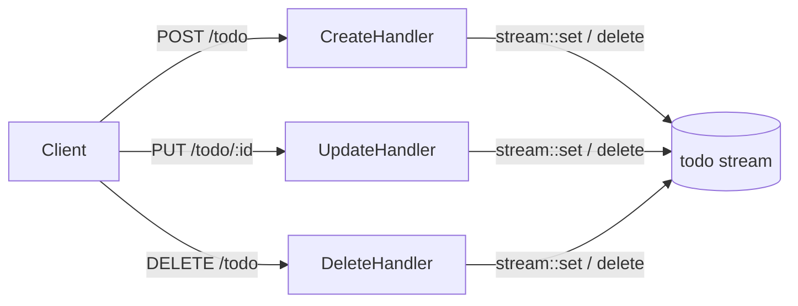

This example builds a complete Todo API using the iii SDK directly. It covers custom stream registration (`iii.createStream`), reading and writing via `stream::get` / `stream::set` / `stream::delete`, and the helper `stream::list` for group-level queries.



## Custom stream

The iii SDK lets you register a custom stream backed by any storage — in-memory, a database, or a remote service. The engine routes `stream::get` / `stream::set` / `stream::delete` / `stream::list` calls to your implementation.

<Tabs items={['TypeScript', 'Python', 'Rust']}>
  <Tab value="TypeScript">

```typescript
// stream.ts
import { init } from 'iii-sdk'

export type Todo = {
  id: string
  description: string
  groupId: string
  createdAt: string
  dueDate?: string
  completedAt: string | null
}

const iii = init(process.env.III_BRIDGE_URL ?? 'ws://localhost:49134')

let todos: Todo[] = []

iii.createStream('todo', {
  get: async (input) => todos.find((t) => t.id === input.item_id) ?? null,

  set: async (input) => {
    const existing = todos.find((t) => t.id === input.item_id)
    if (existing) {
      const updated = { ...existing, ...input.data }
      todos = todos.map((t) => (t.id === input.item_id ? updated : t))
      return { old_value: existing, new_value: updated }
    }
    const newTodo: Todo = {
      id: input.item_id,
      groupId: input.group_id,
      description: input.data.description,
      createdAt: new Date().toISOString(),
      dueDate: input.data.dueDate,
      completedAt: null,
    }
    todos.push(newTodo)
    return { old_value: undefined, new_value: newTodo }
  },

  delete: async (input) => {
    const old_value = todos.find((t) => t.id === input.item_id)
    todos = todos.filter((t) => t.id !== input.item_id)
    return { old_value }
  },

  list: async (input) => todos.filter((t) => t.groupId === input.group_id),
  listGroups: async () => [...new Set(todos.map((t) => t.groupId))],
  update: async () => { throw new Error('Not implemented') },
})

export { iii }
```

  </Tab>
  <Tab value="Python">

```python
# stream.py
from __future__ import annotations
from typing import Any
from iii import (
    IStream, StreamGetInput, StreamSetInput, StreamDeleteInput,
    StreamListInput, StreamListGroupsInput, StreamSetResult, StreamUpdateInput,
)
from .iii import iii


class TodoStream(IStream[dict[str, Any]]):
    def __init__(self) -> None:
        self._todos: list[dict[str, Any]] = []

    async def get(self, input: StreamGetInput) -> dict[str, Any] | None:
        return next((t for t in self._todos if t["id"] == input.item_id), None)

    async def set(self, input: StreamSetInput) -> StreamSetResult[dict[str, Any]] | None:
        for i, todo in enumerate(self._todos):
            if todo["id"] == input.item_id:
                updated = {**todo, **input.data}
                self._todos[i] = updated
                return StreamSetResult(old_value=todo, new_value=updated)

        new_todo = {
            "id": input.item_id,
            "groupId": input.group_id,
            "description": input.data.get("description", ""),
            "createdAt": input.data.get("createdAt"),
            "dueDate": input.data.get("dueDate"),
            "completedAt": None,
        }
        self._todos.append(new_todo)
        return StreamSetResult(old_value=None, new_value=new_todo)

    async def delete(self, input: StreamDeleteInput) -> None:
        self._todos = [t for t in self._todos if t["id"] != input.item_id]

    async def list(self, input: StreamListInput) -> list[dict[str, Any]]:
        return [t for t in self._todos if t.get("groupId") == input.group_id]

    async def list_groups(self, input: StreamListGroupsInput) -> list[str]:
        return list({t["groupId"] for t in self._todos if "groupId" in t})

    async def update(self, input: StreamUpdateInput) -> StreamSetResult[dict[str, Any]] | None:
        return None


iii.create_stream("todo", TodoStream())
```

  </Tab>
  <Tab value="Rust">

```rust
// In Rust, use the Streams helper for atomic stream operations
use iii_sdk::{III, Streams, UpdateOp};

let streams = Streams::new(iii.clone());
// Stream items are addressed as "stream_name::group_id::item_id"
```

  </Tab>
</Tabs>

## Create

<Tabs items={['TypeScript', 'Python', 'Rust']}>
  <Tab value="TypeScript">

```typescript
import { getContext, type ApiRequest, type ApiResponse } from 'iii-sdk'
import { iii } from './stream'

iii.registerFunction(
  { id: 'api.post.todo', description: 'Create a new todo' },
  async (req: ApiRequest<{ description: string; dueDate?: string }>) => {
    const ctx = getContext()
    const { description, dueDate } = req.body ?? {}

    if (!description) {
      return { status_code: 400, body: { error: 'Description is required' } } satisfies ApiResponse
    }

    const todoId = `todo-${Date.now()}-${Math.random().toString(36).substring(2, 9)}`

    ctx.logger.info('Creating todo', { todoId })

    const todo = await iii.trigger('stream::set', {
      stream_name: 'todo',
      group_id: 'inbox',
      item_id: todoId,
      data: {
        id: todoId,
        description,
        groupId: 'inbox',
        createdAt: new Date().toISOString(),
        dueDate,
        completedAt: null,
      },
    })

    ctx.logger.info('Todo created', { todoId })
    return { status_code: 201, body: todo } satisfies ApiResponse
  },
)

iii.registerTrigger({
  type: 'http',
  function_id: 'api.post.todo',
  config: { api_path: 'todo', http_method: 'POST', description: 'Create a new todo' },
})
```

  </Tab>
  <Tab value="Python">

```python
import random, string, time
from datetime import datetime, timezone
from iii import ApiRequest, ApiResponse, get_context
from .iii import iii


async def _create_todo(req: ApiRequest, ctx) -> ApiResponse:
    description = req.body.get("description") if req.body else None
    due_date = req.body.get("dueDate") if req.body else None

    if not description:
        return ApiResponse(statusCode=400, body={"error": "Description is required"})

    suffix = "".join(random.choices(string.ascii_lowercase + string.digits, k=7))
    todo_id = f"todo-{int(time.time() * 1000)}-{suffix}"

    ctx.logger.info("Creating todo", {"todoId": todo_id})

    todo = await iii.trigger("stream::set", {
        "stream_name": "todo",
        "group_id": "inbox",
        "item_id": todo_id,
        "data": {
            "id": todo_id,
            "description": description,
            "createdAt": datetime.now(timezone.utc).isoformat(),
            "dueDate": due_date,
            "completedAt": None,
        },
    })

    ctx.logger.info("Todo created", {"todoId": todo_id})
    return ApiResponse(statusCode=201, body=todo, headers={"Content-Type": "application/json"})


iii.register_function("api.post.todo", lambda data: _create_todo(
    ApiRequest(**data) if isinstance(data, dict) else data, get_context()
))
iii.register_trigger(
    type="http", function_id="api.post.todo",
    config={"api_path": "todo", "http_method": "POST", "description": "Create a new todo"},
)
```

  </Tab>
  <Tab value="Rust">

```rust
use iii_sdk::{III, Streams, UpdateOp, get_context, types::ApiRequest};
use serde_json::json;

iii.register_function("api.post.todo", |input| async move {
    let ctx = get_context();
    let req: ApiRequest = serde_json::from_value(input)?;
    let description = req.body["description"].as_str().unwrap_or("").to_string();

    if description.is_empty() {
        return Ok(json!({
            "status_code": 400,
            "body": { "error": "Description is required" },
        }));
    }

    let todo_id = format!("todo-{}", chrono::Utc::now().timestamp_millis());
    ctx.logger.info("Creating todo", Some(json!({ "todoId": todo_id })));

    let result = streams.update(
        &format!("todo::inbox::{}", todo_id),
        vec![
            UpdateOp::set("id", json!(todo_id.clone())),
            UpdateOp::set("description", json!(description)),
            UpdateOp::set("createdAt", json!(chrono::Utc::now().to_rfc3339())),
            UpdateOp::set("completedAt", json!(null)),
        ],
    ).await?;

    ctx.logger.info("Todo created", Some(json!({ "todoId": todo_id })));

    Ok(json!({ "status_code": 201, "body": result.new_value }))
});

iii.register_trigger("http", "api.post.todo", json!({
    "api_path": "todo",
    "http_method": "POST",
}))?;
```

  </Tab>
</Tabs>

## Update

<Tabs items={['TypeScript', 'Python', 'Rust']}>
  <Tab value="TypeScript">

```typescript
iii.registerFunction(
  { id: 'api.put.todo', description: 'Update a todo' },
  async (req: ApiRequest) => {
    const ctx = getContext()
    const todoId = req.path_params?.id

    const existing = todoId
      ? await iii.trigger<Todo | null>('stream::get', {
          stream_name: 'todo',
          group_id: 'inbox',
          item_id: todoId,
        })
      : null

    if (!existing) {
      return { status_code: 404, body: { error: 'Todo not found' } } satisfies ApiResponse
    }

    ctx.logger.info('Updating todo', { todoId })

    const updated = await iii.trigger('stream::set', {
      stream_name: 'todo',
      group_id: 'inbox',
      item_id: todoId,
      data: { ...existing, ...req.body },
    })

    ctx.logger.info('Todo updated', { todoId })
    return { status_code: 200, body: updated } satisfies ApiResponse
  },
)

iii.registerTrigger({
  type: 'http',
  function_id: 'api.put.todo',
  config: { api_path: 'todo/:id', http_method: 'PUT', description: 'Update a todo' },
})
```

  </Tab>
  <Tab value="Python">

```python
async def _update_todo(req: ApiRequest, ctx) -> ApiResponse:
    todo_id = req.path_params.get("id") if req.path_params else None

    existing = await iii.trigger("stream::get", {
        "stream_name": "todo", "group_id": "inbox", "item_id": todo_id,
    }) if todo_id else None

    if not existing:
        return ApiResponse(statusCode=404, body={"error": "Todo not found"})

    ctx.logger.info("Updating todo", {"todoId": todo_id})

    merged = {**existing, **(req.body or {})}
    updated = await iii.trigger("stream::set", {
        "stream_name": "todo", "group_id": "inbox", "item_id": todo_id, "data": merged,
    })

    ctx.logger.info("Todo updated", {"todoId": todo_id})
    return ApiResponse(statusCode=200, body=updated, headers={"Content-Type": "application/json"})


iii.register_function("api.put.todo", lambda data: _update_todo(
    ApiRequest(**data) if isinstance(data, dict) else data, get_context()
))
iii.register_trigger(
    type="http", function_id="api.put.todo",
    config={"api_path": "todo/:id", "http_method": "PUT", "description": "Update a todo"},
)
```

  </Tab>
  <Tab value="Rust">

```rust
iii.register_function("api.put.todo", |input| async move {
    let ctx = get_context();
    let req: ApiRequest = serde_json::from_value(input)?;
    let todo_id = req.path_params.get("id").cloned().unwrap_or_default();

    let mut ops = vec![];
    if let Some(desc) = req.body.get("description") {
        ops.push(UpdateOp::set("description", desc.clone()));
    }
    if let Some(checked) = req.body["checked"].as_bool() {
        let completed_at = if checked { json!(chrono::Utc::now().to_rfc3339()) } else { json!(null) };
        ops.push(UpdateOp::set("completedAt", completed_at));
    }

    if ops.is_empty() {
        return Ok(json!({ "status_code": 400, "body": { "error": "No fields to update" } }));
    }

    ctx.logger.info("Updating todo", Some(json!({ "todoId": todo_id })));
    let result = streams.update(&format!("todo::inbox::{}", todo_id), ops).await?;
    ctx.logger.info("Todo updated", Some(json!({ "todoId": todo_id })));

    Ok(json!({ "status_code": 200, "body": result.new_value }))
});

iii.register_trigger("http", "api.put.todo", json!({
    "api_path": "todo/:id",
    "http_method": "PUT",
}))?;
```

  </Tab>
</Tabs>

## Delete

<Tabs items={['TypeScript', 'Python', 'Rust']}>
  <Tab value="TypeScript">

```typescript
iii.registerFunction(
  { id: 'api.delete.todo', description: 'Delete a todo' },
  async (req: ApiRequest<{ todoId: string }>) => {
    const ctx = getContext()
    const { todoId } = req.body ?? {}

    if (!todoId) {
      return { status_code: 400, body: { error: 'todoId is required' } } satisfies ApiResponse
    }

    ctx.logger.info('Deleting todo', { todoId })

    await iii.trigger('stream::delete', {
      stream_name: 'todo',
      group_id: 'inbox',
      item_id: todoId,
    })

    ctx.logger.info('Todo deleted', { todoId })
    return { status_code: 200, body: { success: true } } satisfies ApiResponse
  },
)

iii.registerTrigger({
  type: 'http',
  function_id: 'api.delete.todo',
  config: { api_path: 'todo', http_method: 'DELETE', description: 'Delete a todo' },
})
```

  </Tab>
  <Tab value="Python">

```python
async def _delete_todo(req: ApiRequest, ctx) -> ApiResponse:
    todo_id = req.body.get("todoId") if req.body else None

    if not todo_id:
        return ApiResponse(statusCode=400, body={"error": "todoId is required"})

    ctx.logger.info("Deleting todo", {"todoId": todo_id})

    await iii.trigger("stream::delete", {
        "stream_name": "todo", "group_id": "inbox", "item_id": todo_id,
    })

    ctx.logger.info("Todo deleted", {"todoId": todo_id})
    return ApiResponse(statusCode=200, body={"success": True}, headers={"Content-Type": "application/json"})


iii.register_function("api.delete.todo", lambda data: _delete_todo(
    ApiRequest(**data) if isinstance(data, dict) else data, get_context()
))
iii.register_trigger(
    type="http", function_id="api.delete.todo",
    config={"api_path": "todo", "http_method": "DELETE", "description": "Delete a todo"},
)
```

  </Tab>
  <Tab value="Rust">

```rust
iii.register_function("api.delete.todo", |input| async move {
    let ctx = get_context();
    let req: ApiRequest = serde_json::from_value(input)?;
    let todo_id = req.body["todoId"].as_str().unwrap_or("").to_string();

    if todo_id.is_empty() {
        return Ok(json!({ "status_code": 400, "body": { "error": "todoId is required" } }));
    }

    ctx.logger.info("Deleting todo", Some(json!({ "todoId": todo_id })));

    iii.trigger_void("stream::delete", json!({
        "stream_name": "todo",
        "group_id": "inbox",
        "item_id": todo_id,
    }))?;

    ctx.logger.info("Todo deleted", Some(json!({ "todoId": todo_id })));

    Ok(json!({ "status_code": 200, "body": { "success": true } }))
});

iii.register_trigger("http", "api.delete.todo", json!({
    "api_path": "todo",
    "http_method": "DELETE",
}))?;
```

  </Tab>
</Tabs>

## Key concepts

- `iii.createStream(name, impl)` registers a custom stream with get / set / delete / list / listGroups / update methods. The engine routes `stream::*` calls to this implementation.
- `stream::set` returns the stored value — in the custom implementation above, the `set` handler shapes the result.
- `stream::get` returns `null` if the item doesn't exist — always guard before writing an update.
- In Rust, `Streams::new(iii.clone())` wraps the engine connection and provides `streams.update(key, ops)` for atomic modifications.
