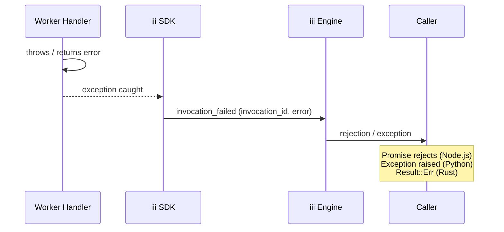

Errors in the iii system flow through a well-defined path from the point of failure back to the caller. Understanding this flow helps you build resilient workers that degrade gracefully and surface actionable diagnostics.

## Error Flow



When a function handler throws (or returns an error), the SDK catches it and sends an `invocation_failed` message to the engine. The engine routes this error back to the original caller, where it surfaces as a rejected promise, a raised exception, or a `Result::Err` depending on the SDK.

## Error Types by SDK

<Tabs items={['TypeScript', 'Python', 'Rust']}>
  <Tab value="TypeScript">

### Invocation Errors

`trigger()` returns a `Promise` that rejects when the remote function fails:

```typescript
import { init } from 'iii-sdk'

const iii = init('ws://localhost:49134')

try {
  const result = await iii.trigger('orders::process', { orderId: '123' })
} catch (err) {
  console.error('Invocation failed:', err.message)
}
```

### Timeout Errors

Invocations time out if the remote function does not respond within the configured window. Set a global default or override per call:

```typescript
const iii = init('ws://localhost:49134', {
  invocationTimeoutMs: 30_000,
})

try {
  const result = await iii.trigger('slow::task', data, {
    timeoutMs: 60_000,
  })
} catch (err) {
  if (err.code === 'INVOCATION_TIMEOUT') {
    console.error('Call timed out')
  }
}
```

### Connection Errors

Monitor connection state changes to react to disconnects and reconnects:

```typescript
iii.onConnectionStateChange((state) => {
  if (state === 'disconnected') {
    console.warn('Lost connection to engine')
  }
  if (state === 'connected') {
    console.log('Reconnected to engine')
  }
})
```

### Handler Errors

Errors thrown inside a function handler are caught by the SDK and sent back to the caller. For HTTP triggers, return a structured `ApiResponse` with an appropriate status code instead of throwing:

```typescript
import { getContext, type ApiResponse } from 'iii-sdk'

iii.registerFunction({ id: 'users::create' }, async (data) => {
  try {
    const user = await createUser(data)
    return { status_code: 201, body: user } satisfies ApiResponse
  } catch (err) {
    const ctx = getContext()
    ctx.logger.error('Failed to create user', err)
    return { status_code: 500, body: { error: 'Internal error' } } satisfies ApiResponse
  }
})
```

  </Tab>
  <Tab value="Python">

### Invocation Errors

`trigger()` is an async call that raises an exception when the remote function fails:

```python
from iii import III, InitOptions

iii = III(address="ws://localhost:49134")
await iii.connect()

try:
    result = await iii.trigger("orders::process", {"orderId": "123"})
except Exception as err:
    print(f"Invocation failed: {err}")
```

### Connection Errors

The `connect()` call can raise if the engine is unreachable:

```python
try:
    await iii.connect()
except ConnectionError as err:
    print(f"Could not connect to engine: {err}")
```

### Handler Errors

Exceptions raised inside a handler are caught by the SDK and sent as `invocation_failed` to the engine:

```python
from iii import get_context, ApiResponse

async def create_user(data):
    try:
        user = await do_create_user(data)
        return ApiResponse(status_code=201, body=user)
    except ValueError as err:
        ctx = get_context()
        ctx.logger.error(f"Validation failed: {err}")
        return ApiResponse(status_code=400, body={"error": str(err)})
    except Exception as err:
        ctx = get_context()
        ctx.logger.error(f"Unexpected error: {err}")
        return ApiResponse(status_code=500, body={"error": "Internal error"})
```

  </Tab>
  <Tab value="Rust">

### Invocation Errors

`trigger()` returns `Result<T, IIIError>`. Pattern match on the error variants:

```rust
use iii_sdk::{III, IIIError};

let iii = III::new("ws://localhost:49134");
iii.connect().await?;

match iii.trigger("orders::process", json!({"orderId": "123"})).await {
    Ok(result) => println!("Success: {:?}", result),
    Err(IIIError::Timeout) => eprintln!("Invocation timed out"),
    Err(IIIError::Remote(msg)) => eprintln!("Remote error: {}", msg),
    Err(IIIError::NotConnected) => eprintln!("Not connected to engine"),
    Err(err) => eprintln!("Unexpected error: {:?}", err),
}
```

### Error Variants

| Variant | Description |
|---------|-------------|
| `IIIError::NotConnected` | WebSocket is not open |
| `IIIError::Timeout` | Invocation timed out |
| `IIIError::Remote(String)` | Remote function returned an error |
| `IIIError::Serde(serde_json::Error)` | JSON serialization or deserialization failed |
| `IIIError::WebSocket(Error)` | Underlying WebSocket transport error |

### Handler Errors

Return `Err` from a handler to signal failure. The SDK sends the error to the engine as `invocation_failed`:

```rust
use iii_sdk::get_context;
use serde_json::json;

iii.register_function("users::create", |input| async move {
    let name = input["name"]
        .as_str()
        .ok_or_else(|| IIIError::Remote("missing 'name' field".into()))?;

    let ctx = get_context();
    ctx.logger.info(&format!("Creating user: {}", name), None);

    Ok(json!({
        "status_code": 201,
        "body": { "id": "abc", "name": name }
    }))
});
```

  </Tab>
</Tabs>

## Common Patterns

### Graceful Degradation

Check connection state before triggering a remote call to provide a fast fallback:

<Tabs items={['TypeScript', 'Python', 'Rust']}>
  <Tab value="TypeScript">

```typescript
async function processOrder(data: unknown) {
  if (iii.connectionState !== 'connected') {
    return { status_code: 503, body: { error: 'Service unavailable' } }
  }
  return iii.trigger('orders::process', data)
}
```

  </Tab>
  <Tab value="Python">

```python
async def process_order(data):
    if not iii.is_connected:
        return {"status_code": 503, "body": {"error": "Service unavailable"}}
    return await iii.trigger("orders::process", data)
```

  </Tab>
  <Tab value="Rust">

```rust
async fn process_order(iii: &III, data: Value) -> Result<Value, IIIError> {
    if !iii.is_connected() {
        return Ok(json!({
            "status_code": 503,
            "body": { "error": "Service unavailable" }
        }));
    }
    iii.trigger("orders::process", data).await
}
```

  </Tab>
</Tabs>

### Retry with Backoff

The SDKs handle WebSocket reconnection automatically with configurable exponential backoff. You do not need to implement reconnection logic yourself:

<Tabs items={['TypeScript', 'Python', 'Rust']}>
  <Tab value="TypeScript">

```typescript
const iii = init('ws://localhost:49134', {
  reconnection: {
    enabled: true,
    initialDelayMs: 500,
    maxDelayMs: 30_000,
    backoffMultiplier: 2,
  },
})
```

  </Tab>
  <Tab value="Python">

```python
iii = III(
    address="ws://localhost:49134",
    options=InitOptions(
        reconnection={
            "enabled": True,
            "initial_delay_ms": 500,
            "max_delay_ms": 30_000,
            "backoff_multiplier": 2,
        },
    ),
)
```

  </Tab>
  <Tab value="Rust">

```rust
let iii = III::builder("ws://localhost:49134")
    .reconnection(ReconnectionConfig {
        enabled: true,
        initial_delay_ms: 500,
        max_delay_ms: 30_000,
        backoff_multiplier: 2.0,
    })
    .build();
```

  </Tab>
</Tabs>

### Structured Error Responses for HTTP Triggers

When your function is bound to an HTTP trigger, always return an `ApiResponse` with an appropriate status code rather than letting exceptions propagate as raw 500 errors:

```typescript
iii.registerFunction({ id: 'api::handler' }, async (data) => {
  try {
    const result = await businessLogic(data)
    return { status_code: 200, body: result }
  } catch (err) {
    if (err instanceof ValidationError) {
      return { status_code: 400, body: { error: err.message, fields: err.fields } }
    }
    if (err instanceof NotFoundError) {
      return { status_code: 404, body: { error: 'Resource not found' } }
    }
    return { status_code: 500, body: { error: 'Internal server error' } }
  }
})
```

### Timeout Handling

Set per-call timeouts for operations with known SLA requirements:

<Tabs items={['TypeScript', 'Python', 'Rust']}>
  <Tab value="TypeScript">

```typescript
try {
  const result = await iii.trigger('reports::generate', data, {
    timeoutMs: 120_000,
  })
} catch (err) {
  if (err.code === 'INVOCATION_TIMEOUT') {
    return { status_code: 504, body: { error: 'Report generation timed out' } }
  }
  throw err
}
```

  </Tab>
  <Tab value="Python">

```python
try:
    result = await iii.trigger(
        "reports::generate", data, timeout_ms=120_000
    )
except TimeoutError:
    return {"status_code": 504, "body": {"error": "Report generation timed out"}}
```

  </Tab>
  <Tab value="Rust">

```rust
match iii.trigger_with_timeout("reports::generate", data, Duration::from_secs(120)).await {
    Ok(result) => Ok(result),
    Err(IIIError::Timeout) => Ok(json!({
        "status_code": 504,
        "body": { "error": "Report generation timed out" }
    })),
    Err(err) => Err(err),
}
```

  </Tab>
</Tabs>

## Next Steps

<Columns cols={2}>
  <Card title="SDK Implementation" href="/docs/advanced/sdk-implementation">
    Connection lifecycle, reconnection, and protocol details
  </Card>
  <Card title="OpenTelemetry Integration" href="/docs/advanced/telemetry">
    Trace errors across workers with distributed tracing
  </Card>
</Columns>
